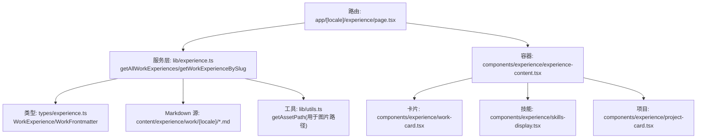
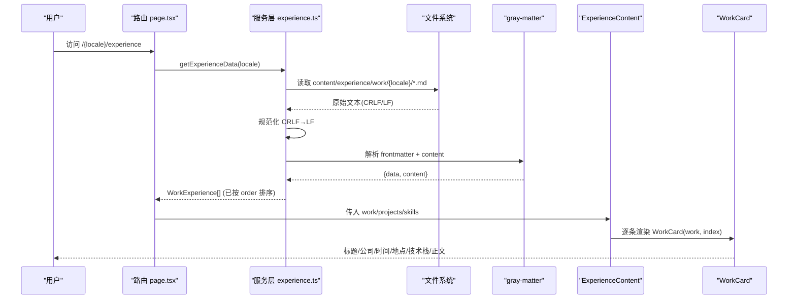
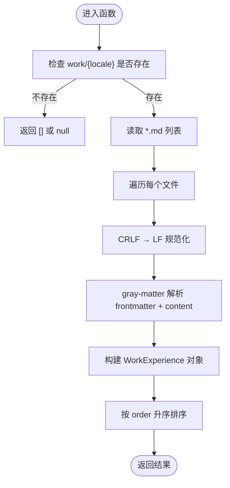
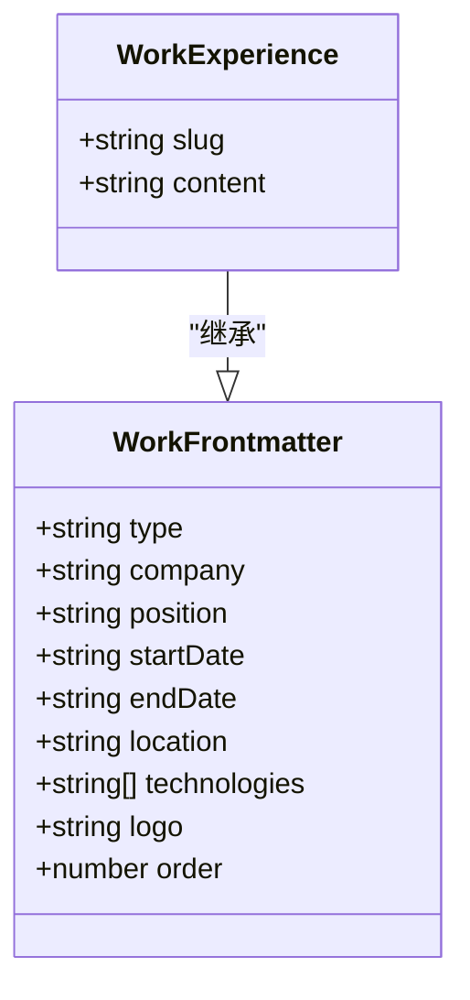
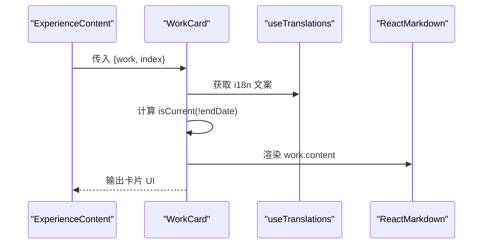
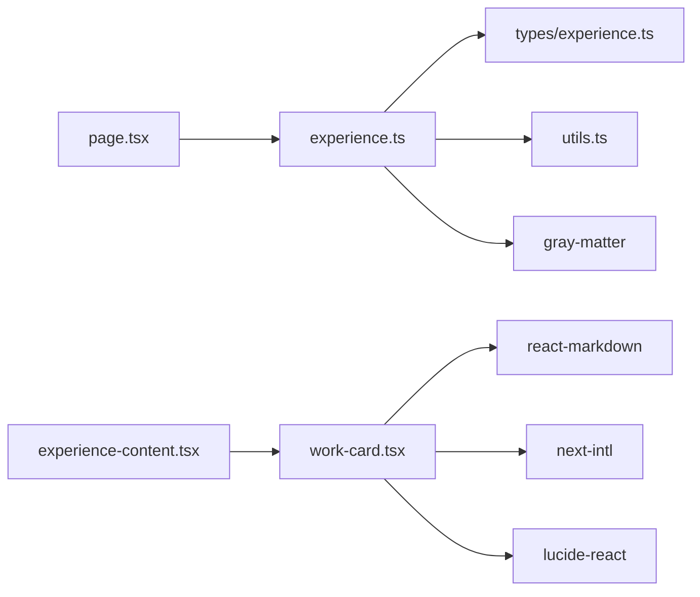

# 工作经验展示

<cite>
**本文引用的文件**
- [lib/experience.ts](file://lib/experience.ts)
- [types/experience.ts](file://types/experience.ts)
- [components/experience/work-card.tsx](file://components/experience/work-card.tsx)
- [components/experience/experience-content.tsx](file://components/experience/experience-content.tsx)
- [app/[locale]/experience/page.tsx](file://app/[locale]/experience/page.tsx)
- [content/experience/work/en/qunje_en.md](file://content/experience/work/en/qunje_en.md)
- [content/experience/skills/zh.json](file://content/experience/skills/zh.json)
- [messages/zh.json](file://messages/zh.json)
- [lib/utils.ts](file://lib/utils.ts)
</cite>

## 目录
1. [简介](#简介)
2. [项目结构](#项目结构)
3. [核心组件与数据流](#核心组件与数据流)
4. [架构总览](#架构总览)
5. [详细组件分析](#详细组件分析)
6. [依赖关系分析](#依赖关系分析)
7. [性能考虑](#性能考虑)
8. [故障排查指南](#故障排查指南)
9. [结论](#结论)
10. [附录：内容编写规范与多语言配置](#附录：内容编写规范与多语言配置)

## 简介
本章节面向“工作经验展示”功能，系统性说明从 Markdown 源文件到页面渲染的完整链路。重点覆盖：
- getAllWorkExperiences 与 getWorkExperienceBySlug 的实现逻辑（含 CRLF→LF 规范化、gray-matter 解析）
- WorkExperience 与 WorkFrontmatter 类型定义的结构与字段含义
- work-card.tsx 的数据绑定、渲染逻辑与交互效果
- 工作经历内容的编写规范、排序规则与多语言支持方法
- 错误处理策略与性能优化建议

## 项目结构
经验页由服务端路由读取 content/experience 下的 Markdown 与 JSON 资源，经 lib/experience.ts 解析后注入前端组件树，最终在 experience-content.tsx 中通过标签切换呈现“工作经历/技能/项目”。

图示来源
- [app/[locale]/experience/page.tsx:1-35](file://app/[locale]/experience/page.tsx#L1-L35)
- [lib/experience.ts:1-147](file://lib/experience.ts#L1-L147)
- [types/experience.ts:1-48](file://types/experience.ts#L1-L48)
- [components/experience/experience-content.tsx:1-106](file://components/experience/experience-content.tsx#L1-L106)
- [components/experience/work-card.tsx:1-69](file://components/experience/work-card.tsx#L1-L69)
- [lib/utils.ts:1-26](file://lib/utils.ts#L1-L26)

章节来源
- [app/[locale]/experience/page.tsx:1-35](file://app/[locale]/experience/page.tsx#L1-L35)
- [lib/experience.ts:1-147](file://lib/experience.ts#L1-L147)
- [types/experience.ts:1-48](file://types/experience.ts#L1-L48)
- [components/experience/experience-content.tsx:1-106](file://components/experience/experience-content.tsx#L1-L106)
- [components/experience/work-card.tsx:1-69](file://components/experience/work-card.tsx#L1-L69)
- [lib/utils.ts:1-26](file://lib/utils.ts#L1-L26)

## 核心组件与数据流
- 路由层：根据 locale 调用 getExperienceData，聚合 work/projects/skills 数据并传入 ExperienceContent。
- 服务层：遍历 content/experience/work/{locale} 下 .md 文件，使用 gray-matter 解析 frontmatter 与正文；统一将 CRLF 替换为 LF，避免部署环境换行差异导致的 RSC Flight 字节长度不一致问题。
- 类型层：WorkFrontmatter 描述元信息，WorkExperience 扩展 slug 与 content。
- 视图层：ExperienceContent 负责标签切换与空态提示；WorkCard 负责单条经历的渲染与交互。

章节来源
- [app/[locale]/experience/page.tsx:25-34](file://app/[locale]/experience/page.tsx#L25-L34)
- [lib/experience.ts:17-46](file://lib/experience.ts#L17-L46)
- [lib/experience.ts:48-67](file://lib/experience.ts#L48-L67)
- [types/experience.ts:3-18](file://types/experience.ts#L3-L18)
- [components/experience/experience-content.tsx:20-103](file://components/experience/experience-content.tsx#L20-L103)
- [components/experience/work-card.tsx:15-69](file://components/experience/work-card.tsx#L15-L69)

## 架构总览
下图展示了从请求到渲染的关键调用链与数据流向。

图示来源
- [app/[locale]/experience/page.tsx:25-34](file://app/[locale]/experience/page.tsx#L25-L34)
- [lib/experience.ts:17-46](file://lib/experience.ts#L17-L46)
- [components/experience/experience-content.tsx:55-69](file://components/experience/experience-content.tsx#L55-L69)
- [components/experience/work-card.tsx:15-69](file://components/experience/work-card.tsx#L15-L69)

## 详细组件分析

### 服务层函数详解：getAllWorkExperiences 与 getWorkExperienceBySlug
- 输入参数
  - locale: 语言标识，决定读取 content/experience/work/{locale} 目录
  - slug: 仅 getWorkExperienceBySlug 需要，对应文件名（不含 .md）
- 核心流程
  - 定位工作目录，若不存在则返回空数组或 null
  - 读取所有 .md 文件，提取 slug
  - 读取文件内容并进行 CRLF→LF 规范化，避免部署后字节长度变化导致 RSC Flight 异常
  - 使用 gray-matter 解析 frontmatter 与正文
  - 组装 WorkExperience 对象（包含 data 扩展字段、slug、content）
  - 按 frontmatter.order 升序排序
- 返回值
  - getAllWorkExperiences: WorkExperience[]
  - getWorkExperienceBySlug: WorkExperience | null（找不到时返回 null）

图示来源
- [lib/experience.ts:17-46](file://lib/experience.ts#L17-L46)
- [lib/experience.ts:48-67](file://lib/experience.ts#L48-L67)

章节来源
- [lib/experience.ts:17-46](file://lib/experience.ts#L17-L46)
- [lib/experience.ts:48-67](file://lib/experience.ts#L48-L67)

### 类型定义：WorkFrontmatter 与 WorkExperience
- WorkFrontmatter（元信息）
  - type: 固定值 "work"
  - company: 公司名称
  - position: 职位
  - startDate: 开始日期（字符串）
  - endDate?: 结束日期（可选；为空表示至今）
  - location?: 工作地点（可选）
  - technologies?: 技术栈标签（可选）
  - logo?: Logo 路径（可选）
  - order: 排序权重（数字）
- WorkExperience（扩展）
  - 继承 WorkFrontmatter
  - slug: 由文件名推导
  - content: gray-matter 解析后的正文 Markdown 字符串

图示来源
- [types/experience.ts:3-18](file://types/experience.ts#L3-L18)

章节来源
- [types/experience.ts:3-18](file://types/experience.ts#L3-L18)

### 组件：work-card.tsx 数据绑定、渲染与交互
- 数据绑定
  - 接收 work: WorkExperience 与 index: number
  - 通过 useTranslations("experience") 获取国际化文案
- 渲染逻辑
  - 头部：职位、公司、是否“在职”徽章、起止时间与地点
  - 正文：ReactMarkdown 渲染 work.content
  - 底部：technologies 以 Badge 形式展示
- 交互效果
  - 卡片 hover 边框高亮与过渡动画
  - 入场动画延迟随 index 递增
  - 点击行为未实现跳转（当前为纯展示）

图示来源
- [components/experience/work-card.tsx:15-69](file://components/experience/work-card.tsx#L15-L69)
- [components/experience/experience-content.tsx:55-69](file://components/experience/experience-content.tsx#L55-L69)

章节来源
- [components/experience/work-card.tsx:1-69](file://components/experience/work-card.tsx#L1-L69)
- [components/experience/experience-content.tsx:20-103](file://components/experience/experience-content.tsx#L20-L103)

### 页面入口：experience 路由
- 生成页面元信息（title/description）
- 设置请求 locale
- 调用 getExperienceData 聚合数据并传递给 ExperienceContent

章节来源
- [app/[locale]/experience/page.tsx:11-34](file://app/[locale]/experience/page.tsx#L11-L34)

## 依赖关系分析
- 模块耦合
  - 路由依赖服务层（lib/experience.ts）
  - 服务层依赖类型定义（types/experience.ts）、文件系统、gray-matter、工具函数（lib/utils.ts）
  - 视图层依赖类型与服务层产出的数据结构
- 外部依赖
  - gray-matter：解析 Markdown frontmatter
  - react-markdown：在客户端渲染 Markdown
  - next-intl：国际化文案
  - lucide-react：图标
  - tailwind + clsx/tw-merge：样式合并

图示来源
- [app/[locale]/experience/page.tsx:1-35](file://app/[locale]/experience/page.tsx#L1-L35)
- [lib/experience.ts:1-147](file://lib/experience.ts#L1-L147)
- [types/experience.ts:1-48](file://types/experience.ts#L1-L48)
- [components/experience/experience-content.tsx:1-106](file://components/experience/experience-content.tsx#L1-L106)
- [components/experience/work-card.tsx:1-69](file://components/experience/work-card.tsx#L1-L69)

章节来源
- [lib/experience.ts:1-147](file://lib/experience.ts#L1-L147)
- [types/experience.ts:1-48](file://types/experience.ts#L1-L48)
- [components/experience/experience-content.tsx:1-106](file://components/experience/experience-content.tsx#L1-L106)
- [components/experience/work-card.tsx:1-69](file://components/experience/work-card.tsx#L1-L69)

## 性能考虑
- 文件 I/O 与解析
  - getAllWorkExperiences 使用同步读取与排序，适合静态站点预渲染场景；对大型仓库可考虑缓存或增量读取。
- 换行规范化
  - 统一 CRLF→LF 可减少部署后字节长度差异，避免 RSC Flight 序列化异常。
- 渲染开销
  - ReactMarkdown 在客户端渲染，长文可能带来首屏压力；可考虑懒加载或分页。
- 样式与动画
  - 大量卡片的入场动画应控制并发与延迟，避免重排抖动。

[本节为通用指导，不直接分析具体文件]

## 故障排查指南
- 常见问题
  - 页面空白或报错：确认 content/experience/work/{locale} 目录下存在 .md 文件且 frontmatter 字段齐全。
  - 中文显示乱码：确保文件编码为 UTF-8。
  - 部署后出现 RSC 相关异常：检查是否发生 CRLF→LF 规范化（已在服务层内置）。
  - 图片路径异常：若使用 image/logo 等相对路径，请结合 getAssetPath 处理 basePath。
- 快速定位
  - 查看路由是否正确设置 locale
  - 检查 gray-matter 解析是否成功（frontmatter 语法是否符合 YAML）
  - 确认排序字段 order 是否为数字

章节来源
- [lib/experience.ts:17-46](file://lib/experience.ts#L17-L46)
- [lib/experience.ts:48-67](file://lib/experience.ts#L48-L67)
- [lib/utils.ts:16-25](file://lib/utils.ts#L16-L25)

## 结论
该功能以“Markdown + frontmatter”驱动内容生产，配合类型约束与国际化，形成清晰的数据流与渲染链路。通过 CRLF 规范化与严格的类型定义，提升了跨平台一致性与可维护性。建议在后续迭代中引入缓存与懒渲染策略，进一步优化大规模内容下的性能表现。

[本节为总结性内容，不直接分析具体文件]

## 附录：内容编写规范与多语言配置

### 工作经历 Markdown 编写规范
- 文件位置
  - 英文：content/experience/work/en/<slug>.md
  - 中文：content/experience/work/zh/<slug>.md
- Frontmatter 必填字段
  - type: "work"
  - company: 公司名
  - position: 职位
  - startDate: 开始时间（如 2024-06）
  - order: 排序权重（数字，越小越靠前）
- 可选字段
  - endDate: 结束时间（留空表示“至今”）
  - location: 地点
  - technologies: 技术栈数组
  - logo: Logo 路径
- 正文内容
  - 使用标准 Markdown，可在 work-card.tsx 中以 ReactMarkdown 渲染

示例参考
- [content/experience/work/en/qunje_en.md:1-27](file://content/experience/work/en/qunje_en.md#L1-L27)

章节来源
- [content/experience/work/en/qunje_en.md:1-27](file://content/experience/work/en/qunje_en.md#L1-L27)
- [types/experience.ts:3-18](file://types/experience.ts#L3-L18)

### 排序规则
- 依据 frontmatter.order 升序排列
- 若未设置或相同，保持文件读取顺序（建议显式设置 order 以保证稳定性）

章节来源
- [lib/experience.ts:43](file://lib/experience.ts#L43)

### 多语言支持配置
- 路由层通过 params.locale 选择对应目录
- 文案通过 messages/{locale}.json 中的 experience.* 键提供
- 技能数据通过 content/experience/skills/{locale}.json 提供

示例参考
- [messages/zh.json:103-117](file://messages/zh.json#L103-L117)
- [content/experience/skills/zh.json:1-102](file://content/experience/skills/zh.json#L1-L102)

章节来源
- [app/[locale]/experience/page.tsx:25-34](file://app/[locale]/experience/page.tsx#L25-L34)
- [messages/zh.json:103-117](file://messages/zh.json#L103-L117)
- [content/experience/skills/zh.json:1-102](file://content/experience/skills/zh.json#L1-L102)