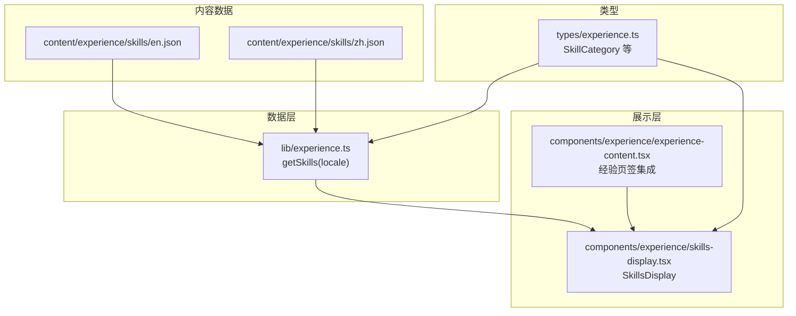
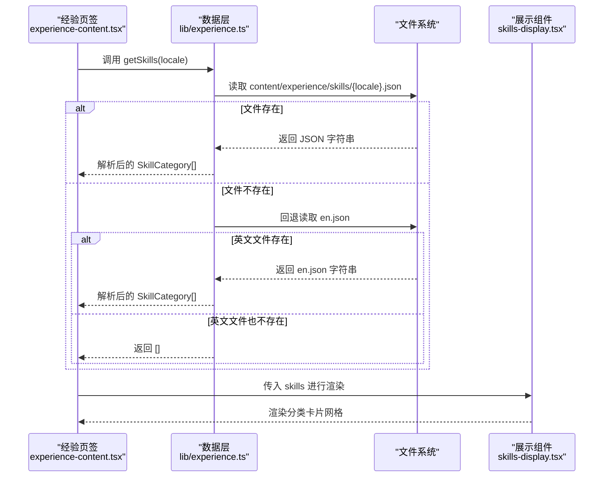
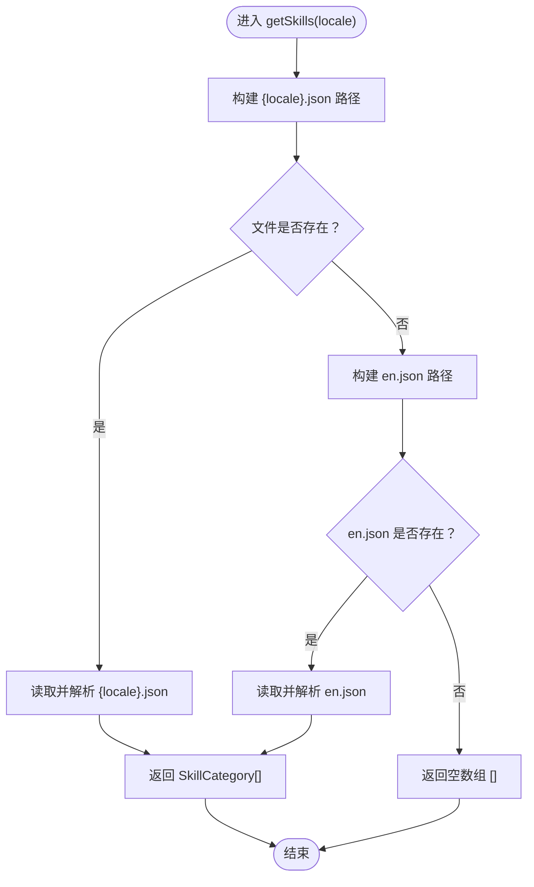
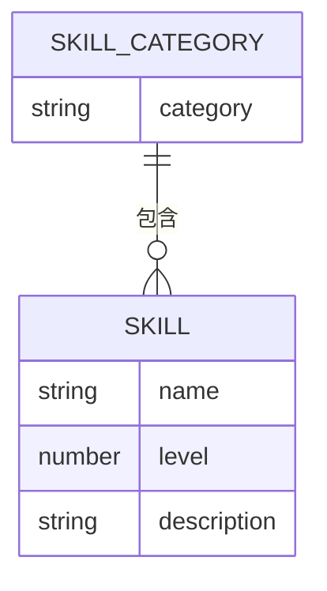
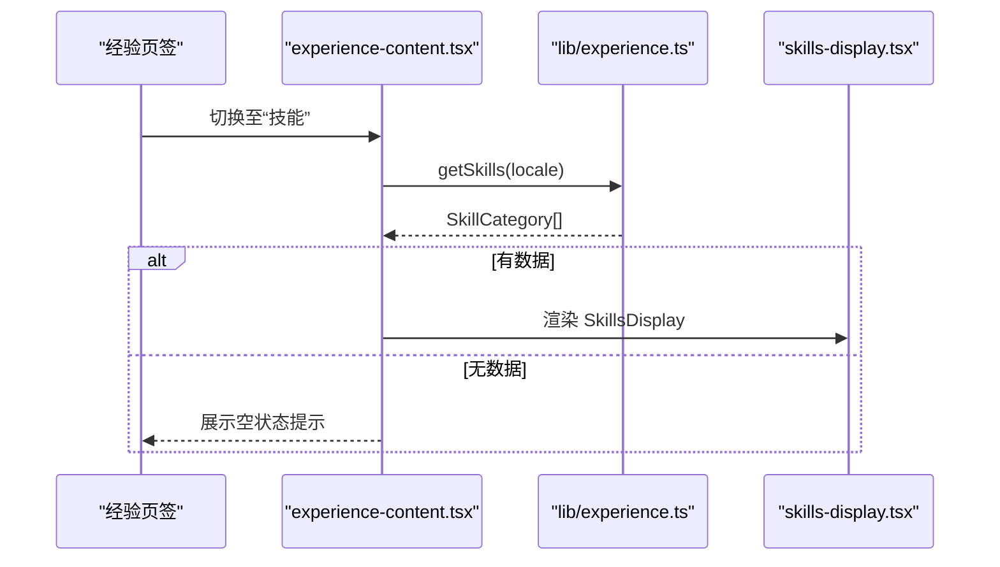
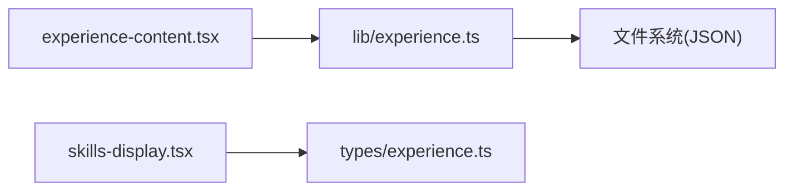

# 技能展示系统

<cite>
**本文引用的文件**   
- [experience.ts](file://lib/experience.ts)
- [skills-display.tsx](file://components\experience\skills-display.tsx)
- [experience-content.tsx](file://components\experience\experience-content.tsx)
- [en.json](file://content\experience\skills\en.json)
- [zh.json](file://content\experience\skills\zh.json)
- [experience.ts](file://types\experience.ts)
- [en.json](file://messages\en.json)
</cite>

## 目录
1. [简介](#简介)
2. [项目结构](#项目结构)
3. [核心组件](#核心组件)
4. [架构总览](#架构总览)
5. [详细组件分析](#详细组件分析)
6. [依赖关系分析](#依赖关系分析)
7. [性能考虑](#性能考虑)
8. [故障排查指南](#故障排查指南)
9. [结论](#结论)
10. [附录](#附录)

## 简介
本文件面向“技能展示系统”，聚焦以下目标：
- 深入解析 getSkills 函数的实现逻辑，包括 JSON 文件读取、多语言支持与回退机制。
- 说明 SkillCategory 类型结构与技能数据的组织方式。
- 文档化 skills-display.tsx 组件的动态渲染逻辑、分类显示与视觉效果。
- 提供技能数据 JSON 格式规范、新增技能类别的方法与样式定制选项。
- 补充国际化配置与移动端适配的实现细节。

## 项目结构
技能展示相关的关键位置如下：
- 数据层：content/experience/skills/{locale}.json（按语言存放）
- 数据获取：lib/experience.ts 中的 getSkills(locale)
- 类型定义：types/experience.ts 中的 SkillCategory 等
- 展示层：components/experience/skills-display.tsx
- 页面集成：components/experience/experience-content.tsx（在“经验”页签中渲染 SkillsDisplay）
- 国际化文案：messages/en.json（用于空状态提示等）



图表来源
- [experience.ts:124-137](file://lib/experience.ts#L124-L137)
- [skills-display.tsx:1-51](file://components\experience\skills-display.tsx#L1-L51)
- [experience-content.tsx:71-82](file://components\experience\experience-content.tsx#L71-L82)
- [experience.ts](file://types\experience.ts)

章节来源
- [experience.ts:124-137](file://lib/experience.ts#L124-L137)
- [skills-display.tsx:1-51](file://components\experience\skills-display.tsx#L1-L51)
- [experience-content.tsx:71-82](file://components\experience\experience-content.tsx#L71-L82)

## 核心组件
- getSkills(locale: string): SkillCategory[]
  - 职责：根据当前语言加载对应 skills JSON；若不存在则回退到英文版本；若英文也不存在则返回空数组。
  - 输入：locale（如 zh、en）
  - 输出：SkillCategory[]（分类数组）
- SkillsDisplay(skills: SkillCategory[])
  - 职责：将分类与技能列表以卡片网格形式渲染，包含进度条与可选描述文本。
  - 输入：从 getSkills 获取的 SkillCategory[]
  - 输出：React 节点（分类卡片网格）

章节来源
- [experience.ts:124-137](file://lib/experience.ts#L124-L137)
- [skills-display.tsx:1-51](file://components\experience\skills-display.tsx#L1-L51)

## 架构总览
下图展示了从语言到数据再到 UI 的完整链路，以及错误与回退路径。



图表来源
- [experience.ts:124-137](file://lib/experience.ts#L124-L137)
- [experience-content.tsx:71-82](file://components\experience\experience-content.tsx#L71-L82)
- [skills-display.tsx:1-51](file://components\experience\skills-display.tsx#L1-L51)

## 详细组件分析

### getSkills 函数实现逻辑
- 文件定位策略
  - 优先尝试读取 content/experience/skills/{locale}.json。
  - 若不存在，回退至 content/experience/skills/en.json。
  - 若仍不存在，返回空数组。
- 解析与返回
  - 使用同步读取并 JSON.parse 解析为 SkillCategory[]。
- 多语言支持
  - 通过 locale 参数驱动不同语言的数据源。
- 回退机制
  - 自动降级到英文，保证站点可用性。



图表来源
- [experience.ts:124-137](file://lib/experience.ts#L124-L137)

章节来源
- [experience.ts:124-137](file://lib/experience.ts#L124-L137)

### SkillCategory 类型结构与数据组织
- 类型来源
  - 类型定义位于 types/experience.ts，供数据层与展示层共同消费。
- 数据结构约定
  - 顶层为 SkillCategory 数组。
  - 每个分类包含 category 名称与 skills 列表。
  - 每个技能包含 name、level、description（可选）。
- 示例文件
  - content/experience/skills/en.json
  - content/experience/skills/zh.json



图表来源
- [experience.ts](file://types\experience.ts)

章节来源
- [experience.ts](file://types\experience.ts)

### SkillsDisplay 组件动态渲染与视觉效果
- 渲染流程
  - 接收 skills: SkillCategory[]。
  - 外层采用两列网格（md 断点），每分类一个卡片。
  - 卡片标题为分类名；内部遍历 skills 列表，渲染技能名、百分比与进度条。
  - 若存在 description，则以小字号展示描述。
- 动画与交互
  - 卡片入场动画延迟随索引递增，形成交错效果。
  - 悬停边框高亮，提升可感知性。
- 进度条
  - 基于 skill.level 动态设置宽度，过渡时长统一。

```mermaid
classDiagram
class SkillsDisplay {
+props : { skills : SkillCategory[] }
+render() JSX
}
class ProgressBar {
+props : { value : number }
+render() JSX
}
SkillsDisplay --> ProgressBar : "使用"
```

图表来源
- [skills-display.tsx:1-51](file://components\experience\skills-display.tsx#L1-L51)

章节来源
- [skills-display.tsx:1-51](file://components\experience\skills-display.tsx#L1-L51)

### 页面集成与空状态处理
- 集成位置
  - experience-content.tsx 在“技能”标签激活时，将 getSkills 的结果传给 SkillsDisplay。
- 空状态
  - 当 skills 为空时，展示友好提示与引导文案（来自 messages）。



图表来源
- [experience-content.tsx:71-82](file://components\experience\experience-content.tsx#L71-L82)
- [experience.ts:124-137](file://lib/experience.ts#L124-L137)
- [skills-display.tsx:1-51](file://components\experience\skills-display.tsx#L1-L51)

章节来源
- [experience-content.tsx:71-82](file://components\experience\experience-content.tsx#L71-L82)

## 依赖关系分析
- 模块耦合
  - experience-content.tsx 依赖 lib/experience.ts 提供的 getSkills。
  - skills-display.tsx 依赖 types/experience.ts 的类型定义。
- 外部依赖
  - 文件系统访问（Node fs）用于读取 JSON。
  - React/Tailwind 用于布局与样式。
- 可能的循环依赖
  - 当前结构为单向依赖，未见循环引用。



图表来源
- [experience-content.tsx:71-82](file://components\experience\experience-content.tsx#L71-L82)
- [experience.ts:124-137](file://lib/experience.ts#L124-L137)
- [skills-display.tsx:1-51](file://components\experience\skills-display.tsx#L1-L51)
- [experience.ts](file://types\experience.ts)

章节来源
- [experience-content.tsx:71-82](file://components\experience\experience-content.tsx#L71-L82)
- [experience.ts:124-137](file://lib/experience.ts#L124-L137)
- [skills-display.tsx:1-51](file://components\experience\skills-display.tsx#L1-L51)
- [experience.ts](file://types\experience.ts)

## 性能考虑
- I/O 模式
  - 当前使用同步读取 JSON，适合静态站点生成或低并发场景。
- 缓存建议
  - 可在应用启动时预读常用语言的 skills 并缓存，减少重复 I/O。
- 渲染优化
  - 对长列表可考虑虚拟滚动（若未来扩展为大量技能）。
- 样式开销
  - 进度条动画与卡片入场动画已控制复杂度，保持默认即可。

[本节为通用指导，不直接分析具体文件]

## 故障排查指南
- 症状：技能页空白或无数据
  - 检查 content/experience/skills/{locale}.json 是否存在且语法正确。
  - 确认回退文件 en.json 是否存在。
  - 校验 JSON 是否符合 SkillCategory 结构。
- 症状：中文显示异常
  - 确认 locale 传递正确（如 zh）。
  - 检查 messages 中的空状态文案是否缺失。
- 症状：进度条不更新
  - 检查 skill.level 是否为数字且在合理范围。
- 症状：分类未渲染
  - 检查 category 字段是否唯一且非空。

章节来源
- [experience.ts:124-137](file://lib/experience.ts#L124-L137)
- [skills-display.tsx:1-51](file://components\experience\skills-display.tsx#L1-L51)
- [experience-content.tsx:71-82](file://components\experience\experience-content.tsx#L71-L82)
- [en.json:103-118](file://messages\en.json#L103-L118)

## 结论
本系统通过简洁的数据层与清晰的展示层分离，实现了多语言技能展示与优雅的回退机制。类型约束保障了数据结构一致性，组件内聚了渲染与动效逻辑，便于后续扩展与维护。

[本节为总结性内容，不直接分析具体文件]

## 附录

### JSON 格式规范
- 文件位置
  - content/experience/skills/{locale}.json（例如 en.json、zh.json）
- 顶层结构
  - 数组：SkillCategory[]
- SkillCategory
  - category: string（分类名称）
  - skills: SkillItem[]
- SkillItem
  - name: string（技能名称）
  - level: number（熟练度百分比，建议 0-100）
  - description?: string（可选，技能描述）

章节来源
- [en.json](file://content\experience\skills\en.json)
- [zh.json](file://content\experience\skills\zh.json)
- [experience.ts](file://types\experience.ts)

### 新增技能类别的步骤
- 在 content/experience/skills/{locale}.json 中添加新的分类对象。
- 确保 category 唯一，skills 列表符合 SkillItem 结构。
- 如需英文回退，请在 en.json 中也添加对应分类。
- 刷新页面验证渲染效果。

章节来源
- [experience.ts:124-137](file://lib/experience.ts#L124-L137)
- [en.json](file://content\experience\skills\en.json)
- [zh.json](file://content\experience\skills\zh.json)

### 样式定制选项
- 卡片容器
  - 可通过 Tailwind 类调整间距、圆角、阴影等。
- 进度条
  - 修改背景色、前景色与过渡时长以匹配主题。
- 动画
  - 调整 animationDelay 与关键帧以实现不同的入场节奏。
- 响应式
  - 当前使用 md 断点分两列，可按需调整断点或改为三列。

章节来源
- [skills-display.tsx:1-51](file://components\experience\skills-display.tsx#L1-L51)

### 国际化配置要点
- 空状态文案
  - 参考 messages/en.json 中 experience.empty.skills 与 skillsHint 键值。
- 语言切换
  - 由上层路由与 i18n 配置决定 locale，传递给 getSkills。

章节来源
- [en.json:103-118](file://messages\en.json#L103-L118)

### 移动端适配实现细节
- 网格布局
  - 默认单列，中等屏幕及以上双列。
- 字体与间距
  - 使用紧凑的字号与间距，确保在小屏可读性与信息密度平衡。
- 触摸友好
  - 悬停态在移动端不可用，建议保留基础视觉反馈。

章节来源
- [skills-display.tsx:1-51](file://components\experience\skills-display.tsx#L1-L51)