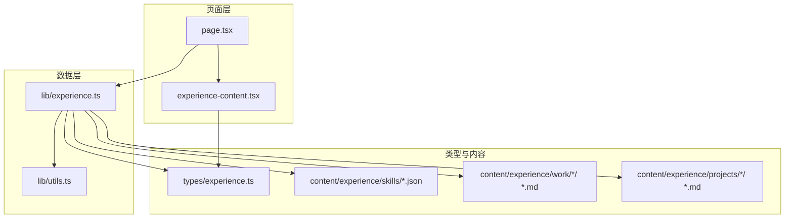
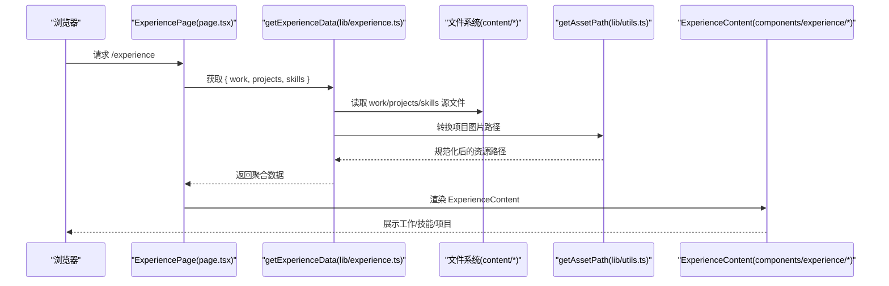
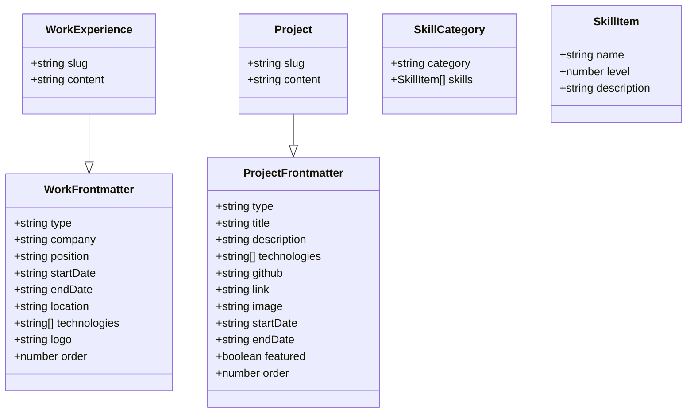
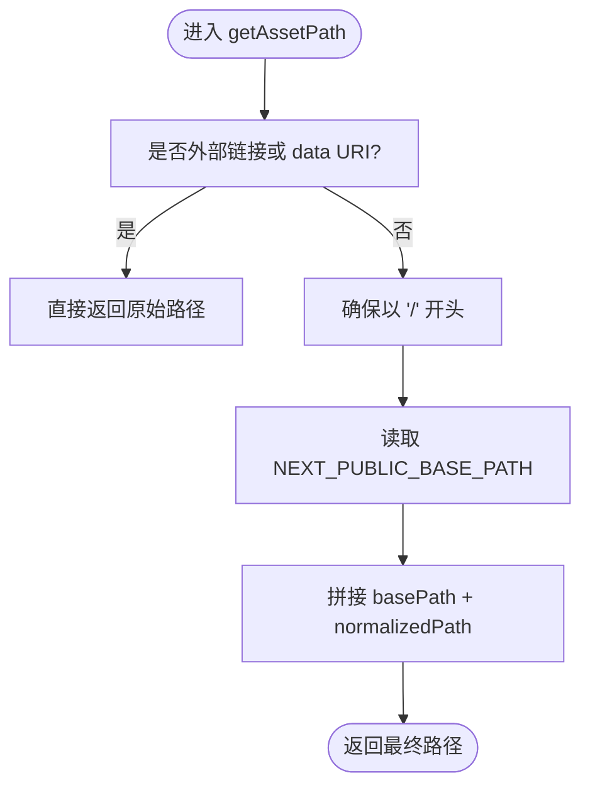
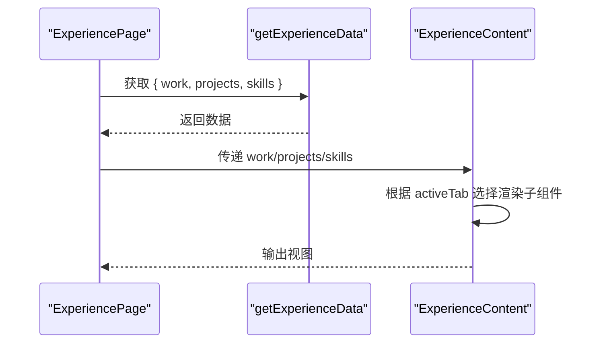
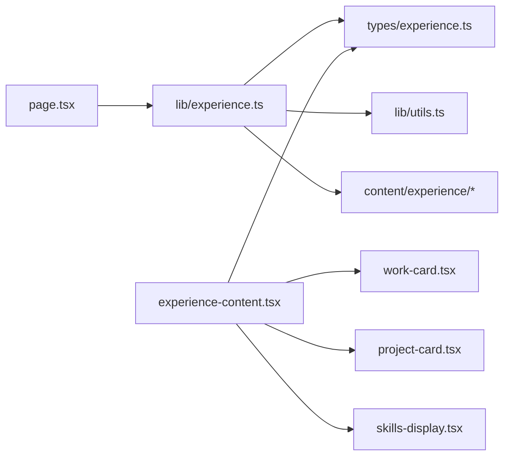

# 经验数据管理

<cite>
**本文引用的文件**   
- [lib/experience.ts](file://lib/experience.ts)
- [types/experience.ts](file://types/experience.ts)
- [lib/utils.ts](file://lib/utils.ts)
- [app/[locale]/experience/page.tsx](file://app/[locale]/experience/page.tsx)
- [components/experience/experience-content.tsx](file://components/experience/experience-content.tsx)
- [components/experience/work-card.tsx](file://components/experience/work-card.tsx)
- [components/experience/project-card.tsx](file://components/experience/project-card.tsx)
- [components/experience/skills-display.tsx](file://components/experience/skills-display.tsx)
- [content/experience/skills/zh.json](file://content/experience/skills/zh.json)
- [content/experience/projects/zh/ai-bid-dev.md](file://content/experience/projects/zh/ai-bid-dev.md)
</cite>

## 目录
1. [简介](#简介)
2. [项目结构](#项目结构)
3. [核心组件](#核心组件)
4. [架构总览](#架构总览)
5. [详细组件分析](#详细组件分析)
6. [依赖关系分析](#依赖关系分析)
7. [性能与缓存](#性能与缓存)
8. [故障排查指南](#故障排查指南)
9. [结论](#结论)
10. [附录：类型系统与数据规范](#附录：类型系统与数据规范)

## 简介
本文件围绕“经验数据管理”展开，聚焦以下目标：
- 深入解析 getExperienceData 组合函数的设计模式与数据聚合逻辑。
- 统一说明所有数据访问函数的接口设计与错误处理策略。
- 文档化 types/experience.ts 中的 TypeScript 类型系统（接口继承、联合类型、可选属性）。
- 解释 getAssetPath 工具函数的路径处理逻辑与资源管理策略。
- 提供数据验证规则、缓存机制与性能优化最佳实践。
- 给出数据迁移与版本管理的指导方案。

## 项目结构
经验数据相关代码主要分布在以下位置：
- 数据访问层：lib/experience.ts
- 类型定义：types/experience.ts
- 工具函数：lib/utils.ts
- 页面入口：app/[locale]/experience/page.tsx
- 展示组件：components/experience/*
- 静态内容：content/experience/{work,projects,skills}

图表来源
- [app/[locale]/experience/page.tsx:1-35](file://app/[locale]/experience/page.tsx#L1-L35)
- [lib/experience.ts:1-147](file://lib/experience.ts#L1-L147)
- [lib/utils.ts:1-26](file://lib/utils.ts#L1-L26)
- [types/experience.ts:1-48](file://types/experience.ts#L1-L48)

章节来源
- [app/[locale]/experience/page.tsx:1-35](file://app/[locale]/experience/page.tsx#L1-L35)
- [lib/experience.ts:1-147](file://lib/experience.ts#L1-L147)
- [types/experience.ts:1-48](file://types/experience.ts#L1-L48)
- [lib/utils.ts:1-26](file://lib/utils.ts#L1-L26)

## 核心组件
- 数据访问层（lib/experience.ts）
  - 工作履历：getAllWorkExperiences、getWorkExperienceBySlug
  - 项目：getAllProjects、getFeaturedProjects、getProjectBySlug
  - 技能：getSkills
  - 组合器：getExperienceData
- 类型系统（types/experience.ts）
  - WorkFrontmatter / WorkExperience
  - ProjectFrontmatter / Project
  - SkillCategory / SkillItem
- 工具函数（lib/utils.ts）
  - getAssetPath：统一资源路径前缀处理
- 页面与展示（app/[locale]/experience/page.tsx 与 components/experience/*）
  - 页面负责调用 getExperienceData 并传入 ExperienceContent
  - 展示组件按 tab 渲染工作、技能、项目三类数据

章节来源
- [lib/experience.ts:1-147](file://lib/experience.ts#L1-L147)
- [types/experience.ts:1-48](file://types/experience.ts#L1-L48)
- [lib/utils.ts:1-26](file://lib/utils.ts#L1-L26)
- [app/[locale]/experience/page.tsx:1-35](file://app/[locale]/experience/page.tsx#L1-L35)
- [components/experience/experience-content.tsx:1-106](file://components/experience/experience-content.tsx#L1-L106)

## 架构总览
从页面到数据的完整流程如下：

图表来源
- [app/[locale]/experience/page.tsx:1-35](file://app/[locale]/experience/page.tsx#L1-L35)
- [lib/experience.ts:1-147](file://lib/experience.ts#L1-L147)
- [lib/utils.ts:1-26](file://lib/utils.ts#L1-L26)
- [components/experience/experience-content.tsx:1-106](file://components/experience/experience-content.tsx#L1-L106)

## 详细组件分析

### 数据访问层：lib/experience.ts
- 统一接口设计
  - 列表型：getAllWorkExperiences(locale)、getAllProjects(locale)
  - 详情型：getWorkExperienceBySlug(slug, locale)、getProjectBySlug(slug, locale)
  - 筛选型：getFeaturedProjects(locale)
  - 配置型：getSkills(locale)
  - 组合型：getExperienceData(locale)
- 数据聚合逻辑
  - 遍历 content/experience 下对应 locale 的目录
  - 使用 gray-matter 解析 frontmatter 与正文
  - 将 slug 注入结果对象，便于路由与唯一标识
  - 对 work 与 projects 按 order 字段排序
  - 对 project.image 通过 getAssetPath 进行路径归一化
- 错误处理策略
  - 目录不存在时返回列表空值，避免中断渲染
  - 单个文件读取失败时捕获异常并返回 null，保证整体可用性
  - 统一 CRLF→LF 文本规范化，规避部署环境差异导致的字节长度不一致问题
- 关键实现要点
  - 工作履历：过滤 .md 文件，解析后追加 slug 与 content，按 order 升序
  - 项目：同上，额外将 image 转为绝对或带 basePath 的路径
  - 技能：优先加载 locale.json，不存在则回退 en.json，再不存在返回空数组
  - 组合器：将三类数据合并为单一对象，供页面一次性消费

章节来源
- [lib/experience.ts:1-147](file://lib/experience.ts#L1-L147)

### 类型系统：types/experience.ts
- 接口继承
  - WorkExperience 继承 WorkFrontmatter，增加 slug 与 content
  - Project 继承 ProjectFrontmatter，增加 slug 与 content
- 联合类型与判别字段
  - WorkFrontmatter.type = "work"
  - ProjectFrontmatter.type = "project"
  - 可用于运行时区分不同实体类型
- 可选属性
  - endDate?: string（缺失表示“至今”）
  - location?: string、technologies?: string[]、logo?: string
  - github?、link?、image?、startDate?、endDate?、featured?
  - SkillItem.description?
- 数值与约束
  - order: number 用于排序
  - SkillItem.level: number（约定 0-100）

图表来源
- [types/experience.ts:1-48](file://types/experience.ts#L1-L48)

章节来源
- [types/experience.ts:1-48](file://types/experience.ts#L1-L48)

### 工具函数：getAssetPath（lib/utils.ts）
- 路径处理逻辑
  - 若输入为绝对 URL（http/https）、协议相对（//）或 data URI，直接原样返回
  - 否则拼接环境变量 NEXT_PUBLIC_BASE_PATH（GitHub Pages 等场景常用），并确保以 / 开头
- 资源管理策略
  - 集中式路径前缀管理，适配多部署基址
  - 对外部资源透明放行，避免误加前缀导致 404

图表来源
- [lib/utils.ts:1-26](file://lib/utils.ts#L1-L26)

章节来源
- [lib/utils.ts:1-26](file://lib/utils.ts#L1-L26)

### 页面与展示：page.tsx 与 experience-content.tsx
- page.tsx
  - 异步页面中调用 getExperienceData(locale)，解构出 work、projects、skills
  - 构建 SEO 元信息并渲染 ExperienceContent
- experience-content.tsx
  - 提供三个 Tab：工作、技能、项目
  - 根据 activeTab 切换渲染 WorkCard、SkillsDisplay、ProjectCard
  - 当某类数据为空时，显示友好占位提示

图表来源
- [app/[locale]/experience/page.tsx:1-35](file://app/[locale]/experience/page.tsx#L1-L35)
- [components/experience/experience-content.tsx:1-106](file://components/experience/experience-content.tsx#L1-L106)

章节来源
- [app/[locale]/experience/page.tsx:1-35](file://app/[locale]/experience/page.tsx#L1-L35)
- [components/experience/experience-content.tsx:1-106](file://components/experience/experience-content.tsx#L1-L106)
- [components/experience/work-card.tsx:1-69](file://components/experience/work-card.tsx#L1-L69)
- [components/experience/project-card.tsx:1-73](file://components/experience/project-card.tsx#L1-L73)
- [components/experience/skills-display.tsx:1-51](file://components/experience/skills-display.tsx#L1-L51)

## 依赖关系分析
- 模块耦合
  - page.tsx 仅依赖 lib/experience.ts 与展示组件，职责清晰
  - lib/experience.ts 依赖 fs、path、gray-matter、types/experience.ts 与 utils.getAssetPath
  - 展示组件仅消费 types/experience.ts 的类型，不直接访问文件系统
- 外部依赖
  - gray-matter：解析 Markdown frontmatter
  - next-intl：国际化（在页面与组件中使用）
  - React/Next.js：SSR/RSC 运行环境

图表来源
- [app/[locale]/experience/page.tsx:1-35](file://app/[locale]/experience/page.tsx#L1-L35)
- [lib/experience.ts:1-147](file://lib/experience.ts#L1-L147)
- [types/experience.ts:1-48](file://types/experience.ts#L1-L48)
- [lib/utils.ts:1-26](file://lib/utils.ts#L1-L26)
- [components/experience/experience-content.tsx:1-106](file://components/experience/experience-content.tsx#L1-L106)

章节来源
- [app/[locale]/experience/page.tsx:1-35](file://app/[locale]/experience/page.tsx#L1-L35)
- [lib/experience.ts:1-147](file://lib/experience.ts#L1-L147)
- [types/experience.ts:1-48](file://types/experience.ts#L1-L48)
- [lib/utils.ts:1-26](file://lib/utils.ts#L1-L26)
- [components/experience/experience-content.tsx:1-106](file://components/experience/experience-content.tsx#L1-L106)

## 性能与缓存
- 当前实现特征
  - 同步 I/O：fs.readFileSync 与 readdirSync，适合构建期或低并发场景
  - 无内存缓存：每次请求均重新扫描与解析
- 建议优化
  - 构建期预取：在 Next.js 构建阶段生成 JSON 快照，运行时直接读取，减少 I/O
  - 运行时缓存：引入轻量内存缓存（如 Map），按 locale 键存储解析结果，设置合理过期策略
  - 增量更新：监听 content 变更事件触发缓存失效或重建
  - 懒加载：按需只加载当前 Tab 所需数据
  - 图片优化：结合 next/image 与 getAssetPath 统一管理资源路径
  - 并行读取：对多个文件使用 Promise.all 并行读取（注意 Node 版本与 RSC 限制）

[本节为通用性能建议，无需源码引用]

## 故障排查指南
- 常见问题
  - 目录不存在：返回空数组，检查 content/experience 下对应 locale 目录是否存在
  - 单个文件缺失：详情查询返回 null，确认 slug 与文件名一致
  - 部署后字节长度不一致：已内置 CRLF→LF 规范化，若仍出现异常，检查部署平台换行处理
  - 图片 404：确认 NEXT_PUBLIC_BASE_PATH 配置与 getAssetPath 行为是否符合预期
- 定位步骤
  - 打印 locale 与目录路径，确认路径拼接正确
  - 校验 frontmatter 必填字段（type、order 等）
  - 检查 skills JSON 结构与类型定义是否匹配

章节来源
- [lib/experience.ts:1-147](file://lib/experience.ts#L1-L147)
- [lib/utils.ts:1-26](file://lib/utils.ts#L1-L26)

## 结论
本方案通过统一的类型定义与数据访问层，实现了经验数据的标准化采集、聚合与展示。getExperienceData 作为组合入口，简化了页面侧的数据消费；getAssetPath 提供了跨部署环境的资源路径治理能力。建议在后续迭代中引入构建期快照与运行时缓存，进一步提升性能与稳定性。

[本节为总结性内容，无需源码引用]

## 附录：类型系统与数据规范

### 类型与字段说明
- WorkFrontmatter
  - type: "work"
  - company、position、startDate、endDate（可选，缺失表示“至今”）
  - location、technologies、logo（可选）
  - order: number（排序）
- WorkExperience
  - 继承 WorkFrontmatter，新增 slug、content
- ProjectFrontmatter
  - type: "project"
  - title、description、technologies、github、link、image、startDate、endDate、featured、order
- Project
  - 继承 ProjectFrontmatter，新增 slug、content
- SkillCategory / SkillItem
  - category、skills[]
  - name、level（0-100）、description（可选）

章节来源
- [types/experience.ts:1-48](file://types/experience.ts#L1-L48)

### 数据示例参考
- 技能数据（JSON）
  - 参考 content/experience/skills/zh.json，包含分类与技能项
- 项目数据（Markdown + Frontmatter）
  - 参考 content/experience/projects/zh/ai-bid-dev.md，演示 frontmatter 字段与正文内容

章节来源
- [content/experience/skills/zh.json:1-102](file://content/experience/skills/zh.json#L1-L102)
- [content/experience/projects/zh/ai-bid-dev.md:1-25](file://content/experience/projects/zh/ai-bid-dev.md#L1-L25)

### 数据验证规则（建议）
- 必填字段校验
  - WorkFrontmatter：type="work"、company、position、startDate、order
  - ProjectFrontmatter：type="project"、title、description、technologies、order
  - SkillCategory：category、skills 非空
  - SkillItem：name、level（0-100）
- 格式校验
  - 日期字符串符合 ISO 或约定格式
  - technologies 为字符串数组
  - image/github/link 为合法 URL 或相对路径
- 健壮性校验
  - 对缺失字段提供默认值或降级展示
  - 对非法 level 进行边界修正

[本节为通用规范建议，无需源码引用]

### 缓存机制与性能优化（建议）
- 构建期缓存
  - 在构建阶段生成各 locale 的 JSON 快照，运行时直接 require/import
- 运行时缓存
  - 基于内存 Map 缓存解析结果，key 为 locale
  - 提供 invalidateCache(locale) 方法支持手动失效
- 并发与批处理
  - 使用 Promise.all 并行读取小文件
  - 大文件流式解析，降低峰值内存占用

[本节为通用优化建议，无需源码引用]

### 数据迁移与版本管理（建议）
- 版本化策略
  - 为 content/experience 增加 version 字段或目录版本（如 v1/v2）
  - 在数据访问层兼容旧版字段，逐步弃用
- 迁移脚本
  - 提供脚本批量转换旧字段到新结构
  - 自动补全缺失的必填字段与默认值
- 回滚方案
  - 保留历史快照，支持快速回滚
  - 发布前执行 lint 与 schema 校验，阻断不兼容变更

[本节为通用迁移建议，无需源码引用]