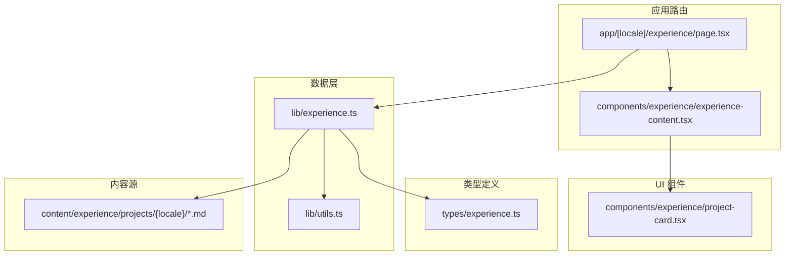
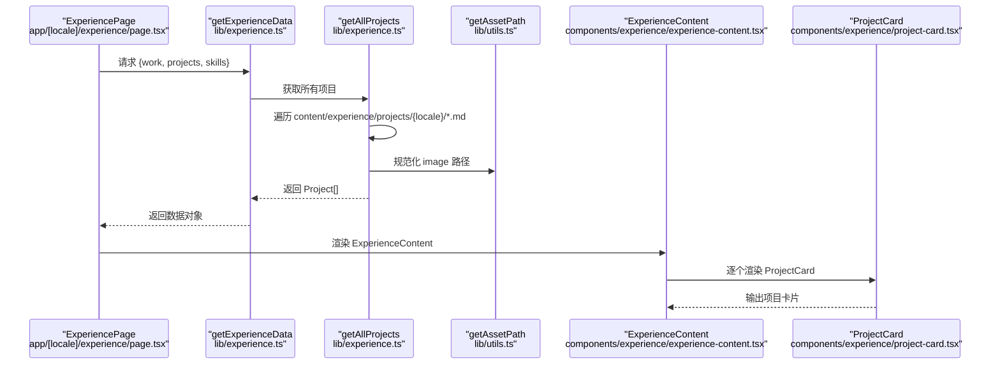
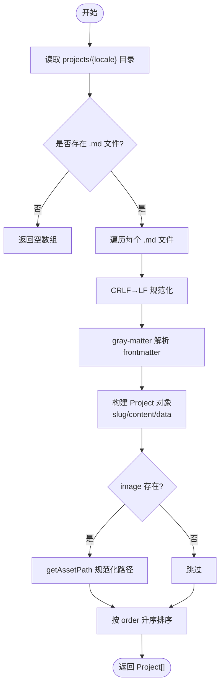
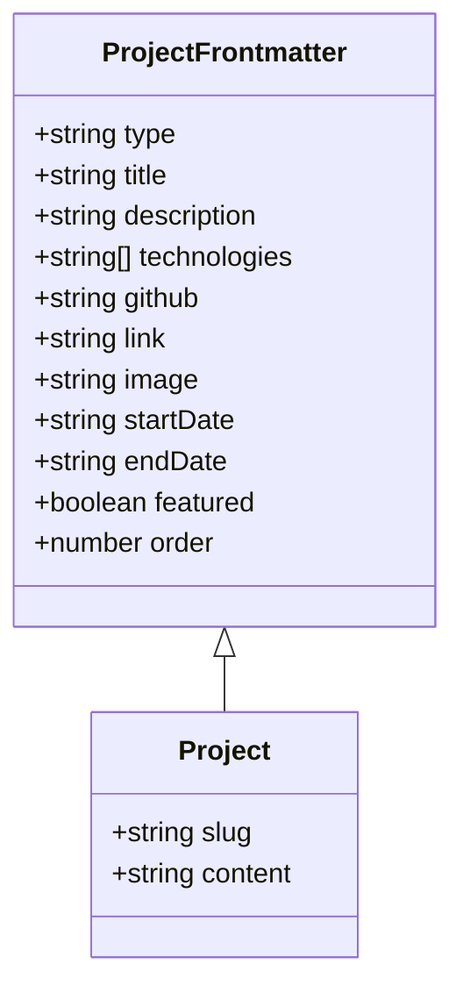
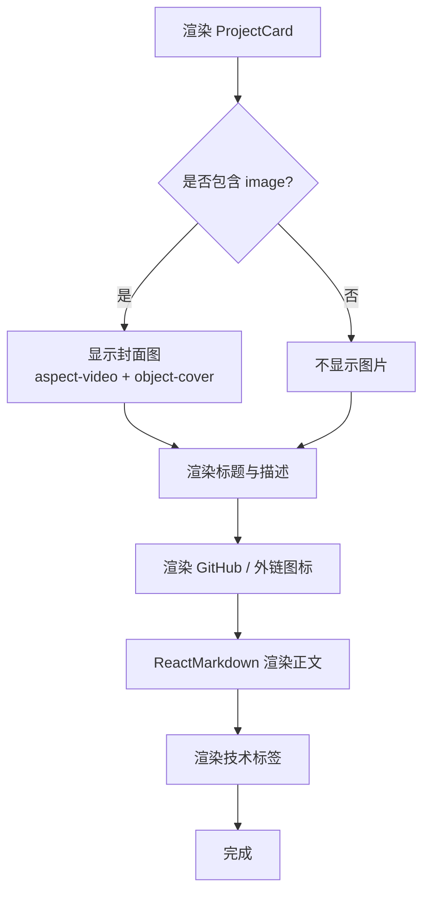
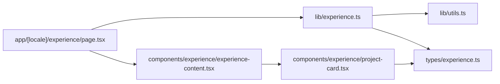

# 项目作品集

<cite>
**本文引用的文件**   
- [lib/experience.ts](file://lib/experience.ts)
- [components/experience/project-card.tsx](file://components/experience/project-card.tsx)
- [types/experience.ts](file://types/experience.ts)
- [app/[locale]/experience/page.tsx](file://app/[locale]/experience/page.tsx)
- [components/experience/experience-content.tsx](file://components/experience/experience-content.tsx)
- [content/experience/projects/zh/ai-bid-dev.md](file://content/experience/projects/zh/ai-bid-dev.md)
- [content/experience/projects/en/ai-mcp-gateway.md](file://content/experience/projects/en/ai-mcp-gateway.md)
- [content/experience/projects/zh/seal-management-platform.md](file://content/experience/projects/zh/seal-management-platform.md)
- [content/experience/projects/en/seal-management-platform.md](file://content/experience/projects/en/seal-management-platform.md)
- [lib/utils.ts](file://lib/utils.ts)
- [messages/zh.json](file://messages/zh.json)
</cite>

## 目录
1. [简介](#简介)
2. [项目结构](#项目结构)
3. [核心组件与数据流](#核心组件与数据流)
4. [架构总览](#架构总览)
5. [详细实现分析](#详细实现分析)
6. [依赖关系分析](#依赖关系分析)
7. [性能与可扩展性](#性能与可扩展性)
8. [故障排查指南](#故障排查指南)
9. [结论](#结论)
10. [附录：配置与样式指南](#附录配置与样式指南)

## 简介
本文件聚焦“项目作品集”展示功能，系统性说明以下要点：
- 数据获取与处理：getAllProjects、getFeaturedProjects、getProjectBySlug 的实现细节，包括读取 Markdown、解析 frontmatter、过滤与排序。
- 类型定义：Project 与 ProjectFrontmatter 的结构，特别是 featured 标志位的作用。
- 前端呈现：project-card.tsx 的视觉呈现、图片处理与响应式布局。
- 内容规范：Markdown 格式、多语言组织方式与图片资源管理。
- 配置与自定义：如何扩展字段、调整排序与筛选、定制样式。

## 项目结构
项目采用 Next.js + React（App Router）+ TypeScript 技术栈，经验与项目内容以 Markdown 形式存储在 content 目录下，按 locale 分目录组织；页面在 app/[locale] 下渲染，通过 lib 层函数统一读取并组装数据。

图表来源
- [app/[locale]/experience/page.tsx:1-35](file://app/[locale]/experience/page.tsx#L1-L35)
- [components/experience/experience-content.tsx:1-106](file://components/experience/experience-content.tsx#L1-L106)
- [lib/experience.ts:1-147](file://lib/experience.ts#L1-L147)
- [lib/utils.ts:1-26](file://lib/utils.ts#L1-L26)
- [types/experience.ts:1-48](file://types/experience.ts#L1-L48)
- [components/experience/project-card.tsx:1-73](file://components/experience/project-card.tsx#L1-L73)

章节来源
- [app/[locale]/experience/page.tsx:1-35](file://app/[locale]/experience/page.tsx#L1-L35)
- [components/experience/experience-content.tsx:1-106](file://components/experience/experience-content.tsx#L1-L106)
- [lib/experience.ts:1-147](file://lib/experience.ts#L1-L147)
- [types/experience.ts:1-48](file://types/experience.ts#L1-L48)
- [components/experience/project-card.tsx:1-73](file://components/experience/project-card.tsx#L1-L73)

## 核心组件与数据流
- 页面入口：app/[locale]/experience/page.tsx 调用 getExperienceData(locale)，返回 work、projects、skills 三块数据，并传入 ExperienceContent 渲染。
- 数据层：lib/experience.ts 提供 getAllProjects、getFeaturedProjects、getProjectBySlug 等函数，负责从 content/experience/projects/{locale} 读取 .md 文件，使用 gray-matter 解析 frontmatter，补充 slug 与 content，并对 image 进行路径规范化。
- 类型层：types/experience.ts 定义 ProjectFrontmatter 与 Project，其中 featured 为可选布尔值，用于标记“精选项目”。
- UI 层：components/experience/experience-content.tsx 将 projects 列表渲染为网格，每个项目由 components/experience/project-card.tsx 卡片组件展示。

章节来源
- [app/[locale]/experience/page.tsx:25-34](file://app/[locale]/experience/page.tsx#L25-L34)
- [lib/experience.ts:71-120](file://lib/experience.ts#L71-L120)
- [types/experience.ts:20-37](file://types/experience.ts#L20-L37)
- [components/experience/experience-content.tsx:84-99](file://components/experience/experience-content.tsx#L84-L99)
- [components/experience/project-card.tsx:16-73](file://components/experience/project-card.tsx#L16-L73)

## 架构总览
下图展示了从页面到数据再到内容的完整流程，以及关键函数的调用关系。

图表来源
- [app/[locale]/experience/page.tsx:25-34](file://app/[locale]/experience/page.tsx#L25-L34)
- [lib/experience.ts:141-147](file://lib/experience.ts#L141-L147)
- [lib/experience.ts:71-98](file://lib/experience.ts#L71-L98)
- [lib/utils.ts:16-25](file://lib/utils.ts#L16-L25)
- [components/experience/experience-content.tsx:84-99](file://components/experience/experience-content.tsx#L84-L99)
- [components/experience/project-card.tsx:16-73](file://components/experience/project-card.tsx#L16-L73)

## 详细实现分析

### 数据获取与处理逻辑
- getAllProjects(locale)
  - 扫描 content/experience/projects/{locale} 下的 .md 文件。
  - 对每个文件读取并做 CRLF→LF 规范化，避免部署后字节差异导致的问题。
  - 使用 gray-matter 解析 frontmatter，构造 Project 对象，包含 slug、content 与 data 中的字段。
  - 若存在 image，则通过 getAssetPath 进行路径前缀拼接，适配 GitHub Pages 等 basePath 场景。
  - 最终按 order 升序排序返回。
- getFeaturedProjects(locale)
  - 基于 getAllProjects 的结果，仅保留 featured 为 true 的项目。
- getProjectBySlug(slug, locale)
  - 直接读取指定 slug 的 .md 文件，解析并返回 Project 或 null。

图表来源
- [lib/experience.ts:71-98](file://lib/experience.ts#L71-L98)
- [lib/utils.ts:16-25](file://lib/utils.ts#L16-L25)

章节来源
- [lib/experience.ts:71-120](file://lib/experience.ts#L71-L120)
- [lib/utils.ts:16-25](file://lib/utils.ts#L16-L25)

### 类型结构与 featured 标志位
- ProjectFrontmatter
  - 关键字段：type、title、description、technologies、github、link、image、startDate、endDate、featured、order。
  - featured 为可选布尔值，用于标识“精选项目”，配合 getFeaturedProjects 进行筛选。
- Project
  - 继承 ProjectFrontmatter，额外增加 slug 与 content 字段，便于渲染与导航。

图表来源
- [types/experience.ts:20-37](file://types/experience.ts#L20-L37)

章节来源
- [types/experience.ts:20-37](file://types/experience.ts#L20-L37)

### 前端呈现与交互：project-card.tsx
- 视觉呈现
  - 使用 Card 容器包裹，支持玻璃态与悬停边框高亮效果。
  - 标题与描述区域清晰分层，GitHub 与外部链接图标并列显示。
  - 正文内容通过 ReactMarkdown 渲染，支持基础 Markdown 语法。
  - 底部以标签形式展示 technologies 列表。
- 图片处理
  - 当 project.image 存在时，以固定宽高比（aspect-video）展示，图片覆盖填充，悬停有轻微缩放动效。
- 响应式布局
  - 父级 grid 使用 grid-cols-1 md:grid-cols-2，在小屏单列、中屏及以上双列自适应。
  - 卡片内部使用 flex 布局，确保内容高度一致与对齐。

图表来源
- [components/experience/project-card.tsx:16-73](file://components/experience/project-card.tsx#L16-L73)

章节来源
- [components/experience/project-card.tsx:16-73](file://components/experience/project-card.tsx#L16-L73)
- [components/experience/experience-content.tsx:84-99](file://components/experience/experience-content.tsx#L84-L99)

### Markdown 内容与多语言组织
- 内容位置
  - 中文：content/experience/projects/zh/*.md
  - 英文：content/experience/projects/en/*.md
- Frontmatter 字段
  - 必需：type、title、description、technologies、order
  - 可选：github、link、image、startDate、endDate、featured
- 正文内容
  - 支持标准 Markdown 语法，如加粗、列表、代码块等。
- 示例文件
  - 中文示例：[ai-bid-dev.md](file://content/experience/projects/zh/ai-bid-dev.md)、[seal-management-platform.md](file://content/experience/projects/zh/seal-management-platform.md)
  - 英文示例：[ai-mcp-gateway.md](file://content/experience/projects/en/ai-mcp-gateway.md)、[seal-management-platform.md](file://content/experience/projects/en/seal-management-platform.md)

章节来源
- [content/experience/projects/zh/ai-bid-dev.md:1-25](file://content/experience/projects/zh/ai-bid-dev.md#L1-L25)
- [content/experience/projects/en/ai-mcp-gateway.md:1-26](file://content/experience/projects/en/ai-mcp-gateway.md#L1-L26)
- [content/experience/projects/zh/seal-management-platform.md:1-25](file://content/experience/projects/zh/seal-management-platform.md#L1-L25)
- [content/experience/projects/en/seal-management-platform.md:1-26](file://content/experience/projects/en/seal-management-platform.md#L1-L26)

### 图片资源管理
- 存放位置
  - 建议放置于 public/images/projects 目录，便于静态资源访问。
- 路径规范化
  - 通过 getAssetPath 自动拼接 NEXT_PUBLIC_BASE_PATH，兼容 GitHub Pages 部署。
  - 绝对 URL（http/https）、data URI 或协议相对路径会原样返回，无需前缀。
- 引用方式
  - 在 frontmatter 的 image 字段填写相对路径（如 images/projects/demo.png），系统会自动规范化。

章节来源
- [lib/utils.ts:16-25](file://lib/utils.ts#L16-L25)
- [lib/experience.ts:88-94](file://lib/experience.ts#L88-L94)

## 依赖关系分析
- 页面依赖数据层：page.tsx 依赖 experience.ts 提供的 getExperienceData。
- 数据层依赖工具与类型：experience.ts 依赖 utils.ts 的路径处理与 types/experience.ts 的类型定义。
- UI 层依赖类型与内容：experience-content.tsx 与 project-card.tsx 消费 Project 类型，并渲染 Markdown 内容。

图表来源
- [app/[locale]/experience/page.tsx:1-35](file://app/[locale]/experience/page.tsx#L1-L35)
- [lib/experience.ts:1-147](file://lib/experience.ts#L1-L147)
- [lib/utils.ts:1-26](file://lib/utils.ts#L1-L26)
- [types/experience.ts:1-48](file://types/experience.ts#L1-L48)
- [components/experience/experience-content.tsx:1-106](file://components/experience/experience-content.tsx#L1-L106)
- [components/experience/project-card.tsx:1-73](file://components/experience/project-card.tsx#L1-L73)

章节来源
- [app/[locale]/experience/page.tsx:1-35](file://app/[locale]/experience/page.tsx#L1-L35)
- [lib/experience.ts:1-147](file://lib/experience.ts#L1-L147)
- [lib/utils.ts:1-26](file://lib/utils.ts#L1-L26)
- [types/experience.ts:1-48](file://types/experience.ts#L1-L48)
- [components/experience/experience-content.tsx:1-106](file://components/experience/experience-content.tsx#L1-L106)
- [components/experience/project-card.tsx:1-73](file://components/experience/project-card.tsx#L1-L73)

## 性能与可扩展性
- I/O 与解析
  - 当前实现使用同步文件系统读取与解析，适合中小规模内容；若项目数量增长，可考虑异步读取与缓存策略。
- 排序与过滤
  - 排序基于 order 字段，稳定且高效；featured 过滤在内存中进行，开销极低。
- 图片加载
  - 使用 object-cover 与固定宽高比减少重排；可按需引入懒加载以提升首屏性能。
- 可扩展点
  - 新增字段：在 types/experience.ts 中扩展 ProjectFrontmatter，并在 experience.ts 映射到 Project。
  - 新增筛选：在 getFeaturedProjects 基础上扩展更多维度（如按年份、技术栈）。
  - 国际化：通过 messages 文件扩展文案，页面已集成 next-intl。

[本节为通用指导，不直接分析具体文件]

## 故障排查指南
- 部署后图片路径异常
  - 检查 NEXT_PUBLIC_BASE_PATH 环境变量是否正确设置。
  - 确认 image 字段是否为相对路径；绝对 URL 不会被前缀处理。
- Windows 换行符导致 RSC 字节不一致
  - 已在读取时进行 CRLF→LF 规范化，避免部署后 CR 被剥离引发的运行时错误。
- 未显示项目或内容为空
  - 确认 content/experience/projects/{locale} 下存在 .md 文件，且 frontmatter 必填字段齐全。
  - 检查 order 字段是否合理，确保排序可见。
- 链接无法打开
  - 确认 github/link 字段为有效 URL；注意 target="_blank" 与 rel="noopener noreferrer" 的安全属性。

章节来源
- [lib/utils.ts:16-25](file://lib/utils.ts#L16-L25)
- [lib/experience.ts:84-94](file://lib/experience.ts#L84-L94)
- [components/experience/project-card.tsx:36-57](file://components/experience/project-card.tsx#L36-L57)

## 结论
本项目作品集模块通过清晰的类型定义、统一的 Markdown 内容管理与简洁的前端组件，实现了良好的可维护性与可扩展性。数据层函数提供了稳定的获取、过滤与排序能力；前端组件在视觉与交互上兼顾美观与可用性。通过合理的图片路径处理与环境变量配置，能够适配多种部署场景。

[本节为总结，不直接分析具体文件]

## 附录：配置与样式指南
- 配置选项
  - NEXT_PUBLIC_BASE_PATH：用于静态资源路径前缀，影响图片等资源访问。
  - 多语言文案：在 messages/zh.json 与 messages/en.json 中扩展 experience 相关文案。
- 自定义样式
  - 卡片样式：可通过 Tailwind 类名调整 glass、hover:border-primary/30、animate-fade-in 等效果。
  - 图片样式：aspect-video 与 object-cover 控制封面比例与填充；group-hover:scale-105 提供悬停缩放。
  - 排版：prose 与 dark:prose-invert 控制 Markdown 文本主题适配。
- 扩展字段
  - 在 types/experience.ts 中添加新字段，并在 experience.ts 的 map 阶段将其注入 Project。
  - 在 project-card.tsx 中按需渲染新字段，保持 UI 一致性。

章节来源
- [messages/zh.json:103-117](file://messages/zh.json#L103-L117)
- [components/experience/project-card.tsx:18-70](file://components/experience/project-card.tsx#L18-L70)
- [types/experience.ts:20-37](file://types/experience.ts#L20-L37)
- [lib/experience.ts:88-94](file://lib/experience.ts#L88-L94)