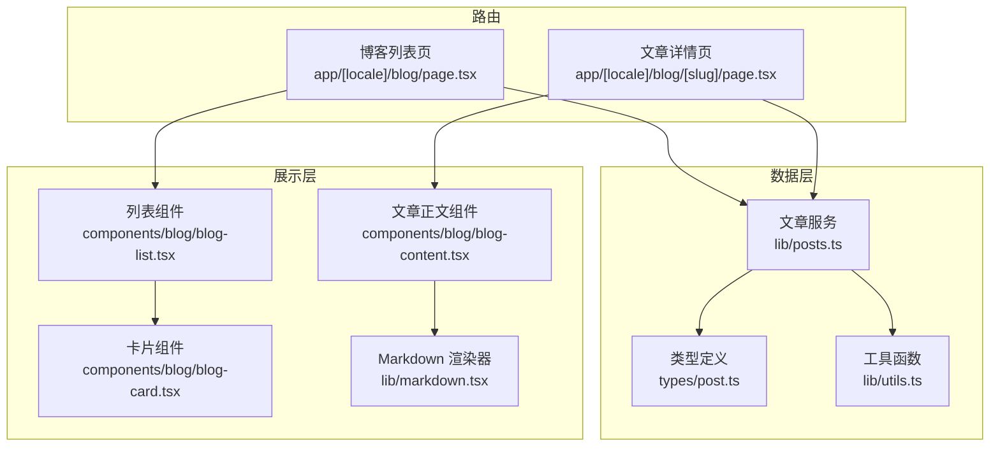
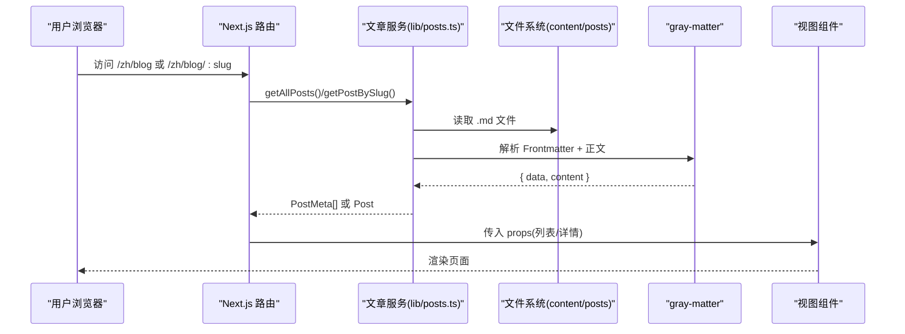
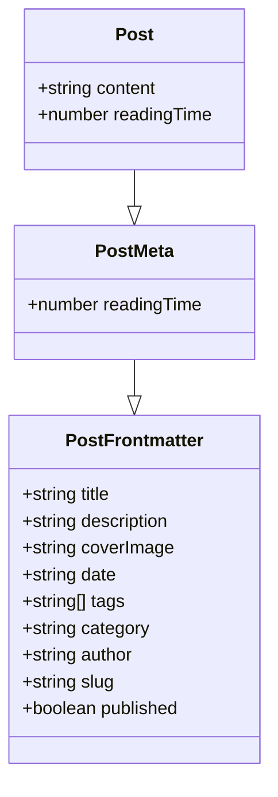
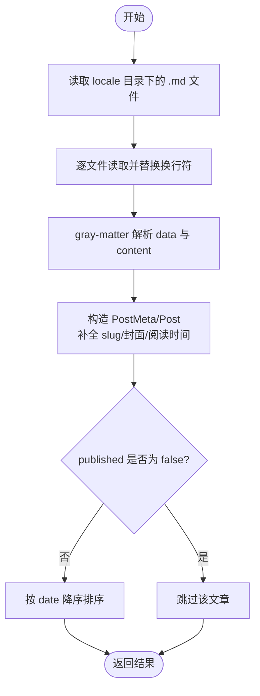
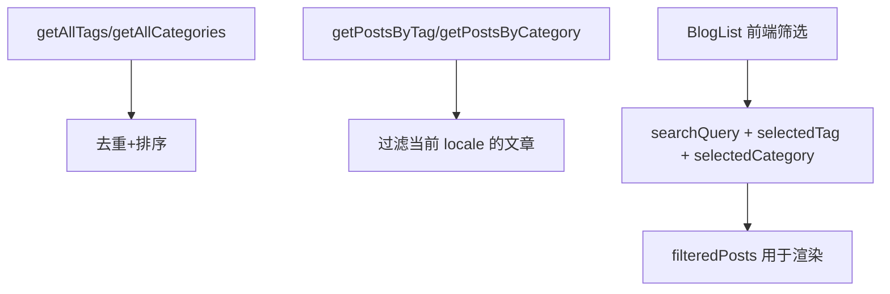
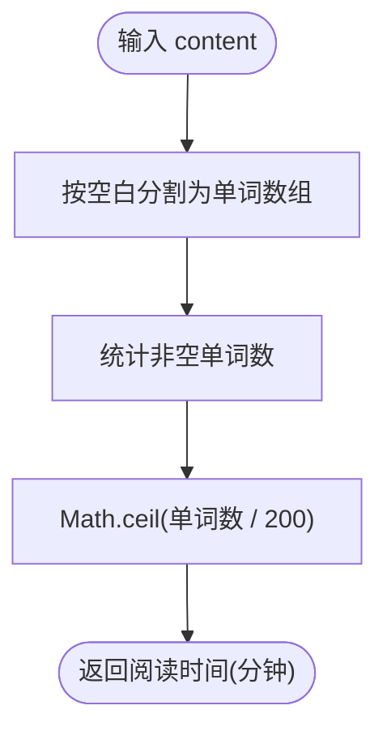
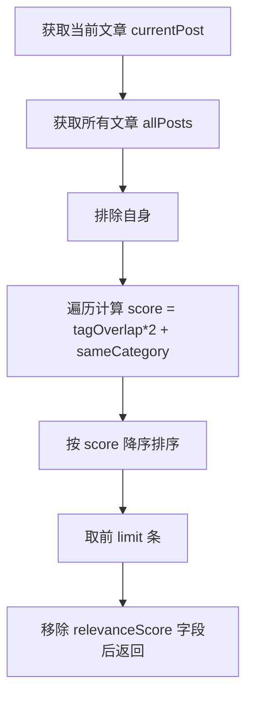
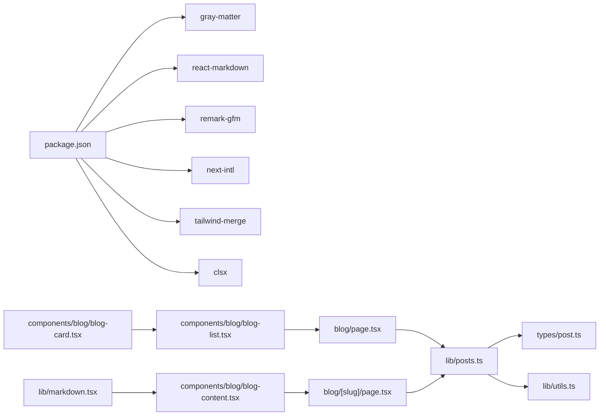

# 博客系统

<cite>
**本文引用的文件**
- [lib/posts.ts](file://lib/posts.ts)
- [types/post.ts](file://types/post.ts)
- [app/[locale]/blog/page.tsx](file://app/[locale]/blog/page.tsx)
- [app/[locale]/blog/[slug]/page.tsx](file://app/[locale]/blog/[slug]/page.tsx)
- [components/blog/blog-list.tsx](file://components/blog/blog-list.tsx)
- [components/blog/blog-card.tsx](file://components/blog/blog-card.tsx)
- [components/blog/blog-content.tsx](file://components/blog/blog-content.tsx)
- [lib/markdown.tsx](file://lib/markdown.tsx)
- [lib/utils.ts](file://lib/utils.ts)
- [package.json](file://package.json)
- [README.md](file://README.md)
</cite>

## 目录
1. [简介](#简介)
2. [项目结构](#项目结构)
3. [核心组件](#核心组件)
4. [架构总览](#架构总览)
5. [详细组件分析](#详细组件分析)
6. [依赖关系分析](#依赖关系分析)
7. [性能与优化](#性能与优化)
8. [故障排查指南](#故障排查指南)
9. [结论](#结论)
10. [附录：Frontmatter 规范与最佳实践](#appendicesfrontmatter-规范与最佳实践)

## 简介
本博客系统基于 Next.js App Router，使用 gray-matter 解析 Markdown 文章 Frontmatter，提供多语言、分类与标签筛选、阅读时间计算、相关文章推荐、代码高亮与目录导航等能力。内容以 Markdown 文件形式管理，构建期或请求期读取并渲染为页面。

## 项目结构
- 路由层
  - 博客列表页：[app/[locale]/blog/page.tsx](file://app/[locale]/blog/page.tsx)
  - 文章详情页：[app/[locale]/blog/[slug]/page.tsx](file://app/[locale]/blog/[slug]/page.tsx)
- 数据层
  - 文章读写与元数据处理：[lib/posts.ts](file://lib/posts.ts)
  - 类型定义：[types/post.ts](file://types/post.ts)
  - 资源路径处理（适配 GitHub Pages）：[lib/utils.ts](file://lib/utils.ts)
- 展示层
  - 列表与卡片：[components/blog/blog-list.tsx](file://components/blog/blog-list.tsx)、[components/blog/blog-card.tsx](file://components/blog/blog-card.tsx)
  - 文章内容渲染与交互：[components/blog/blog-content.tsx](file://components/blog/blog-content.tsx)
  - Markdown 渲染器（含代码块折叠/复制）：[lib/markdown.tsx](file://lib/markdown.tsx)
- 配置与说明
  - 依赖与脚本：[package.json](file://package.json)
  - 使用说明与部署：[README.md](file://README.md)

图表来源
- [app/[locale]/blog/page.tsx:1-34](file://app/[locale]/blog/page.tsx#L1-L34)
- [app/[locale]/blog/[slug]/page.tsx:1-180](file://app/[locale]/blog/[slug]/page.tsx#L1-L180)
- [lib/posts.ts:1-121](file://lib/posts.ts#L1-L121)
- [types/post.ts:1-20](file://types/post.ts#L1-L20)
- [lib/utils.ts:1-26](file://lib/utils.ts#L1-L26)
- [components/blog/blog-list.tsx:1-416](file://components/blog/blog-list.tsx#L1-L416)
- [components/blog/blog-card.tsx:1-156](file://components/blog/blog-card.tsx#L1-L156)
- [components/blog/blog-content.tsx:1-254](file://components/blog/blog-content.tsx#L1-L254)
- [lib/markdown.tsx:1-318](file://lib/markdown.tsx#L1-L318)

章节来源
- [README.md:33-67](file://README.md#L33-L67)

## 核心组件
- 文章服务 lib/posts.ts
  - 读取 content/posts/{locale}/*.md，使用 gray-matter 解析 Frontmatter 与正文
  - 生成 PostMeta/Post 对象，包含 slug、封面图、阅读时间等
  - 提供按标签/分类过滤、获取全部标签/分类、相关文章推荐等能力
- 类型 types/post.ts
  - 定义 Frontmatter 字段、文章元信息、完整文章对象
- 列表与详情路由
  - 列表页聚合 posts/tags/categories，传递给 BlogList 进行前端筛选
  - 详情页根据 slug 加载文章、生成 SEO 元信息、渲染正文与相关推荐
- 展示组件
  - BlogList：搜索、标签/分类筛选、置顶首篇、移动端横向分类胶囊
  - BlogCard：封面图、日期、阅读时间、标签展示
  - BlogContent：头部信息、正文渲染、目录侧边栏、评论、相关文章
  - MarkdownRenderer：标题锚点、表格、图片、代码块折叠与复制

章节来源
- [lib/posts.ts:1-121](file://lib/posts.ts#L1-L121)
- [types/post.ts:1-20](file://types/post.ts#L1-L20)
- [app/[locale]/blog/page.tsx:1-34](file://app/[locale]/blog/page.tsx#L1-L34)
- [app/[locale]/blog/[slug]/page.tsx:1-180](file://app/[locale]/blog/[slug]/page.tsx#L1-L180)
- [components/blog/blog-list.tsx:1-416](file://components/blog/blog-list.tsx#L1-L416)
- [components/blog/blog-card.tsx:1-156](file://components/blog/blog-card.tsx#L1-L156)
- [components/blog/blog-content.tsx:1-254](file://components/blog/blog-content.tsx#L1-L254)
- [lib/markdown.tsx:1-318](file://lib/markdown.tsx#L1-L318)

## 架构总览
下图展示了从路由到数据再到展示的调用链，以及灰度 matter 的解析流程。

图表来源
- [app/[locale]/blog/page.tsx:25-33](file://app/[locale]/blog/page.tsx#L25-L33)
- [app/[locale]/blog/[slug]/page.tsx:110-128](file://app/[locale]/blog/[slug]/page.tsx#L110-L128)
- [lib/posts.ts:15-71](file://lib/posts.ts#L15-L71)

## 详细组件分析

### 文章数据模型与 Frontmatter
- Frontmatter 字段
  - 必填：title、description、date、tags、category、author、slug
  - 可选：coverImage、published
- 数据结构
  - PostFrontmatter：对应 Frontmatter 字段
  - PostMeta：在前者基础上增加 readingTime
  - Post：在 PostMeta 基础上增加 content

图表来源
- [types/post.ts:1-20](file://types/post.ts#L1-L20)

章节来源
- [types/post.ts:1-20](file://types/post.ts#L1-L20)
- [README.md:178-191](file://README.md#L178-L191)

### 文章读取与解析流程（gray-matter）
- 读取策略
  - 列表：遍历 content/posts/{locale}/*.md，解析后返回 PostMeta 数组
  - 详情：根据 slug 精确读取单篇文章，返回 Post 对象
- Frontmatter 解析
  - 使用 gray-matter 将 YAML frontmatter 解析为 data，剩余文本作为 content
- 元数据处理
  - 统一补全 slug、封面图路径（通过 getAssetPath 适配 basePath）、阅读时间
  - 过滤未发布文章（published=false），并按 date 降序排序

图表来源
- [lib/posts.ts:15-47](file://lib/posts.ts#L15-L47)
- [lib/posts.ts:49-71](file://lib/posts.ts#L49-L71)
- [lib/utils.ts:16-25](file://lib/utils.ts#L16-L25)

章节来源
- [lib/posts.ts:1-121](file://lib/posts.ts#L1-L121)
- [lib/utils.ts:1-26](file://lib/utils.ts#L1-L26)

### 分类与标签
- 获取全部标签/分类：去重并排序
- 按标签/分类筛选：对已排序列表进行过滤
- 列表页前端筛选：支持搜索关键词、标签、分类组合过滤；移动端提供横向分类胶囊；桌面端提供侧边栏分类导航

图表来源
- [lib/posts.ts:73-93](file://lib/posts.ts#L73-L93)
- [components/blog/blog-list.tsx:44-55](file://components/blog/blog-list.tsx#L44-L55)

章节来源
- [lib/posts.ts:73-93](file://lib/posts.ts#L73-L93)
- [components/blog/blog-list.tsx:1-416](file://components/blog/blog-list.tsx#L1-L416)

### 阅读时间计算算法
- 算法
  - 基于正文纯文本字数，按每分钟 200 词估算
  - 使用正则分词并过滤空项，向上取整得到分钟数
- 复杂度
  - 时间 O(n)，n 为字符数；空间 O(k)，k 为分词片段数量

图表来源
- [lib/posts.ts:9-13](file://lib/posts.ts#L9-L13)

章节来源
- [lib/posts.ts:9-13](file://lib/posts.ts#L9-L13)

### 相关文章推荐算法
- 评分规则
  - 标签重叠权重：每有一个共同标签加 2 分
  - 分类相同加分：同分类加 1 分
  - 总分 = 标签重叠数 × 2 + 是否同分类
- 排序与截取
  - 按 relevanceScore 降序排序，取前 limit 条（默认 3）
- 复杂度
  - 时间 O(m×t)，m 为候选文章数，t 为标签平均长度；空间 O(m)

图表来源
- [lib/posts.ts:95-121](file://lib/posts.ts#L95-L121)

章节来源
- [lib/posts.ts:95-121](file://lib/posts.ts#L95-L121)

### 文章列表与分页
- 列表生成
  - 服务端获取 posts/tags/categories，客户端进行本地筛选与排序
- 分页逻辑
  - 当前实现未内置分页，采用“首篇置顶 + 其余网格”的布局呈现
  - 如需分页，可在列表组件中引入分页状态与切片逻辑

章节来源
- [app/[locale]/blog/page.tsx:25-33](file://app/[locale]/blog/page.tsx#L25-L33)
- [components/blog/blog-list.tsx:65-68](file://components/blog/blog-list.tsx#L65-L68)

### 文章详情页与 SEO
- 静态参数生成：遍历所有语言与文章，预生成路由参数
- 元信息：标题、描述、发布时间、作者、分类、标签、OpenGraph/Twitter 卡片、多语言 alternate、结构化数据 JSON-LD
- 正文渲染：MarkdownRenderer 负责标题锚点、表格、图片、代码块折叠/复制等

章节来源
- [app/[locale]/blog/[slug]/page.tsx:24-108](file://app/[locale]/blog/[slug]/page.tsx#L24-L108)
- [components/blog/blog-content.tsx:170-179](file://components/blog/blog-content.tsx#L170-L179)
- [lib/markdown.tsx:35-192](file://lib/markdown.tsx#L35-L192)

### Markdown 渲染与代码高亮
- 渲染管线
  - ReactMarkdown + remark-gfm
  - 自定义组件：标题自动锚点、表格样式、链接行为、图片懒加载
- 代码块
  - 支持折叠（行数超过阈值时）
  - 支持一键复制
  - 支持 Shiki 高亮 HTML（由 highlightCodeBlocks 预处理注入）

章节来源
- [lib/markdown.tsx:1-318](file://lib/markdown.tsx#L1-L318)
- [components/blog/blog-content.tsx:170-179](file://components/blog/blog-content.tsx#L170-L179)

## 依赖关系分析
- 外部依赖
  - gray-matter：解析 Markdown Frontmatter
  - react-markdown、remark-gfm：Markdown 渲染与 GFM 扩展
  - next-intl：国际化
  - tailwind-merge、clsx：类名合并
- 内部模块耦合
  - 路由层依赖文章服务与 SEO 工具
  - 展示层依赖类型定义与工具函数
  - 文章服务依赖文件系统与 utils.getAssetPath

图表来源
- [package.json:13-34](file://package.json#L13-L34)
- [app/[locale]/blog/page.tsx:1-34](file://app/[locale]/blog/page.tsx#L1-L34)
- [app/[locale]/blog/[slug]/page.tsx:1-180](file://app/[locale]/blog/[slug]/page.tsx#L1-L180)
- [lib/posts.ts:1-121](file://lib/posts.ts#L1-L121)
- [types/post.ts:1-20](file://types/post.ts#L1-L20)
- [lib/utils.ts:1-26](file://lib/utils.ts#L1-L26)
- [components/blog/blog-list.tsx:1-416](file://components/blog/blog-list.tsx#L1-L416)
- [components/blog/blog-card.tsx:1-156](file://components/blog/blog-card.tsx#L1-L156)
- [components/blog/blog-content.tsx:1-254](file://components/blog/blog-content.tsx#L1-L254)
- [lib/markdown.tsx:1-318](file://lib/markdown.tsx#L1-L318)

章节来源
- [package.json:1-47](file://package.json#L1-L47)

## 性能与优化
- 建议
  - 列表页可考虑分页或虚拟滚动，减少 DOM 节点数量
  - 封面图使用响应式尺寸与懒加载，结合 CDN 缓存
  - 对长文阅读时间计算可缓存至构建产物，避免重复计算
  - 相关度计算可按标签索引优化，降低 O(m×t) 复杂度
  - 代码高亮尽量在构建期完成，避免运行时开销

## 故障排查指南
- 常见问题
  - Frontmatter 格式错误：检查 YAML 语法与必填字段
  - 图片路径异常：确认相对路径或外部 URL，GitHub Pages 下需 basePath 前缀
  - 构建失败：检查 Node 版本、依赖安装、Markdown 文件编码与换行符
- 定位方法
  - 查看 README 中的“常见问题”与“构建失败怎么办”
  - 检查路由 generateStaticParams 是否能正确枚举文章
  - 验证 gray-matter 解析后的 data/content 是否符合预期

章节来源
- [README.md:549-582](file://README.md#L549-L582)

## 结论
本博客系统以 gray-matter 为核心，围绕 Next.js App Router 构建了轻量、可扩展的博客方案。通过清晰的类型定义、模块化数据服务与丰富的前端交互，实现了多语言、分类标签筛选、阅读时间估算与相关文章推荐等功能。建议在后续迭代中补充分页、缓存与更细粒度的性能监控。

## 附录：Frontmatter 规范与最佳实践
- 字段清单与说明
  - title：文章标题（必填）
  - description：文章简介（必填）
  - date：发布日期 YYYY-MM-DD（必填）
  - tags：标签数组（必填）
  - category：分类（必填）
  - author：作者（必填）
  - slug：URL 路径（必填）
  - coverImage：封面图路径（可选）
  - published：是否发布，默认 true（可选）
- 最佳实践
  - 保持 slug 唯一且语义化
  - 合理划分分类与标签，避免过度细分
  - 封面图建议使用 1200×630 比例，利于社交分享
  - 使用 published=false 进行草稿管理
  - 在 README 中维护 Frontmatter 文档，便于协作

章节来源
- [README.md:178-191](file://README.md#L178-L191)
- [types/post.ts:1-20](file://types/post.ts#L1-L20)