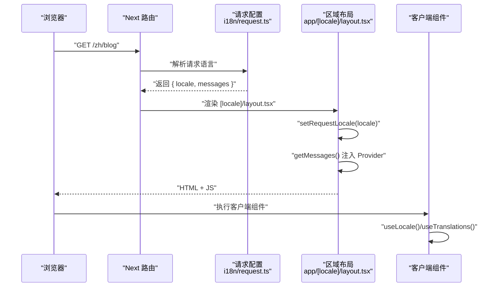
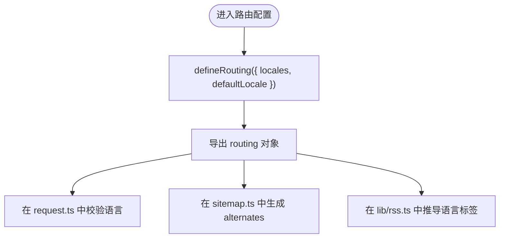
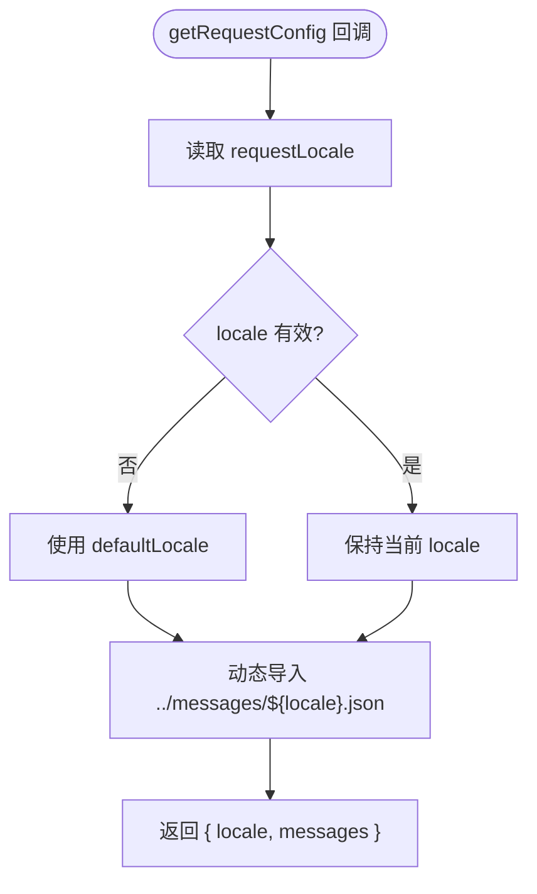
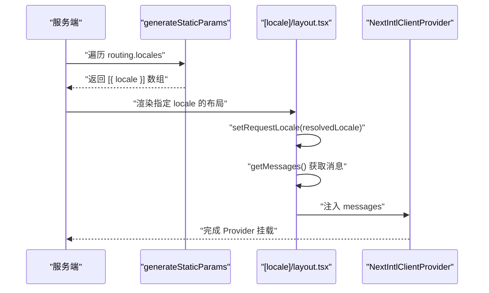
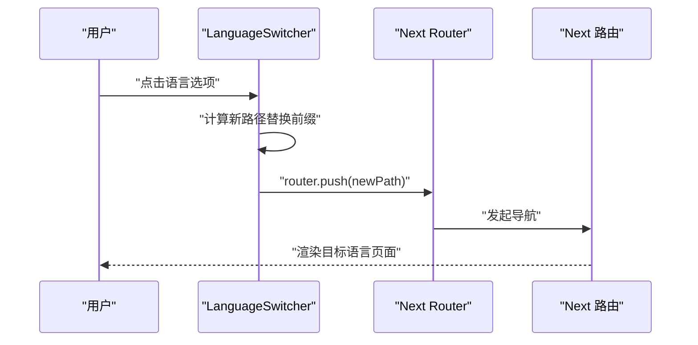
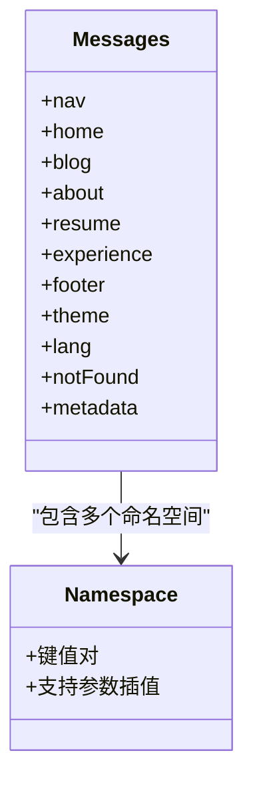
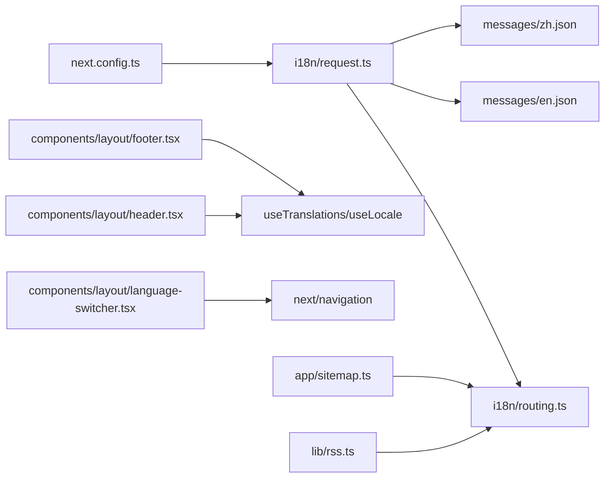

# 国际化系统

<cite>
**本文引用的文件列表**
- [i18n/routing.ts](file://i18n/routing.ts)
- [i18n/request.ts](file://i18n/request.ts)
- [next.config.ts](file://next.config.ts)
- [app/layout.tsx](file://app/layout.tsx)
- [app/[locale]/layout.tsx](file://app/[locale]/layout.tsx)
- [app/[locale]/page.tsx](file://app/[locale]/page.tsx)
- [components/layout/language-switcher.tsx](file://components/layout/language-switcher.tsx)
- [components/layout/header.tsx](file://components/layout/header.tsx)
- [components/layout/footer.tsx](file://components/layout/footer.tsx)
- [messages/en.json](file://messages/en.json)
- [messages/zh.json](file://messages/zh.json)
- [lib/rss.ts](file://lib/rss.ts)
- [app/sitemap.ts](file://app/sitemap.ts)
</cite>

## 目录
1. [简介](#简介)
2. [项目结构](#项目结构)
3. [核心组件](#核心组件)
4. [架构总览](#架构总览)
5. [详细组件分析](#详细组件分析)
6. [依赖关系分析](#依赖关系分析)
7. [性能考虑](#性能考虑)
8. [故障排查指南](#故障排查指南)
9. [结论](#结论)
10. [附录](#附录)

## 简介
本文件系统性地梳理并文档化基于 next-intl 的多语言支持实现方案，覆盖路由国际化、消息文件管理、动态语言切换、服务端与客户端的上下文处理、SEO 与站点地图的语言交替标注等。重点解析 routing.ts 的路由配置与语言前缀处理逻辑、request.ts 的请求上下文与语言检测机制，以及 messages 目录下多语言 JSON 的组织结构与键值管理规范；同时说明 language-switcher 组件的实现原理与交互流程，并提供新语言添加流程、翻译字符串管理策略与性能优化技巧，以及动态内容翻译、复数形式与日期格式化的最佳实践。

## 项目结构
本项目采用 Next.js App Router 与 next-intl 进行国际化：
- i18n 层：定义路由与请求配置，提供语言检测与消息加载能力
- app 层：[locale] 路由包裹所有页面，统一注入 NextIntlClientProvider
- components 层：语言切换器、头部、底部等 UI 组件使用 useTranslations/useLocale
- messages 层：按语言拆分的 JSON 文件，统一管理界面文案
- SEO 与站点地图：根据路由 locales 生成 alternates 与 RSS 语言信息

```mermaid
graph TB
subgraph "应用入口"
RootLayout["根布局<br/>app/layout.tsx"]
LocaleLayout["区域布局<br/>app/[locale]/layout.tsx"]
end
subgraph "国际化配置"
Routing["路由定义<br/>i18n/routing.ts"]
RequestConfig["请求配置<br/>i18n/request.ts"]
NextConfig["Next 插件集成<br/>next.config.ts"]
end
subgraph "UI 组件"
Header["头部导航<br/>components/layout/header.tsx"]
Footer["底部<br/>components/layout/footer.tsx"
LangSwitcher["语言切换器<br/>components/layout/language-switcher.tsx"]
end
subgraph "消息文件"
EN["en.json"]
ZH["zh.json"]
end
subgraph "SEO 与资源"
Sitemap["站点地图<br/>app/sitemap.ts"]
RSS["RSS 生成<br/>lib/rss.ts"]
end
RootLayout --> LocaleLayout
LocaleLayout --> Header
LocaleLayout --> Footer
Header --> LangSwitcher
NextConfig --> RequestConfig
RequestConfig --> Routing
RequestConfig --> EN
RequestConfig --> ZH
Sitemap --> Routing
RSS --> Routing
```

图表来源
- [app/layout.tsx:1-114](file://app/layout.tsx#L1-L114)
- [app/[locale]/layout.tsx:1-64](file://app/[locale]/layout.tsx#L1-L64)
- [i18n/routing.ts:1-6](file://i18n/routing.ts#L1-L6)
- [i18n/request.ts:1-15](file://i18n/request.ts#L1-L15)
- [next.config.ts:1-38](file://next.config.ts#L1-L38)
- [components/layout/header.tsx:1-270](file://components/layout/header.tsx#L1-L270)
- [components/layout/footer.tsx:1-81](file://components/layout/footer.tsx#L1-L81)
- [components/layout/language-switcher.tsx:1-53](file://components/layout/language-switcher.tsx#L1-L53)
- [messages/en.json:1-168](file://messages/en.json#L1-L168)
- [messages/zh.json:1-168](file://messages/zh.json#L1-L168)
- [app/sitemap.ts:1-39](file://app/sitemap.ts#L1-L39)
- [lib/rss.ts:1-46](file://lib/rss.ts#L1-L46)

章节来源
- [app/layout.tsx:1-114](file://app/layout.tsx#L1-L114)
- [app/[locale]/layout.tsx:1-64](file://app/[locale]/layout.tsx#L1-L64)
- [i18n/routing.ts:1-6](file://i18n/routing.ts#L1-L6)
- [i18n/request.ts:1-15](file://i18n/request.ts#L1-L15)
- [next.config.ts:1-38](file://next.config.ts#L1-L38)

## 核心组件
- 路由定义（routing.ts）：集中声明支持的 locales 与默认语言，供服务端与客户端共享
- 请求配置（request.ts）：在请求阶段解析语言、校验合法性并动态加载对应消息文件
- 区域布局（[locale]/layout.tsx）：验证 locale、设置请求语言、注入 NextIntlClientProvider
- 语言切换器（language-switcher.tsx）：通过路由器将路径前缀替换为新的语言代码
- 消息文件（messages/*.json）：以命名空间组织键值对，支持参数插值与层级结构

章节来源
- [i18n/routing.ts:1-6](file://i18n/routing.ts#L1-L6)
- [i18n/request.ts:1-15](file://i18n/request.ts#L1-L15)
- [app/[locale]/layout.tsx:1-64](file://app/[locale]/layout.tsx#L1-L64)
- [components/layout/language-switcher.tsx:1-53](file://components/layout/language-switcher.tsx#L1-L53)
- [messages/en.json:1-168](file://messages/en.json#L1-L168)
- [messages/zh.json:1-168](file://messages/zh.json#L1-L168)

## 架构总览
下图展示了从浏览器访问到渲染的关键流程：URL 中的语言前缀被路由解析，服务端在 request.ts 中完成语言检测与消息加载，随后在 [locale]/layout.tsx 中注入 Provider，最终在组件中使用 useTranslations/useLocale 获取当前语言与文案。



图表来源
- [i18n/request.ts:1-15](file://i18n/request.ts#L1-L15)
- [app/[locale]/layout.tsx:1-64](file://app/[locale]/layout.tsx#L1-L64)
- [components/layout/language-switcher.tsx:1-53](file://components/layout/language-switcher.tsx#L1-L53)

## 详细组件分析

### 路由配置与语言前缀处理（routing.ts）
- 职责：集中声明支持的语言集合与默认语言，作为全局单例供其他模块复用
- 关键点：
  - 使用 defineRouting 定义 locales 与 defaultLocale
  - 被 request.ts 用于校验传入语言是否合法
  - 被 sitemap.ts 与 RSS 生成逻辑用于枚举语言变体



图表来源
- [i18n/routing.ts:1-6](file://i18n/routing.ts#L1-L6)
- [i18n/request.ts:1-15](file://i18n/request.ts#L1-L15)
- [app/sitemap.ts:1-39](file://app/sitemap.ts#L1-L39)
- [lib/rss.ts:1-46](file://lib/rss.ts#L1-L46)

章节来源
- [i18n/routing.ts:1-6](file://i18n/routing.ts#L1-L6)

### 请求上下文与语言检测（request.ts）
- 职责：在服务端请求阶段确定最终使用的语言，并动态加载对应的消息文件
- 关键流程：
  - 读取 requestLocale（来自 URL 前缀或 Cookie/Header）
  - 若未提供或不在支持列表中，回退至 defaultLocale
  - 使用动态 import 按需加载 messages/{locale}.json
  - 返回 { locale, messages } 供后续渲染使用



图表来源
- [i18n/request.ts:1-15](file://i18n/request.ts#L1-L15)
- [i18n/routing.ts:1-6](file://i18n/routing.ts#L1-L6)

章节来源
- [i18n/request.ts:1-15](file://i18n/request.ts#L1-L15)

### 区域布局与 Provider 注入（[locale]/layout.tsx）
- 职责：校验 locale、启用静态渲染、注入 NextIntlClientProvider
- 关键点：
  - generateStaticParams 基于 routing.locales 预生成静态参数
  - setRequestLocale 标记当前请求语言，配合 getMessages 获取已加载的消息
  - 将 messages 传递给 NextIntlClientProvider，使客户端可用 useTranslations/useLocale



图表来源
- [app/[locale]/layout.tsx:1-64](file://app/[locale]/layout.tsx#L1-L64)
- [i18n/routing.ts:1-6](file://i18n/routing.ts#L1-L6)

章节来源
- [app/[locale]/layout.tsx:1-64](file://app/[locale]/layout.tsx#L1-L64)

### 语言切换器实现与交互（language-switcher.tsx）
- 职责：提供下拉菜单切换语言，更新 URL 前缀
- 交互流程：
  - 使用 useLocale 获取当前语言
  - 点击选项后，移除旧语言前缀并拼接新语言前缀
  - 使用 router.push 导航到新路径，触发服务端重新渲染



图表来源
- [components/layout/language-switcher.tsx:1-53](file://components/layout/language-switcher.tsx#L1-L53)

章节来源
- [components/layout/language-switcher.tsx:1-53](file://components/layout/language-switcher.tsx#L1-L53)

### 消息文件组织与键值规范（messages/*.json）
- 组织结构：
  - 每个语言一个 JSON 文件，文件名与 routing.locales 一一对应
  - 顶层键为命名空间（如 nav、home、blog、about、resume、experience、footer、theme、lang、notFound、metadata）
  - 子级键为具体文案，支持参数占位符（如 {count}、{time}、{query}、{category}、{date}、{year}、{name}、{profession}）
- 使用方式：
  - 服务端：getTranslations(namespace) 获取命名空间下的 t 函数
  - 客户端：useTranslations(namespace) 获取 t 函数
  - 调用示例：t("stats.skills", { count })、t("readingTime", { time })、t("copyright", { year, name })



图表来源
- [messages/en.json:1-168](file://messages/en.json#L1-L168)
- [messages/zh.json:1-168](file://messages/zh.json#L1-L168)

章节来源
- [messages/en.json:1-168](file://messages/en.json#L1-L168)
- [messages/zh.json:1-168](file://messages/zh.json#L1-L168)

### 头部与底部组件的国际化使用
- 头部（header.tsx）：
  - 使用 useTranslations("nav") 渲染导航项
  - 使用 useLocale 构建带语言前缀的链接
  - 集成 LanguageSwitcher 与 ThemeToggle
- 底部（footer.tsx）：
  - 使用 useTranslations("footer") 渲染版权与社交信息
  - 使用 useLocale 构建语言相关链接

章节来源
- [components/layout/header.tsx:1-270](file://components/layout/header.tsx#L1-L270)
- [components/layout/footer.tsx:1-81](file://components/layout/footer.tsx#L1-L81)

### 首页与服务端翻译（app/[locale]/page.tsx）
- 在服务端使用 getTranslations 获取 metadata.home 命名空间的标题与描述
- 结合 buildPageMetadata 生成页面元数据，确保 SEO 友好

章节来源
- [app/[locale]/page.tsx:1-37](file://app/[locale]/page.tsx#L1-L37)

### 站点地图与 RSS 的语言交替
- 站点地图（sitemap.ts）：
  - 基于 routing.locales 生成各语言的 URL 与 alternates.languages
- RSS（lib/rss.ts）：
  - 根据 locale 映射语言标签（如 zh-CN、en-US）

章节来源
- [app/sitemap.ts:1-39](file://app/sitemap.ts#L1-L39)
- [lib/rss.ts:1-46](file://lib/rss.ts#L1-L46)

## 依赖关系分析
- next-intl 插件集成：
  - next.config.ts 通过 createNextIntlPlugin 指向 i18n/request.ts，使框架在构建与运行时正确识别国际化配置
- 组件耦合：
  - header.tsx 与 footer.tsx 强依赖 useTranslations/useLocale
  - language-switcher.tsx 依赖 useRouter/usePathname 进行路径操作
- SEO 与资源：
  - sitemap.ts 与 rss.ts 依赖 routing.locales 生成多语言变体



图表来源
- [next.config.ts:1-38](file://next.config.ts#L1-L38)
- [i18n/request.ts:1-15](file://i18n/request.ts#L1-L15)
- [i18n/routing.ts:1-6](file://i18n/routing.ts#L1-L6)
- [messages/en.json:1-168](file://messages/en.json#L1-L168)
- [messages/zh.json:1-168](file://messages/zh.json#L1-L168)
- [components/layout/header.tsx:1-270](file://components/layout/header.tsx#L1-L270)
- [components/layout/footer.tsx:1-81](file://components/layout/footer.tsx#L1-L81)
- [components/layout/language-switcher.tsx:1-53](file://components/layout/language-switcher.tsx#L1-L53)
- [app/sitemap.ts:1-39](file://app/sitemap.ts#L1-L39)
- [lib/rss.ts:1-46](file://lib/rss.ts#L1-L46)

章节来源
- [next.config.ts:1-38](file://next.config.ts#L1-L38)
- [i18n/request.ts:1-15](file://i18n/request.ts#L1-L15)
- [i18n/routing.ts:1-6](file://i18n/routing.ts#L1-L6)
- [app/sitemap.ts:1-39](file://app/sitemap.ts#L1-L39)
- [lib/rss.ts:1-46](file://lib/rss.ts#L1-L46)

## 性能考虑
- 动态消息加载：
  - request.ts 使用动态 import 按需加载 messages/{locale}.json，避免一次性打包全部语言包
- 静态生成：
  - [locale]/layout.tsx 使用 generateStaticParams 预生成所有语言变体的静态页面，减少首屏延迟
- 客户端最小化：
  - 仅在需要时引入 useTranslations/useLocale，避免不必要的重渲染
- 建议优化：
  - 将大型命名空间拆分到独立文件并通过懒加载合并（例如 blog、about 等大命名空间）
  - 对高频使用的命名空间（如 nav、footer）保持精简，减少重复渲染开销
  - 利用缓存策略（CDN）缓存静态 HTML 与 JSON 资源

[本节为通用指导，不直接分析具体文件]

## 故障排查指南
- 语言无效导致 404：
  - 现象：访问 /xx/... 时显示 not found
  - 原因：resolvedLocale 不在 routing.locales 中，[locale]/layout.tsx 会主动 notFound
  - 解决：确认 URL 前缀是否为 en 或 zh，或在 routing.ts 中添加新语言
- 语言切换后页面未刷新：
  - 现象：点击语言切换器后 URL 变化但内容不变
  - 原因：客户端未触发服务端渲染或缓存问题
  - 解决：检查 router.push 是否正确替换前缀，确认 NextIntlClientProvider 已注入
- 翻译缺失或键不存在：
  - 现象：页面显示键名或未定义
  - 原因：messages 文件中缺少对应命名空间或键
  - 解决：在 en.json 与 zh.json 中补齐键值，确保命名空间一致
- 日期格式化异常：
  - 现象：日期显示不正确
  - 原因：未使用正确的 locale 或格式化选项
  - 解决：使用 toLocaleDateString(locale, options)，参考 blog-content.tsx 与 blog-card.tsx 的使用方式

章节来源
- [app/[locale]/layout.tsx:1-64](file://app/[locale]/layout.tsx#L1-L64)
- [components/layout/language-switcher.tsx:1-53](file://components/layout/language-switcher.tsx#L1-L53)
- [messages/en.json:1-168](file://messages/en.json#L1-L168)
- [messages/zh.json:1-168](file://messages/zh.json#L1-L168)

## 结论
本项目通过 next-intl 实现了完整的多语言支持：路由前缀驱动的语言选择、服务端的语言检测与消息加载、客户端的动态切换与渲染、以及 SEO 友好的多语言站点地图与 RSS。整体架构清晰、扩展性强，新增语言只需在 routing.ts 与 messages 中添加对应文件，并在必要处补充命名空间即可。

[本节为总结性内容，不直接分析具体文件]

## 附录

### 新语言添加流程
- 步骤：
  1. 在 routing.ts 的 locales 数组中添加新语言代码
  2. 在 messages 目录下创建新语言 JSON 文件（如 fr.json），复制现有命名空间并翻译
  3. 在 [locale]/layout.tsx 的类型校验中允许新语言（如需）
  4. 在 sitemap.ts 与 RSS 生成逻辑中自动生效（基于 routing.locales）
  5. 在 language-switcher.tsx 的 locales 列表中添加新语言条目
- 注意事项：
  - 确保所有命名空间在新语言文件中存在，避免运行时缺失
  - 若涉及 SEO 元数据，需在 metadata 命名空间中补齐标题与描述

章节来源
- [i18n/routing.ts:1-6](file://i18n/routing.ts#L1-L6)
- [messages/en.json:1-168](file://messages/en.json#L1-L168)
- [messages/zh.json:1-168](file://messages/zh.json#L1-L168)
- [app/[locale]/layout.tsx:1-64](file://app/[locale]/layout.tsx#L1-L64)
- [app/sitemap.ts:1-39](file://app/sitemap.ts#L1-L39)
- [lib/rss.ts:1-46](file://lib/rss.ts#L1-L46)
- [components/layout/language-switcher.tsx:1-53](file://components/layout/language-switcher.tsx#L1-L53)

### 翻译字符串管理策略
- 命名空间划分：
  - 按功能域划分（nav、home、blog、about、resume、experience、footer、theme、lang、notFound、metadata）
- 键值规范：
  - 使用小写与下划线分隔（如 latestPostsSubtitle、noPostsHint）
  - 参数占位符使用花括号（如 {count}、{time}、{query}、{category}、{date}、{year}、{name}、{profession}）
- 一致性：
  - 同一语义在不同页面使用相同键，便于维护与查找
- 工具辅助：
  - 可引入类型生成工具（如 @lingui/swc-plugin 或 next-intl 的类型提示）提升开发体验

章节来源
- [messages/en.json:1-168](file://messages/en.json#L1-L168)
- [messages/zh.json:1-168](file://messages/zh.json#L1-L168)

### 动态内容翻译、复数形式与日期格式化最佳实践
- 动态内容翻译：
  - 在服务端使用 getTranslations(namespace) 获取 t 函数，在客户端使用 useTranslations(namespace)
  - 通过参数插值传递变量（如 t("stats.posts", { count })）
- 复数形式：
  - 当前项目使用参数插值（如 "{count} skills"）而非 ICU 复数规则
  - 若需复杂复数规则，可引入 ICU MessageFormat 或第三方库
- 日期格式化：
  - 使用 toLocaleDateString(locale, options) 并按需设置 month/day/year 等选项
  - 参考 blog-content.tsx 与 blog-card.tsx 中的用法

章节来源
- [app/[locale]/page.tsx:1-37](file://app/[locale]/page.tsx#L1-L37)
- [components/home/home-content.tsx:1-200](file://components/home/home-content.tsx#L1-L200)
- [components/blog/blog-content.tsx:85-170](file://components/blog/blog-content.tsx#L85-L170)
- [components/blog/blog-card.tsx:40-75](file://components/blog/blog-card.tsx#L40-L75)