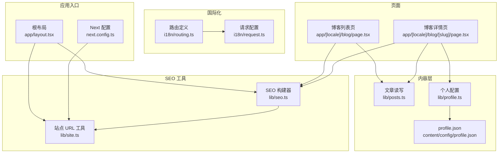
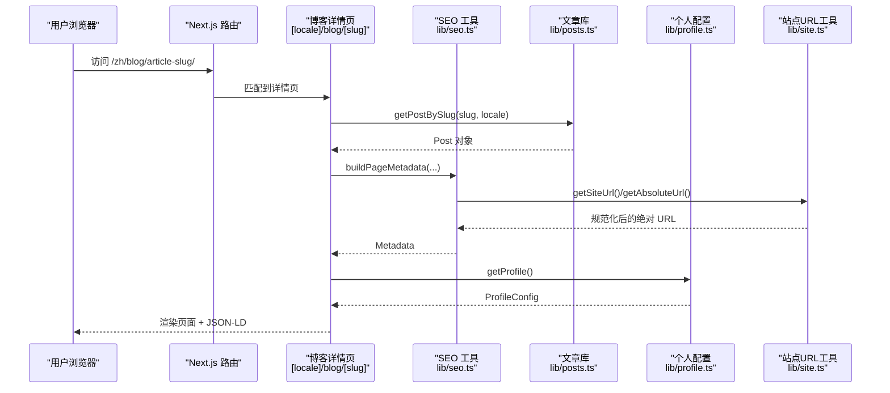
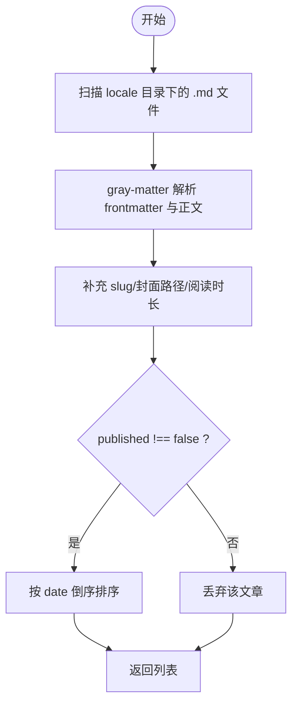
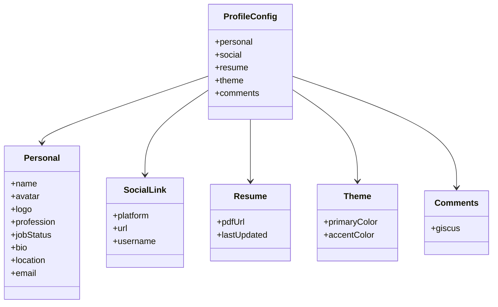
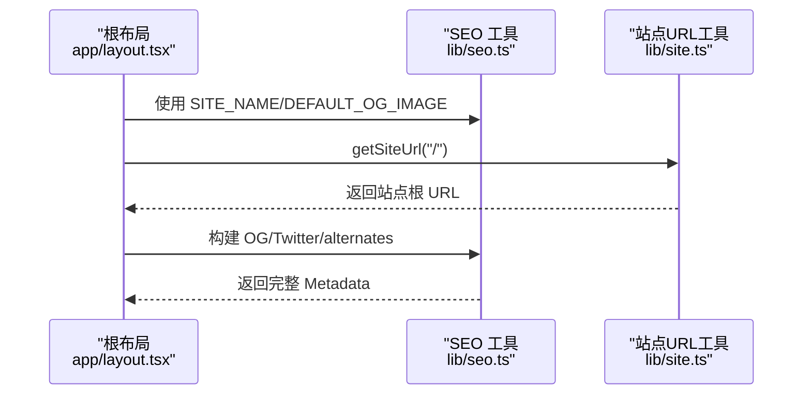
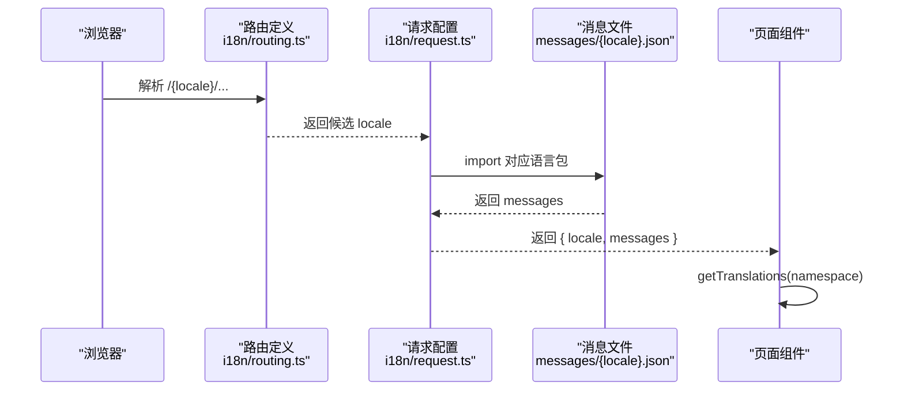
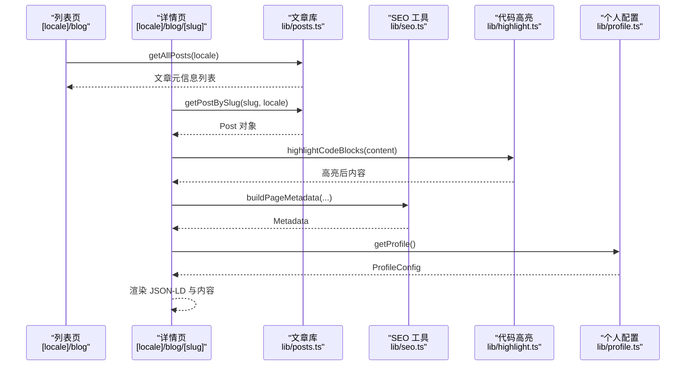
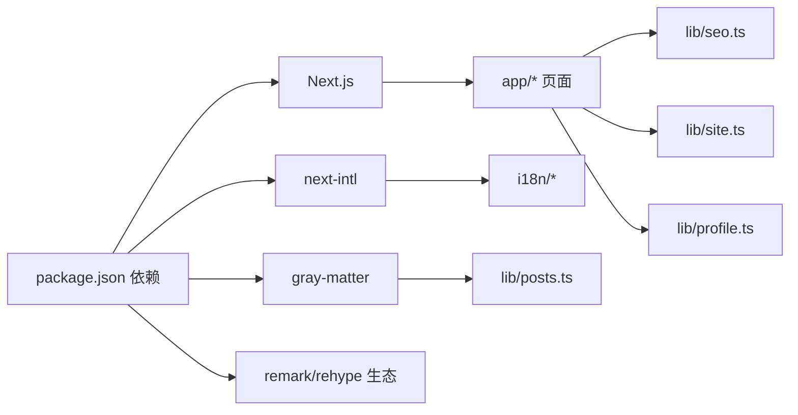

# 核心功能模块

<cite>
**本文引用的文件**   
- [package.json](file://package.json)
- [README.md](file://README.md)
- [next.config.ts](file://next.config.ts)
- [app/layout.tsx](file://app/layout.tsx)
- [i18n/routing.ts](file://i18n/routing.ts)
- [i18n/request.ts](file://i18n/request.ts)
- [lib/posts.ts](file://lib/posts.ts)
- [lib/seo.ts](file://lib/seo.ts)
- [lib/site.ts](file://lib/site.ts)
- [lib/profile.ts](file://lib/profile.ts)
- [content/config/profile.json](file://content/config/profile.json)
- [types/post.ts](file://types/post.ts)
- [types/profile.ts](file://types/profile.ts)
- [app/[locale]/blog/page.tsx](file://app/[locale]/blog/page.tsx)
- [app/[locale]/blog/[slug]/page.tsx](file://app/[locale]/blog/[slug]/page.tsx)
</cite>

## 目录
1. [简介](#简介)
2. [项目结构](#项目结构)
3. [核心组件](#核心组件)
4. [架构总览](#架构总览)
5. [详细组件分析](#详细组件分析)
6. [依赖关系分析](#依赖关系分析)
7. [性能考量](#性能考量)
8. [故障排查指南](#故障排查指南)
9. [结论](#结论)
10. [附录](#附录)

## 简介
本文件聚焦博客系统的核心功能模块，围绕以下关键能力进行系统化说明：
- 博客文章管理系统：基于文件系统与 Markdown frontmatter 的静态内容管理、列表与详情渲染、标签/分类聚合、相关文章推荐。
- 个人展示模块：个人信息、社交链接、简历 PDF、主题配置等集中式配置与读取。
- SEO 优化引擎：站点级元信息、多语言 alternates、OpenGraph/Twitter Card、JSON-LD（Person/WebSite/BreadcrumbList/BlogPosting）。
- 国际化系统：基于 next-intl 的多语言路由与消息加载、默认语言回退策略。

文档同时给出模块间的依赖关系、数据流、扩展点与最佳实践，帮助开发者快速理解并高效扩展。

## 项目结构
整体采用 Next.js App Router + 静态导出模式，结合 next-intl 实现多语言，使用 gray-matter 解析 Markdown frontmatter，并通过 lib 层统一封装业务逻辑。

图表来源
- [app/layout.tsx:1-114](file://app/layout.tsx#L1-L114)
- [next.config.ts:1-38](file://next.config.ts#L1-L38)
- [i18n/routing.ts:1-6](file://i18n/routing.ts#L1-L6)
- [i18n/request.ts:1-15](file://i18n/request.ts#L1-L15)
- [lib/posts.ts:1-121](file://lib/posts.ts#L1-L121)
- [lib/seo.ts:1-199](file://lib/seo.ts#L1-L199)
- [lib/site.ts:1-35](file://lib/site.ts#L1-L35)
- [lib/profile.ts:1-30](file://lib/profile.ts#L1-L30)
- [content/config/profile.json:1-66](file://content/config/profile.json#L1-L66)
- [app/[locale]/blog/page.tsx:1-34](file://app/[locale]/blog/page.tsx#L1-L34)
- [app/[locale]/blog/[slug]/page.tsx:1-180](file://app/[locale]/blog/[slug]/page.tsx#L1-L180)

章节来源
- [README.md:33-67](file://README.md#L33-L67)
- [package.json:1-47](file://package.json#L1-L47)

## 核心组件
- 博客文章管理
  - 通过 lib/posts.ts 提供获取文章列表、按 slug 获取详情、标签/分类聚合、相关度排序的文章推荐等能力。
  - 类型定义集中在 types/post.ts，确保 frontmatter 字段与返回结构的强类型约束。
- 个人展示模块
  - 通过 lib/profile.ts 读取 content/config/profile.json，并对图片路径进行 basePath 适配；提供社交链接查询与 PDF 地址获取。
  - 类型定义集中在 types/profile.ts，包含 Giscus 评论配置等。
- SEO 优化引擎
  - 通过 lib/seo.ts 提供站点名、默认语言、OG 图常量，以及 buildPageMetadata、多语言 alternates、JSON-LD（Person/WebSite/BreadcrumbList）生成与序列化。
  - 文章详情页额外注入 BlogPosting JSON-LD。
- 国际化系统
  - i18n/routing.ts 声明支持的语言与默认语言；i18n/request.ts 在请求时动态加载对应 messages 并做回退处理。
  - 页面中使用 getTranslations/setRequestLocale 配合 next-intl 服务端 API。

章节来源
- [lib/posts.ts:1-121](file://lib/posts.ts#L1-L121)
- [types/post.ts:1-20](file://types/post.ts#L1-L20)
- [lib/profile.ts:1-30](file://lib/profile.ts#L1-L30)
- [types/profile.ts:1-52](file://types/profile.ts#L1-L52)
- [lib/seo.ts:1-199](file://lib/seo.ts#L1-L199)
- [i18n/routing.ts:1-6](file://i18n/routing.ts#L1-L6)
- [i18n/request.ts:1-15](file://i18n/request.ts#L1-L15)

## 架构总览
系统以“页面 -> lib 工具 -> 资源/配置”的分层组织，强调无状态与可组合性：
- 页面层负责组装数据、调用工具函数、渲染 UI。
- lib 层封装跨页面的通用逻辑（文章、SEO、站点 URL、个人配置）。
- 配置与内容位于 content 与 public 目录，便于非代码维护。

图表来源
- [app/[locale]/blog/[slug]/page.tsx:1-180](file://app/[locale]/blog/[slug]/page.tsx#L1-L180)
- [lib/seo.ts:1-199](file://lib/seo.ts#L1-L199)
- [lib/posts.ts:1-121](file://lib/posts.ts#L1-L121)
- [lib/profile.ts:1-30](file://lib/profile.ts#L1-L30)
- [lib/site.ts:1-35](file://lib/site.ts#L1-L35)

## 详细组件分析

### 博客文章管理系统
- 数据源与解析
  - 扫描 content/posts/{locale} 下的 .md 文件，使用 gray-matter 解析 frontmatter 与正文。
  - 计算阅读时长（字数/每分钟词数），对封面图片路径进行 basePath 适配。
- 列表与筛选
  - 提供 getAllPosts、getAllTags、getAllCategories、getPostsByTag、getPostsByCategory。
  - 过滤未发布文章并按发布日期倒序排列。
- 相关文章推荐
  - 基于标签重叠权重与同分类加分的相关度评分，取 Top-N。
- 类型契约
  - PostFrontmatter/Post/PostMeta 明确 frontmatter 字段与返回结构。

图表来源
- [lib/posts.ts:1-121](file://lib/posts.ts#L1-L121)
- [types/post.ts:1-20](file://types/post.ts#L1-L20)

章节来源
- [lib/posts.ts:1-121](file://lib/posts.ts#L1-L121)
- [types/post.ts:1-20](file://types/post.ts#L1-L20)

### 个人展示模块
- 配置中心
  - profile.json 集中存放个人信息、社交链接、简历 PDF、主题色、Giscus 评论配置等。
- 读取与适配
  - lib/profile.ts 读取配置并对头像/Logo 等图片路径执行 basePath 适配；提供 getPdfUrl 用于 iframe 等原生元素场景。
- 类型约束
  - types/profile.ts 定义了 SocialLink、GiscusConfig、ProfileConfig 等接口，保证配置项的类型安全。

图表来源
- [types/profile.ts:1-52](file://types/profile.ts#L1-L52)
- [content/config/profile.json:1-66](file://content/config/profile.json#L1-L66)
- [lib/profile.ts:1-30](file://lib/profile.ts#L1-L30)

章节来源
- [lib/profile.ts:1-30](file://lib/profile.ts#L1-L30)
- [types/profile.ts:1-52](file://types/profile.ts#L1-L52)
- [content/config/profile.json:1-66](file://content/config/profile.json#L1-L66)

### SEO 优化引擎
- 站点级元信息
  - app/layout.tsx 设置 metadataBase、标题模板、描述、作者、图标、robots、OpenGraph/Twitter 基础信息等。
- 页面级元信息
  - lib/seo.ts 提供 buildPageMetadata，自动注入 canonical、多语言 alternates、OG/Twitter 卡片、robots 等。
- JSON-LD
  - 提供 Person、WebSite、BreadcrumbList 生成；文章详情页注入 BlogPosting。
- 站点 URL 工具
  - lib/site.ts 根据环境变量拼接 origin/basePath/path，提供 getSiteUrl/getAbsoluteUrl。

图表来源
- [app/layout.tsx:1-114](file://app/layout.tsx#L1-L114)
- [lib/seo.ts:1-199](file://lib/seo.ts#L1-L199)
- [lib/site.ts:1-35](file://lib/site.ts#L1-L35)

章节来源
- [app/layout.tsx:1-114](file://app/layout.tsx#L1-L114)
- [lib/seo.ts:1-199](file://lib/seo.ts#L1-L199)
- [lib/site.ts:1-35](file://lib/site.ts#L1-L35)

### 国际化系统
- 路由与消息加载
  - i18n/routing.ts 声明 locales 与 defaultLocale。
  - i18n/request.ts 在请求时选择有效 locale，否则回退至默认语言，并动态 import messages/{locale}.json。
- 页面集成
  - 页面中通过 setRequestLocale 与 getTranslations 获取翻译键值，并在 generateMetadata 中构造多语言元信息。

图表来源
- [i18n/routing.ts:1-6](file://i18n/routing.ts#L1-L6)
- [i18n/request.ts:1-15](file://i18n/request.ts#L1-L15)
- [app/[locale]/blog/page.tsx:1-34](file://app/[locale]/blog/page.tsx#L1-L34)

章节来源
- [i18n/routing.ts:1-6](file://i18n/routing.ts#L1-L6)
- [i18n/request.ts:1-15](file://i18n/request.ts#L1-L15)
- [app/[locale]/blog/page.tsx:1-34](file://app/[locale]/blog/page.tsx#L1-L34)

### 博客列表与详情页协作流程
- 列表页
  - 从 lib/posts.ts 拉取 posts/tags/categories，并传入 BlogList 组件渲染。
- 详情页
  - 预生成参数 generateStaticParams 遍历所有语言与文章生成静态路由。
  - generateMetadata 根据文章 frontmatter 与 SEO 工具生成丰富元信息。
  - 渲染前计算高亮代码块、相关文章、JSON-LD 等。

图表来源
- [app/[locale]/blog/page.tsx:1-34](file://app/[locale]/blog/page.tsx#L1-L34)
- [app/[locale]/blog/[slug]/page.tsx:1-180](file://app/[locale]/blog/[slug]/page.tsx#L1-L180)
- [lib/posts.ts:1-121](file://lib/posts.ts#L1-L121)
- [lib/seo.ts:1-199](file://lib/seo.ts#L1-L199)
- [lib/profile.ts:1-30](file://lib/profile.ts#L1-L30)

章节来源
- [app/[locale]/blog/page.tsx:1-34](file://app/[locale]/blog/page.tsx#L1-L34)
- [app/[locale]/blog/[slug]/page.tsx:1-180](file://app/[locale]/blog/[slug]/page.tsx#L1-L180)

## 依赖关系分析
- 外部依赖
  - next、react、next-intl、gray-matter、rehype/shiki 生态（用于代码高亮）、tailwind 等。
- 内部耦合
  - 页面层依赖 lib 层；lib 层之间低耦合，通过工具函数组合。
  - 配置文件与类型定义作为稳定契约，降低变更风险。

图表来源
- [package.json:1-47](file://package.json#L1-L47)
- [app/[locale]/blog/page.tsx:1-34](file://app/[locale]/blog/page.tsx#L1-L34)
- [app/[locale]/blog/[slug]/page.tsx:1-180](file://app/[locale]/blog/[slug]/page.tsx#L1-L180)
- [lib/posts.ts:1-121](file://lib/posts.ts#L1-L121)
- [lib/seo.ts:1-199](file://lib/seo.ts#L1-L199)
- [lib/site.ts:1-35](file://lib/site.ts#L1-L35)
- [lib/profile.ts:1-30](file://lib/profile.ts#L1-L30)

章节来源
- [package.json:1-47](file://package.json#L1-L47)

## 性能考量
- 静态导出与预渲染
  - 通过 output: export 与 trailingSlash 输出纯静态站点，适合 GitHub Pages 部署。
  - 详情页使用 generateStaticParams 预生成所有语言与文章的静态路由，提升首屏与 SEO。
- 资源优化
  - images.unoptimized: true 适配静态导出环境，避免运行时图片优化开销。
  - 代码高亮在构建期完成，减少客户端计算。
- 缓存与体积
  - 建议开启浏览器缓存与压缩（见 README 的 Docker/Nginx 示例）。
  - 图片资源建议预处理压缩，减小传输体积。

章节来源
- [next.config.ts:1-38](file://next.config.ts#L1-L38)
- [app/[locale]/blog/[slug]/page.tsx:1-180](file://app/[locale]/blog/[slug]/page.tsx#L1-L180)
- [README.md:443-546](file://README.md#L443-L546)

## 故障排查指南
- 构建失败
  - 检查 Node.js 版本与依赖安装；确认 Markdown frontmatter 格式正确。
- 部署问题
  - 用户站点与项目站点的 basePath/assetPrefix 差异需与环境变量 DEPLOY_TARGET 一致。
  - 静态导出不支持服务端特性（API Routes、ISR 等）。
- 国际化异常
  - 确认 i18n/routing.ts 中的 locales 与 messages 文件存在且命名一致。
  - 若请求 locale 不在支持列表，将回退到默认语言。
- 资源路径错误
  - 检查 getSiteUrl/getAbsoluteUrl 的使用场景，确保 basePath 拼接正确。
  - 头像/Logo 等图片路径由 lib/profile.ts 统一适配，iframe 等原生元素请使用 getPdfUrl。

章节来源
- [README.md:577-582](file://README.md#L577-L582)
- [next.config.ts:1-38](file://next.config.ts#L1-L38)
- [i18n/routing.ts:1-6](file://i18n/routing.ts#L1-L6)
- [i18n/request.ts:1-15](file://i18n/request.ts#L1-L15)
- [lib/site.ts:1-35](file://lib/site.ts#L1-L35)
- [lib/profile.ts:1-30](file://lib/profile.ts#L1-L30)

## 结论
本博客系统以“配置驱动 + 静态优先”的方式实现了可扩展的博客平台。通过清晰的模块划分与工具化封装，文章管理、个人展示、SEO 与国际化四大核心能力相互解耦又紧密协作，既满足日常写作与展示需求，也为后续扩展（如新增语言、接入新评论系统、增强搜索与统计）提供了良好基础。

## 附录
- 配置选项速览
  - 站点与部署
    - DEPLOY_TARGET：切换用户站点/项目站点模式（影响 basePath/assetPrefix）。
    - NEXT_PUBLIC_SITE_URL：站点根 URL（生产/开发区分）。
    - NEXT_PUBLIC_BASE_PATH：子路径前缀（项目站点模式）。
  - 个人配置（profile.json）
    - personal/social/resume/theme/comments 等字段集中管理。
  - 国际化
    - i18n/routing.ts 中 locales/defaultLocale 控制语言集合与默认语言。
- 扩展点建议
  - 新增语言：在 routing 中添加语言、创建 messages/{lang}.json、content/posts/{lang} 目录。
  - 新增评论系统：在 profile.json.comments 下扩展配置，并在详情页组件中按需渲染。
  - 自定义 SEO：复用 buildPageMetadata 并在页面级覆盖特定字段。
- 最佳实践
  - 保持 frontmatter 字段规范与必填校验。
  - 使用 lib/site.ts 提供的 URL 工具统一处理路径与资源地址。
  - 为长文添加 coverImage 与 tags/category，提升分享效果与导航体验。

章节来源
- [next.config.ts:1-38](file://next.config.ts#L1-L38)
- [content/config/profile.json:1-66](file://content/config/profile.json#L1-L66)
- [i18n/routing.ts:1-6](file://i18n/routing.ts#L1-L6)
- [lib/seo.ts:1-199](file://lib/seo.ts#L1-L199)
- [lib/site.ts:1-35](file://lib/site.ts#L1-L35)