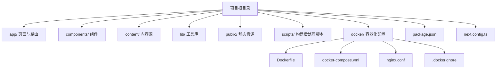
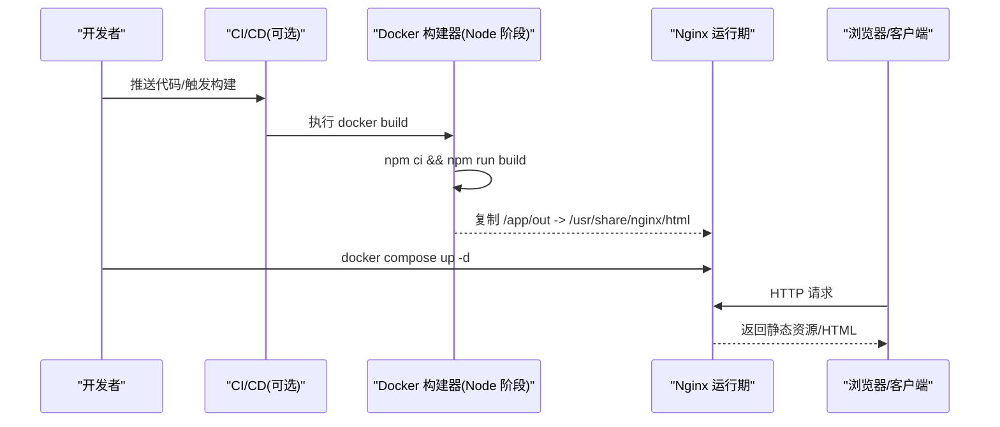
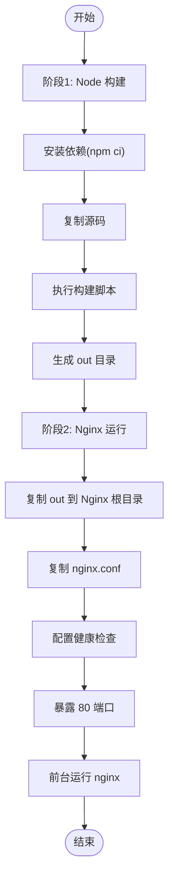
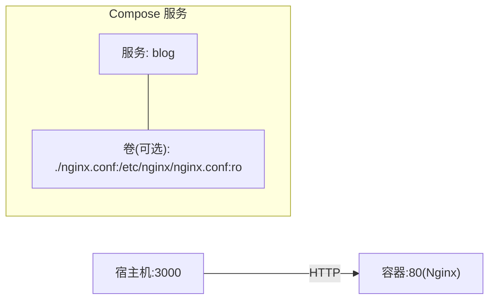
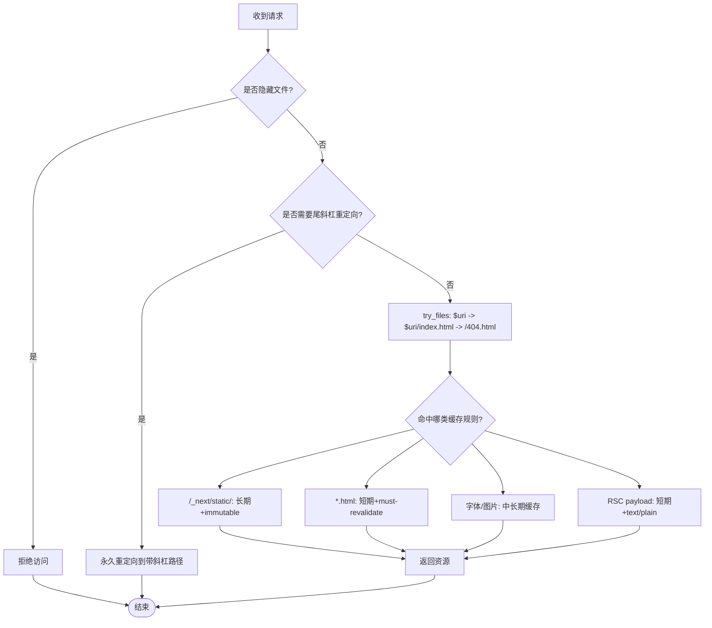
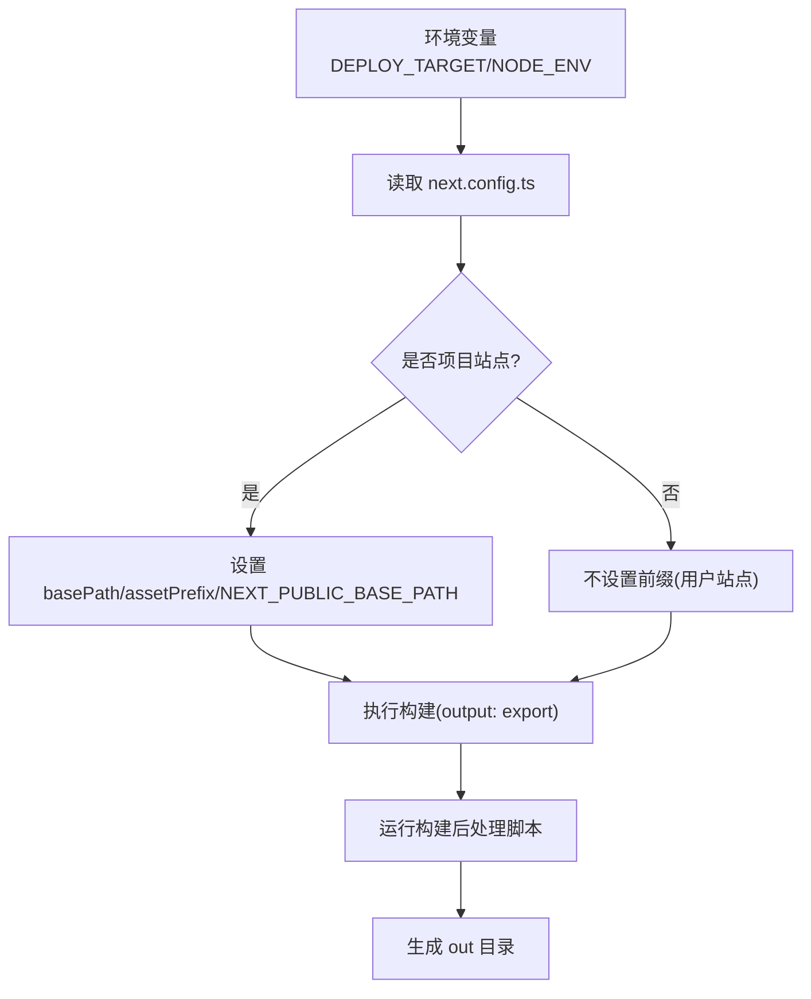
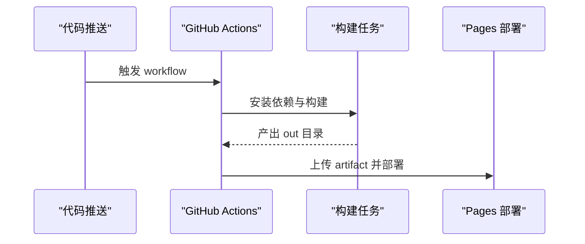
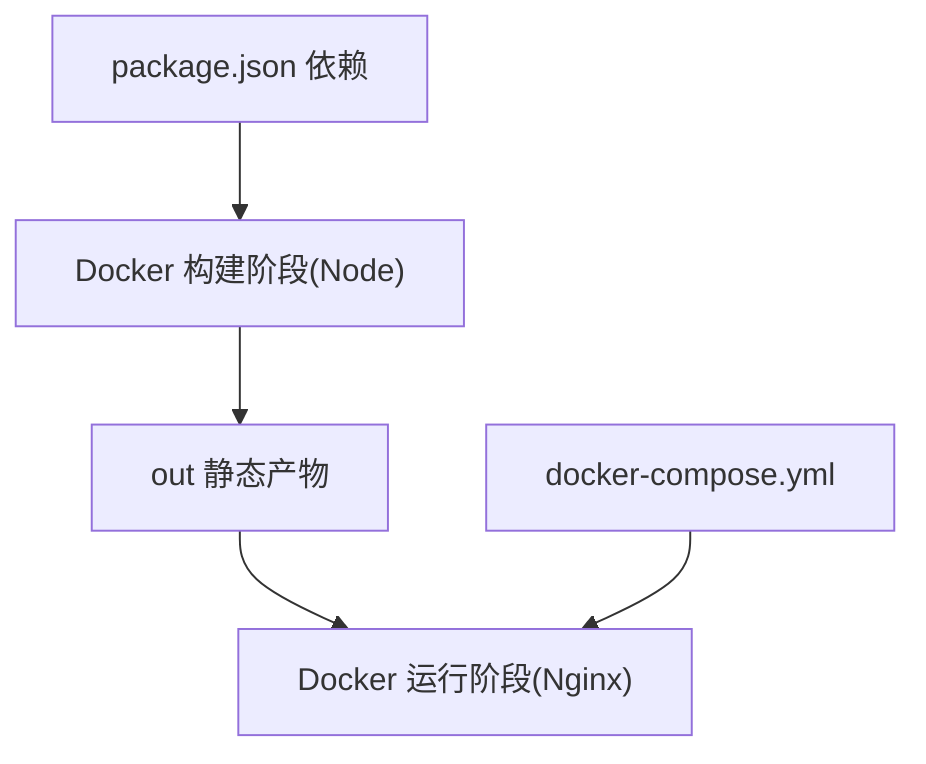

# Docker 容器化部署

<cite>
**本文引用的文件**   
- [docker/Dockerfile](file://docker/Dockerfile)
- [docker/docker-compose.yml](file://docker/docker-compose.yml)
- [docker/nginx.conf](file://docker/nginx.conf)
- [docker/.dockerignore](file://docker/.dockerignore)
- [package.json](file://package.json)
- [next.config.ts](file://next.config.ts)
- [.github/workflows/deploy.yml.bak](file://.github/workflows/deploy.yml.bak)
</cite>

## 目录
1. [简介](#简介)
2. [项目结构](#项目结构)
3. [核心组件](#核心组件)
4. [架构总览](#架构总览)
5. [详细组件分析](#详细组件分析)
6. [依赖关系分析](#依赖关系分析)
7. [性能与缓存优化](#性能与缓存优化)
8. [健康检查、日志与监控](#健康检查日志与监控)
9. [生产环境最佳实践](#生产环境最佳实践)
10. [故障排除指南](#故障排除指南)
11. [结论](#结论)

## 简介
本指南面向使用 Next.js 静态导出（output: export）的博客项目，提供基于多阶段构建的 Docker 镜像方案：Node.js 构建阶段生成静态站点，Nginx 运行阶段提供高性能反向代理与静态资源服务。文档涵盖 docker-compose 编排、环境变量管理、数据卷挂载、网络配置、Nginx 反向代理策略（含缓存、Gzip、安全头）、健康检查、日志管理与监控集成，以及生产环境最佳实践与排障方法。

## 项目结构
本项目采用“应用源码 + 容器化配置”分离的组织方式：
- 应用源码位于根目录（Next.js 应用），通过脚本完成构建并输出到 out 目录
- 容器化相关配置集中在 docker 目录中，包括 Dockerfile、docker-compose.yml、nginx.conf 和 .dockerignore

**图表来源** 
- [docker/Dockerfile:1-32](file://docker/Dockerfile#L1-L32)
- [docker/docker-compose.yml:1-15](file://docker/docker-compose.yml#L1-L15)
- [docker/nginx.conf:1-112](file://docker/nginx.conf#L1-L112)
- [docker/.dockerignore:1-54](file://docker/.dockerignore#L1-L54)
- [package.json:1-47](file://package.json#L1-L47)
- [next.config.ts:1-38](file://next.config.ts#L1-L38)

**章节来源**
- [docker/Dockerfile:1-32](file://docker/Dockerfile#L1-L32)
- [docker/docker-compose.yml:1-15](file://docker/docker-compose.yml#L1-L15)
- [docker/nginx.conf:1-112](file://docker/nginx.conf#L1-L112)
- [docker/.dockerignore:1-54](file://docker/.dockerignore#L1-L54)
- [package.json:1-47](file://package.json#L1-L47)
- [next.config.ts:1-38](file://next.config.ts#L1-L38)

## 核心组件
- 多阶段 Dockerfile：第一阶段使用 Node.js 镜像安装依赖并执行构建；第二阶段使用 Nginx 镜像托管静态产物
- docker-compose.yml：定义 blog 服务，映射端口、设置重启策略，支持运行时挂载自定义 nginx.conf
- nginx.conf：实现访问日志、Gzip 压缩、安全响应头、静态资源缓存策略、路由回退与隐藏文件拒绝
- .dockerignore：排除 node_modules、.next/out、IDE/Git/CI 等无关文件，减小上下文体积
- package.json：定义构建脚本，包含构建与构建后处理步骤
- next.config.ts：配置 output: export、trailingSlash、images.unoptimized、basePath/assetPrefix 与环境变量注入

**章节来源**
- [docker/Dockerfile:1-32](file://docker/Dockerfile#L1-L32)
- [docker/docker-compose.yml:1-15](file://docker/docker-compose.yml#L1-L15)
- [docker/nginx.conf:1-112](file://docker/nginx.conf#L1-L112)
- [docker/.dockerignore:1-54](file://docker/.dockerignore#L1-L54)
- [package.json:1-47](file://package.json#L1-L47)
- [next.config.ts:1-38](file://next.config.ts#L1-L38)

## 架构总览
下图展示了从代码仓库到容器运行的整体流程：GitHub Actions 或本地触发构建，生成静态站点；Docker 多阶段构建将产物复制到 Nginx 镜像；Compose 启动服务并通过端口映射对外提供服务。

**图表来源** 
- [docker/Dockerfile:1-32](file://docker/Dockerfile#L1-L32)
- [docker/docker-compose.yml:1-15](file://docker/docker-compose.yml#L1-L15)
- [.github/workflows/deploy.yml.bak:1-56](file://.github/workflows/deploy.yml.bak#L1-L56)

## 详细组件分析

### 多阶段 Dockerfile 解析
- 构建阶段（builder）
  - 基础镜像：node:20-alpine
  - 工作目录：/app
  - 先复制包清单并安装依赖，利用层缓存加速后续构建
  - 复制源码并执行构建脚本，产出静态站点到 out 目录
- 运行阶段（nginx）
  - 基础镜像：nginx:alpine
  - 将构建阶段的 /app/out 复制到 /usr/share/nginx/html
  - 覆盖默认 nginx.conf
  - 配置健康检查、暴露 80 端口、以前台模式运行

**图表来源** 
- [docker/Dockerfile:1-32](file://docker/Dockerfile#L1-L32)

**章节来源**
- [docker/Dockerfile:1-32](file://docker/Dockerfile#L1-L32)
- [package.json:1-47](file://package.json#L1-L47)

### docker-compose.yml 服务编排
- 服务名：blog
- 构建上下文：项目根目录，指定 dockerfile 路径
- 容器名称：blog
- 端口映射：宿主机 3000 映射到容器 80
- 重启策略：unless-stopped
- 可选卷挂载：运行时挂载自定义 nginx.conf（只读）

**图表来源** 
- [docker/docker-compose.yml:1-15](file://docker/docker-compose.yml#L1-L15)

**章节来源**
- [docker/docker-compose.yml:1-15](file://docker/docker-compose.yml#L1-L15)

### Nginx 反向代理与静态资源策略
- 全局性能参数：sendfile、tcp_nopush、tcp_nodelay、keepalive_timeout
- 访问日志：统一格式写入 /var/log/nginx/access.log，错误日志 warn 级别
- Gzip 压缩：启用 vary、合理压缩等级与最小长度，针对文本/JS/CSS/JSON/XML/SVG 等类型
- 安全响应头：X-Frame-Options、X-Content-Type-Options、X-XSS-Protection、Referrer-Policy
- 缓存策略：
  - Next.js 静态资源（/_next/static/）：长期缓存且 immutable
  - HTML 页面：短期缓存并 must-revalidate
  - 字体与图片：较长缓存时间
  - RSC payload（__next.*.txt）：短期缓存并设置 Content-Type
- 路由规则：
  - 重定向无尾斜杠到带尾斜杠（仅当目录存在时）
  - try_files 优先匹配 URI，其次 index.html，最后 404
- 错误页：内部 404.html，短缓存
- 安全加固：拒绝访问隐藏文件

**图表来源** 
- [docker/nginx.conf:1-112](file://docker/nginx.conf#L1-L112)

**章节来源**
- [docker/nginx.conf:1-112](file://docker/nginx.conf#L1-L112)

### Next.js 构建与导出配置
- 构建脚本：包含 next build 与两个构建后处理脚本（SEO 修复与 RSC 路径扁平化）
- 导出模式：output: export，生成纯静态站点
- 路径规范：trailingSlash: true，配合 Nginx 的重定向逻辑
- 图片优化：unoptimized: true，适配静态导出场景
- 子路径部署：根据 DEPLOY_TARGET 决定是否设置 basePath/assetPrefix 及 NEXT_PUBLIC_BASE_PATH
- 站点 URL：根据 NODE_ENV 注入 NEXT_PUBLIC_SITE_URL

**图表来源** 
- [next.config.ts:1-38](file://next.config.ts#L1-L38)
- [package.json:1-47](file://package.json#L1-L47)

**章节来源**
- [next.config.ts:1-38](file://next.config.ts#L1-L38)
- [package.json:1-47](file://package.json#L1-L47)

### CI/CD 集成参考（GitHub Pages）
- 示例工作流用于 GitHub Pages 部署，展示在 CI 中安装依赖、构建与上传 artifact 的流程
- 可作为容器化部署前的构建验证参考

**图表来源** 
- [.github/workflows/deploy.yml.bak:1-56](file://.github/workflows/deploy.yml.bak#L1-L56)

**章节来源**
- [.github/workflows/deploy.yml.bak:1-56](file://.github/workflows/deploy.yml.bak#L1-L56)

## 依赖关系分析
- 构建阶段依赖 Node.js 环境与 npm 包管理器
- 运行阶段依赖 Nginx 镜像及其内置模块（mime.types、gzip 等）
- Compose 负责服务生命周期管理、端口映射与可选卷挂载
- 构建产物为静态文件，无需运行时 Node.js 进程

**图表来源** 
- [package.json:1-47](file://package.json#L1-L47)
- [docker/Dockerfile:1-32](file://docker/Dockerfile#L1-L32)
- [docker/docker-compose.yml:1-15](file://docker/docker-compose.yml#L1-L15)

**章节来源**
- [package.json:1-47](file://package.json#L1-L47)
- [docker/Dockerfile:1-32](file://docker/Dockerfile#L1-L32)
- [docker/docker-compose.yml:1-15](file://docker/docker-compose.yml#L1-L15)

## 性能与缓存优化
- 传输优化：开启 sendfile、tcp_nopush、tcp_nodelay，减少系统调用与延迟
- 连接复用：keepalive_timeout 设置为合理值，提升并发能力
- 压缩策略：启用 gzip，按类型与大小阈值进行压缩，平衡 CPU 与带宽
- 缓存策略：
  - 静态资源使用强缓存与 immutable，避免重复校验
  - HTML 页面短期缓存并强制重新验证，保证更新及时
  - 字体与图片中长期缓存，降低带宽消耗
  - RSC payload 短期缓存，确保导航体验与一致性
- 构建优化：依赖安装与源码复制分层，最大化利用 Docker 层缓存

[本节为通用性能建议，不直接分析具体文件]

## 健康检查、日志与监控

### 健康检查
- 容器内使用 wget 对 http://localhost:80 发起探测，间隔、超时、重试与启动宽限期已配置
- 建议在编排层结合健康状态进行滚动升级或自动恢复

**章节来源**
- [docker/Dockerfile:26-27](file://docker/Dockerfile#L26-L27)

### 日志管理
- Nginx 访问日志与错误日志分别输出到容器内固定路径
- 生产环境建议将日志目录挂载到宿主机或接入集中式日志系统（如 Filebeat/Fluent Bit）
- 可通过 Compose volumes 将 /var/log/nginx 持久化或转发

**章节来源**
- [docker/nginx.conf:14-17](file://docker/nginx.conf#L14-L17)

### 监控集成方案
- 指标采集：可引入 Prometheus 抓取 Nginx 指标（需额外配置 stub_status 或第三方 exporter）
- 链路追踪：可在前端与后端网关层集成 OpenTelemetry，便于定位问题
- 告警：结合日志关键字（如 5xx、404 激增）与健康检查失败事件建立告警规则

[本节为通用监控建议，不直接分析具体文件]

## 生产环境最佳实践
- 镜像瘦身
  - 使用 alpine 基础镜像
  - 仅复制必要文件，利用 .dockerignore 排除无关内容
- 构建缓存
  - 先复制包清单再安装依赖，充分利用层缓存
  - 在 CI 中缓存 node_modules 或 npm 缓存目录
- 安全加固
  - 使用只读文件系统（必要时仅挂载日志目录）
  - 限制容器权限，避免以 root 运行（Nginx 官方镜像通常非 root）
  - 严格的安全响应头已在 nginx.conf 中配置
- 配置热更新
  - 通过 Compose 卷挂载只读 nginx.conf，实现配置变更无需重建镜像
- 版本与可追溯性
  - 为镜像打标签（如 v1.2.3），并在制品库中保留历史版本
- 弹性与高可用
  - 使用负载均衡器（如 Nginx Ingress/HAProxy）分发流量
  - 多副本部署，结合健康检查与滚动更新

[本节为通用最佳实践，不直接分析具体文件]

## 故障排除指南
- 构建失败
  - 检查 Node 版本与依赖是否匹配，确认 npm ci 成功
  - 查看构建后处理脚本是否执行成功（SEO 修复与路径扁平化）
- 静态资源 404
  - 确认 out 目录是否正确复制到 Nginx 根目录
  - 检查 trailingSlash 与 Nginx 重定向规则是否一致
- 缓存未生效
  - 确认浏览器是否携带正确的 Cache-Control 与 ETag
  - 检查 CDN/代理层是否透传缓存头
- 健康检查失败
  - 进入容器手动访问 http://localhost:80 验证
  - 检查 Nginx 错误日志定位问题
- 日志缺失
  - 确认日志路径是否存在并可写
  - 若挂载了日志目录，检查宿主机权限与磁盘空间

**章节来源**
- [docker/Dockerfile:26-27](file://docker/Dockerfile#L26-L27)
- [docker/nginx.conf:14-17](file://docker/nginx.conf#L14-L17)
- [docker/docker-compose.yml:1-15](file://docker/docker-compose.yml#L1-L15)

## 结论
本项目采用多阶段构建与 Nginx 静态托管方案，具备构建高效、运行轻量、缓存友好与安全加固等优势。通过 docker-compose 简化编排，结合合理的健康检查与日志策略，可满足生产环境的稳定性与可观测性需求。建议在生产中持续优化镜像体积、完善监控告警与灰度发布流程，以提升整体交付质量与运维效率。