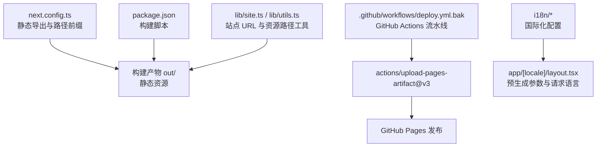
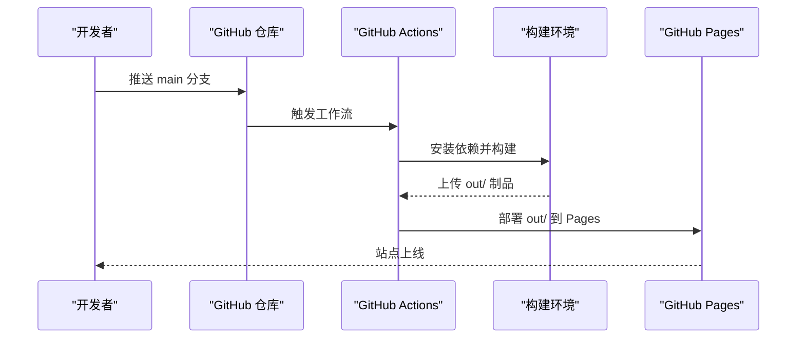
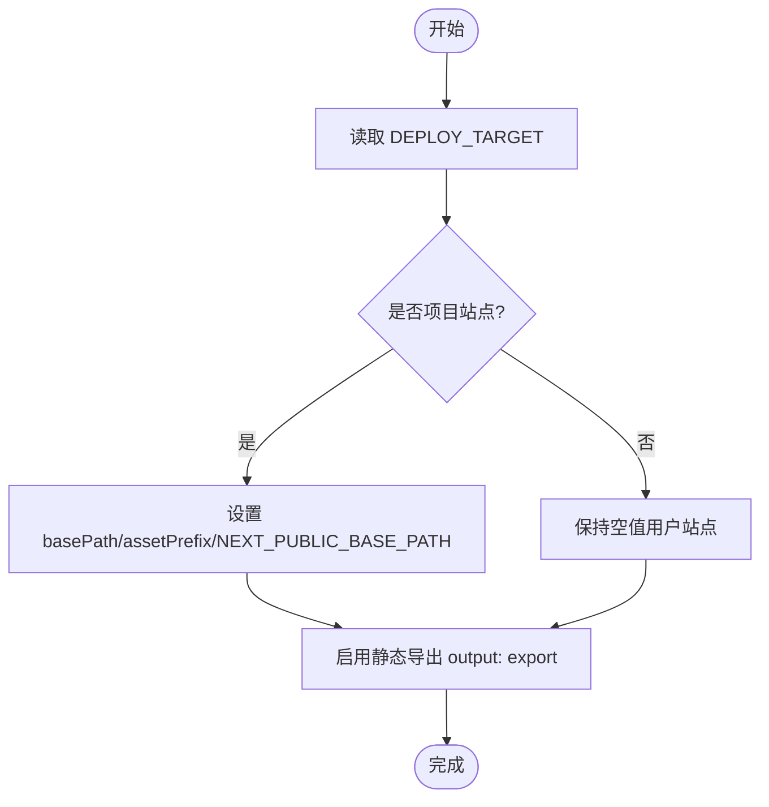
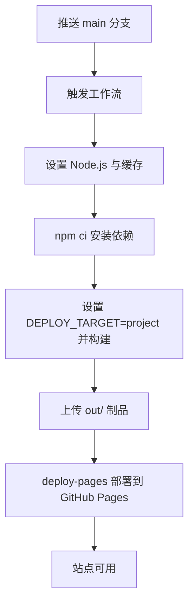
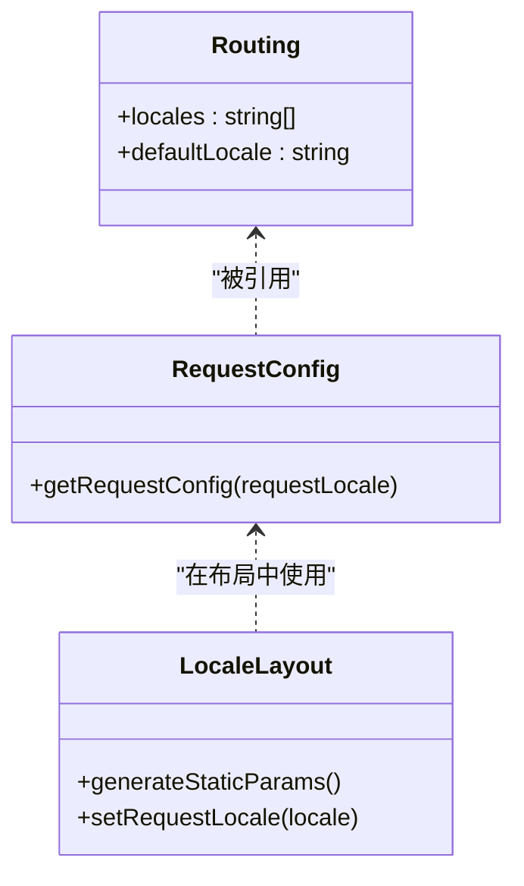
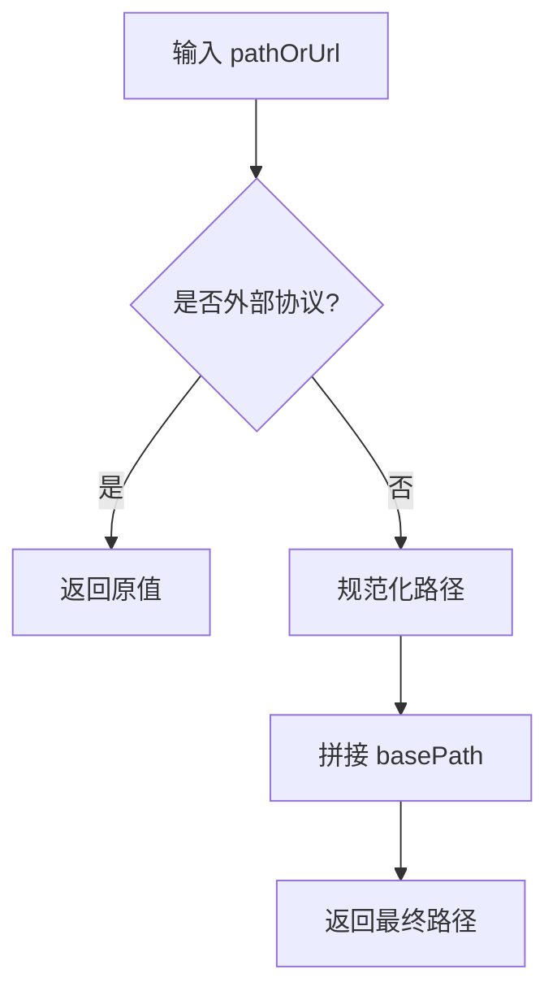
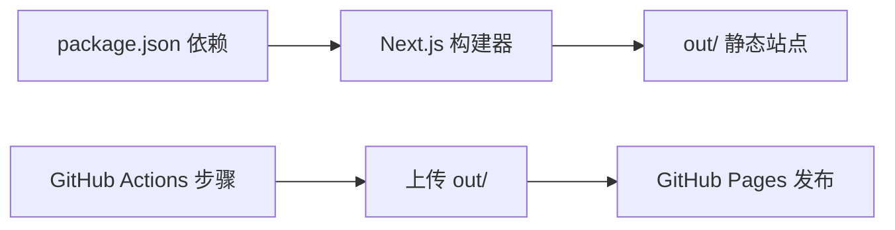

# GitHub Pages 部署

<cite>
**本文引用的文件**
- [next.config.ts](file://next.config.ts)
- [package.json](file://package.json)
- [.github/workflows/deploy.yml.bak](file://.github/workflows/deploy.yml.bak)
- [README.md](file://README.md)
- [i18n/request.ts](file://i18n/request.ts)
- [i18n/routing.ts](file://i18n/routing.ts)
- [lib/site.ts](file://lib/site.ts)
- [lib/utils.ts](file://lib/utils.ts)
- [app/[locale]/layout.tsx](file://app/[locale]/layout.tsx)
- [docker/docker-compose.yml](file://docker/docker-compose.yml)
</cite>

## 目录
1. [简介](#简介)
2. [项目结构](#项目结构)
3. [核心组件](#核心组件)
4. [架构总览](#架构总览)
5. [详细组件分析](#详细组件分析)
6. [依赖关系分析](#依赖关系分析)
7. [性能与优化建议](#性能与优化建议)
8. [故障排查指南](#故障排查指南)
9. [结论](#结论)
10. [附录](#附录)

## 简介
本指南面向使用 Next.js 静态导出模式将站点部署到 GitHub Pages 的开发者，覆盖以下要点：
- next.config.ts 中 basePath、assetPrefix、trailingSlash、images.unoptimized 等关键配置
- 构建脚本与输出目录 out/ 的使用方式
- GitHub Actions 工作流（CI/CD）自动构建与部署
- 用户站点与项目站点的差异及环境变量切换
- 自定义域名绑定与 SSL 证书设置
- 常见问题定位与性能优化建议

## 项目结构
本项目采用 Next.js App Router + TypeScript + Tailwind CSS 技术栈，支持国际化与静态导出。与 GitHub Pages 部署密切相关的目录与文件包括：
- 根级配置：next.config.ts、package.json
- CI/CD：.github/workflows/deploy.yml.bak
- 国际化：i18n/request.ts、i18n/routing.ts
- 工具函数：lib/site.ts、lib/utils.ts
- 布局与路由：app/[locale]/layout.tsx
- Docker 辅助：docker/docker-compose.yml（用于本地或服务器自托管，非 GitHub Pages 必需）

图表来源
- [next.config.ts:1-38](file://next.config.ts#L1-L38)
- [package.json:1-47](file://package.json#L1-L47)
- [.github/workflows/deploy.yml.bak:1-56](file://.github/workflows/deploy.yml.bak#L1-L56)
- [i18n/request.ts:1-15](file://i18n/request.ts#L1-L15)
- [i18n/routing.ts:1-6](file://i18n/routing.ts#L1-L6)
- [lib/site.ts:1-35](file://lib/site.ts#L1-L35)
- [lib/utils.ts:1-25](file://lib/utils.ts#L1-L25)
- [app/[locale]/layout.tsx:1-64](file://app/[locale]/layout.tsx#L1-L64)

章节来源
- [README.md:33-67](file://README.md#L33-L67)

## 核心组件
本节聚焦与 GitHub Pages 部署直接相关的核心配置与逻辑。

- 静态导出与路径前缀
  - output: "export" 启用静态导出模式，禁用 SSR、中间件、API Routes 和 next/image 优化
  - trailingSlash: true 确保生成以斜杠结尾的路径，便于 GitHub Pages 正确解析
  - images.unoptimized: true 适配静态导出场景
  - basePath 与 assetPrefix 根据 DEPLOY_TARGET 环境变量动态切换，区分“用户站点”与“项目站点”
  - NEXT_PUBLIC_BASE_PATH 暴露给客户端，供工具函数拼接资源路径

- 构建脚本
  - build 命令执行 next build 并运行两个后处理脚本（SEO HTML 修复与 RSC 路径扁平化），最终产出 out/ 目录
  - start 使用 serve 提供 out/ 静态服务，便于本地预览

- 国际化与静态渲染
  - i18n/routing.ts 定义支持的语言与默认语言
  - i18n/request.ts 在请求时加载对应语言消息
  - app/[locale]/layout.tsx 通过 generateStaticParams 预生成所有语言路由，并在布局中调用 setRequestLocale 以启用静态渲染

- 资源与站点 URL 工具
  - lib/utils.ts 提供 getAssetPath，统一为相对路径添加 basePath 前缀，同时放行外部协议（http/https/data///）
  - lib/site.ts 提供 getSiteOrigin、getBasePath、getSiteUrl、getAbsoluteUrl 等工具，用于生成完整站点 URL 与绝对链接

章节来源
- [next.config.ts:1-38](file://next.config.ts#L1-L38)
- [package.json:1-47](file://package.json#L1-L47)
- [i18n/routing.ts:1-6](file://i18n/routing.ts#L1-L6)
- [i18n/request.ts:1-15](file://i18n/request.ts#L1-L15)
- [app/[locale]/layout.tsx:1-64](file://app/[locale]/layout.tsx#L1-L64)
- [lib/utils.ts:1-25](file://lib/utils.ts#L1-L25)
- [lib/site.ts:1-35](file://lib/site.ts#L1-L35)

## 架构总览
下图展示了从代码提交到 GitHub Pages 发布的端到端流程，以及构建期与运行期的关键配置点。

图表来源
- [.github/workflows/deploy.yml.bak:1-56](file://.github/workflows/deploy.yml.bak#L1-L56)
- [package.json:1-47](file://package.json#L1-L47)
- [next.config.ts:1-38](file://next.config.ts#L1-L38)

## 详细组件分析

### 静态导出与路径前缀（next.config.ts）
- 通过 DEPLOY_TARGET 环境变量控制两种部署模式：
  - 用户站点（默认）：访问 https://用户名.github.io/，无需 basePath
  - 项目站点：访问 https://用户名.github.io/仓库名/，需要 basePath 与 assetPrefix 前缀
- 关键配置项：
  - output: "export"
  - trailingSlash: true
  - images.unoptimized: true
  - basePath 与 assetPrefix 根据 isProjectSite 动态设置
  - env.NEXT_PUBLIC_BASE_PATH 与 NEXT_PUBLIC_SITE_URL 注入客户端

图表来源
- [next.config.ts:1-38](file://next.config.ts#L1-L38)

章节来源
- [next.config.ts:1-38](file://next.config.ts#L1-L38)

### 构建脚本与产物（package.json）
- build 脚本顺序执行：
  - next build：生成 out/ 静态站点
  - 后处理脚本：修复 SEO HTML 与扁平化 RSC 路径
- start 脚本：使用 serve 提供 out/ 静态服务，便于本地验证

章节来源
- [package.json:1-47](file://package.json#L1-L47)

### GitHub Actions 工作流（.github/workflows/deploy.yml.bak）
- 触发条件：push 到 main 分支或手动触发 workflow_dispatch
- 权限：contents read、pages write、id-token write
- 并发策略：group pages，取消进行中的任务
- 构建阶段：
  - 检出代码
  - 设置 Node.js 版本（示例为 24）
  - npm ci 安装依赖
  - 设置 DEPLOY_TARGET=project 并执行 npm run build
  - 上传 out/ 作为 artifacts
- 部署阶段：
  - 指定 environment github-pages
  - 使用 actions/deploy-pages@v4 部署

图表来源
- [.github/workflows/deploy.yml.bak:1-56](file://.github/workflows/deploy.yml.bak#L1-L56)

章节来源
- [.github/workflows/deploy.yml.bak:1-56](file://.github/workflows/deploy.yml.bak#L1-L56)

### 国际化与静态渲染（i18n 与 layout）
- i18n/routing.ts 定义 locales 与 defaultLocale
- i18n/request.ts 在请求时加载对应 messages
- app/[locale]/layout.tsx：
  - generateStaticParams 预生成所有语言路由
  - setRequestLocale 启用静态渲染
  - 结合 next-intl 客户端提供者渲染页面

图表来源
- [i18n/routing.ts:1-6](file://i18n/routing.ts#L1-L6)
- [i18n/request.ts:1-15](file://i18n/request.ts#L1-L15)
- [app/[locale]/layout.tsx:1-64](file://app/[locale]/layout.tsx#L1-L64)

章节来源
- [i18n/routing.ts:1-6](file://i18n/routing.ts#L1-L6)
- [i18n/request.ts:1-15](file://i18n/request.ts#L1-L15)
- [app/[locale]/layout.tsx:1-64](file://app/[locale]/layout.tsx#L1-L64)

### 资源路径与站点 URL 工具（lib/utils.ts、lib/site.ts）
- getAssetPath：为相对路径添加 basePath 前缀，放行外部协议
- getSiteOrigin/getBasePath/getSiteUrl/getAbsoluteUrl：组合站点源与 basePath，生成完整 URL 或绝对链接

图表来源
- [lib/utils.ts:1-25](file://lib/utils.ts#L1-L25)
- [lib/site.ts:1-35](file://lib/site.ts#L1-L35)

章节来源
- [lib/utils.ts:1-25](file://lib/utils.ts#L1-L25)
- [lib/site.ts:1-35](file://lib/site.ts#L1-L35)

## 依赖关系分析
- 构建期依赖
  - next、next-intl、next-themes、react、react-dom 等运行时依赖
  - sharp（图像处理）、tailwindcss、typescript 等开发依赖
- 部署期依赖
  - GitHub Actions 使用 actions/checkout、setup-node、upload-pages-artifact、deploy-pages
- 运行时依赖
  - 静态导出模式下无服务端依赖，浏览器侧仅依赖 React 生态与 UI 库

图表来源
- [package.json:1-47](file://package.json#L1-L47)
- [.github/workflows/deploy.yml.bak:1-56](file://.github/workflows/deploy.yml.bak#L1-L56)

章节来源
- [package.json:1-47](file://package.json#L1-L47)
- [.github/workflows/deploy.yml.bak:1-56](file://.github/workflows/deploy.yml.bak#L1-L56)

## 性能与优化建议
- 静态导出优势
  - 零服务端成本，全球 CDN 分发，首屏加载快
- 图片与媒体
  - 使用 images.unoptimized: true 避免 next/image 在服务端优化失败
  - 建议在构建前压缩图片（项目提供 compress-images.mjs）
- 资源路径
  - 统一使用 getAssetPath 与 getAbsoluteUrl，避免重复前缀或路径错误导致的 404
- 构建产物
  - 关注 out/ 体积，按需拆分资源；利用浏览器缓存策略（GitHub Pages 默认良好）
- 国际化
  - 预生成所有语言路由，减少运行时开销
- 本地预览
  - 使用 npm start 快速验证 out/ 内容，注意 Windows 下换行符差异可能影响某些生产行为

[本节为通用指导，不直接分析具体文件]

## 故障排查指南
- 构建失败
  - 检查 Node.js 版本与 npm 缓存
  - 清理 node_modules 与 .next 后重试
  - 确认 Markdown frontmatter 格式正确
- 资源 404
  - 确认 basePath/assetPrefix 与 NEXT_PUBLIC_BASE_PATH 一致
  - 检查是否在 Link 组件内误用 getAssetPath 导致双重前缀
- PDF 下载异常
  - 使用原生 a 标签而非 Link 进行 PDF 下载，避免拦截与重复前缀
- 国际化路由不可用
  - 确认 generateStaticParams 已返回所有语言
  - 确认布局中调用 setRequestLocale
- 本地预览与生产差异
  - 本地 serve 保留 CRLF，而 GitHub Pages 会去除 \r，可能导致特定运行时问题；必要时在生产环境复现与调试

章节来源
- [README.md:549-582](file://README.md#L549-L582)
- [AGENTS.md:89-106](file://AGENTS.md#L89-L106)

## 结论
通过将 Next.js 应用配置为静态导出模式，并结合环境变量切换 basePath 与 assetPrefix，可以无缝支持 GitHub Pages 的用户站点与项目站点部署。配合 GitHub Actions 自动化流水线，可实现一键构建与发布。遵循资源路径工具规范与静态导出约束，能有效避免常见部署问题并获得良好的性能表现。

[本节为总结性内容，不直接分析具体文件]

## 附录

### 部署模式与环境变量对照
- 用户站点（默认）
  - 环境变量：不设置 DEPLOY_TARGET
  - basePath/assetPrefix：空
  - 访问地址：https://用户名.github.io/
- 项目站点
  - 环境变量：DEPLOY_TARGET=project
  - basePath/assetPrefix：/仓库名
  - 访问地址：https://用户名.github.io/仓库名/

章节来源
- [next.config.ts:1-38](file://next.config.ts#L1-L38)
- [README.md:331-442](file://README.md#L331-L442)

### 自定义域名与 SSL 证书
- 在 public/ 目录创建 CNAME 文件，内容为你的自定义域名
- 在域名服务商处配置 DNS：
  - A 记录指向 GitHub Pages IP 段
  - 或使用 CNAME 指向 用户名.github.io
- GitHub Pages 会自动为你的自定义域名颁发并续期 HTTPS 证书

章节来源
- [README.md:422-442](file://README.md#L422-L442)

### Docker 本地运行（可选）
- docker/docker-compose.yml 提供 Nginx 容器化方案，适合本地或服务器自托管
- 端口映射可调整，支持挂载自定义 nginx.conf

章节来源
- [docker/docker-compose.yml:1-15](file://docker/docker-compose.yml#L1-L15)