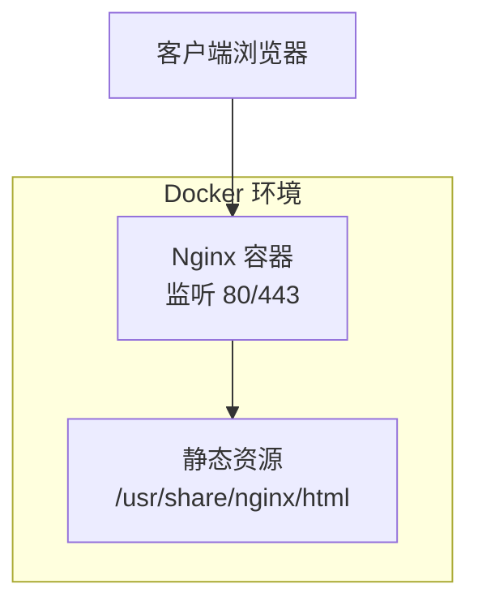
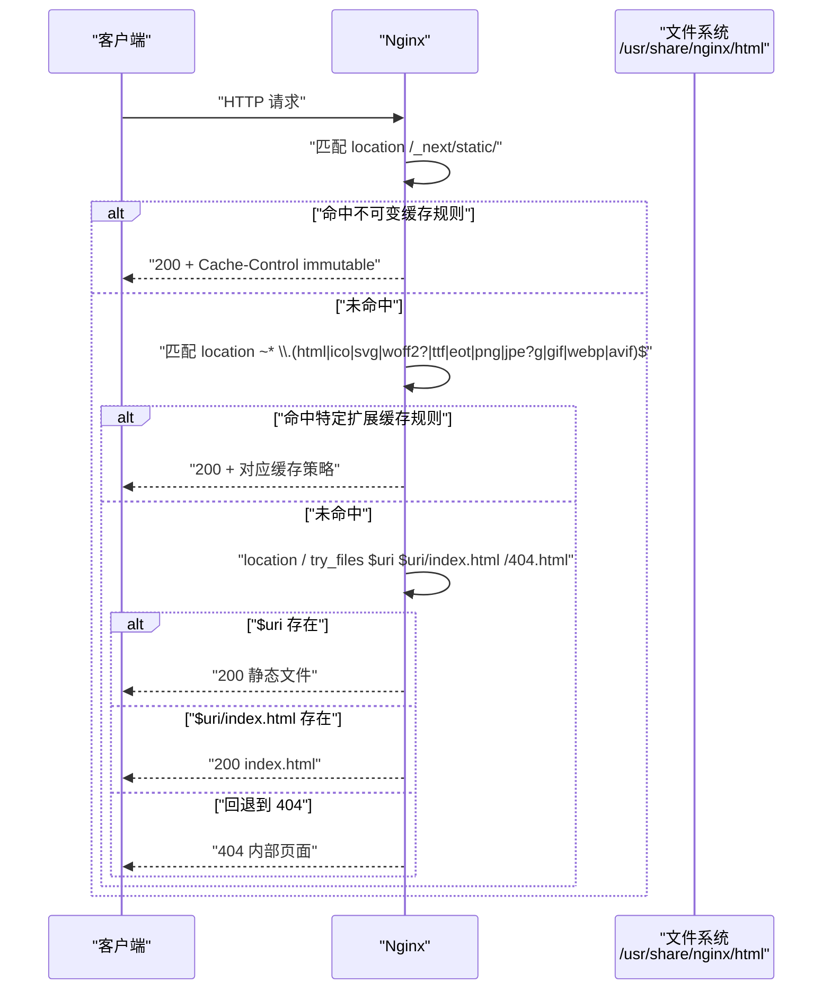
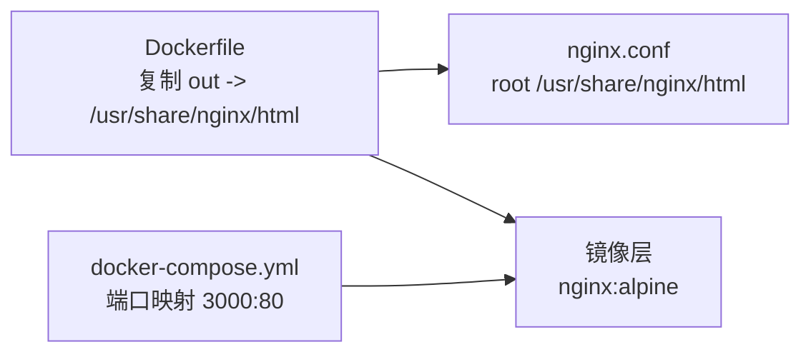

# Nginx 服务器配置

<cite>
**本文引用的文件**
- [docker/nginx.conf](file://docker/nginx.conf)
- [docker/Dockerfile](file://docker/Dockerfile)
- [docker/docker-compose.yml](file://docker/docker-compose.yml)
- [README.md](file://README.md)
</cite>

## 目录
1. [简介](#简介)
2. [项目结构](#项目结构)
3. [核心组件](#核心组件)
4. [架构总览](#架构总览)
5. [详细组件分析](#详细组件分析)
6. [依赖关系分析](#依赖关系分析)
7. [性能考虑](#性能考虑)
8. [故障排查指南](#故障排查指南)
9. [结论](#结论)
10. [附录](#附录)

## 简介
本技术文档围绕仓库中的 Nginx 静态站点部署方案，深入解析 docker/nginx.conf 配置文件的各个模块与最佳实践。内容涵盖事件处理、HTTP 服务、静态资源缓存策略、安全响应头、反向代理集成方式，以及性能优化（worker 进程、连接数、Gzip、TCP 参数）与安全加固（HSTS、HTTPS 强制跳转、安全协议版本）。同时提供负载均衡、会话保持和高可用架构的参考示例，并给出常见问题诊断方法与调优建议。

## 项目结构
本项目采用“构建产物 + Nginx 静态服务”的容器化部署模式：
- 使用 Node.js 镜像进行 Next.js 静态导出构建
- 将构建产物复制到 Nginx 默认静态根目录
- 通过自定义 nginx.conf 提供高性能静态资源服务与安全头

图表来源
- [docker/Dockerfile:16-31](file://docker/Dockerfile#L16-L31)
- [docker/nginx.conf:43-95](file://docker/nginx.conf#L43-L95)

章节来源
- [docker/Dockerfile:1-31](file://docker/Dockerfile#L1-L31)
- [docker/docker-compose.yml:1-15](file://docker/docker-compose.yml#L1-L15)
- [README.md:443-546](file://README.md#L443-L546)

## 核心组件
本节聚焦 nginx.conf 的关键模块与职责划分：
- 全局与事件模块：控制 worker 进程数量、错误日志、PID 文件、事件模型与最大并发连接数
- HTTP 模块：MIME 类型、访问日志、传输优化（sendfile/tcp_nopush/tcp_nodelay）、KeepAlive 超时
- Gzip 压缩：启用开关、可变性提示、压缩级别、最小长度、代理场景、MIME 类型集合
- Server 块：监听端口、server_name、静态根目录与索引页
- 安全响应头：X-Frame-Options、X-Content-Type-Options、X-XSS-Protection、Referrer-Policy
- 缓存策略：Next.js 静态资源不可变缓存、HTML 短缓存、字体与图片长缓存、RSC payload 缓存
- 路由与重定向：规范化尾斜杠、try_files 回退到 index.html 或 404
- 错误页面与隐藏文件保护：内部 404 页面、拒绝访问以点开头的隐藏文件

章节来源
- [docker/nginx.conf:1-112](file://docker/nginx.conf#L1-L112)

## 架构总览
下图展示了从请求进入 Nginx 到返回静态资源的完整流程，包括安全头注入、缓存命中判定与 try_files 回退逻辑。

图表来源
- [docker/nginx.conf:56-95](file://docker/nginx.conf#L56-L95)

## 详细组件分析

### 事件与全局配置
- worker_processes auto：根据 CPU 核数自动分配工作进程，提升并发处理能力
- error_log 与 pid：错误日志级别 warn，便于生产定位问题；pid 文件路径用于进程管理
- events.worker_connections：单 worker 最大并发连接数，结合 keepalive 可显著提升吞吐

章节来源
- [docker/nginx.conf:1-7](file://docker/nginx.conf#L1-L7)

### HTTP 基础与传输优化
- include mime.types 与 default_type：确保正确的 Content-Type 推断
- access_log/main：结构化访问日志格式，便于分析与监控
- sendfile on：内核级零拷贝发送静态文件，降低用户态拷贝开销
- tcp_nopush on：在 sendfile 开启时，尽可能合并 TCP 数据包，减少小包开销
- tcp_nodelay on：禁用 Nagle 算法，降低小报文延迟，适合交互式场景
- keepalive_timeout 65：合理设置长连接超时，平衡连接复用与资源释放

章节来源
- [docker/nginx.conf:9-24](file://docker/nginx.conf#L9-L24)

### Gzip 压缩策略
- gzip on：启用压缩，减少带宽占用
- gzip_vary on：为支持协商缓存的代理与浏览器添加 Vary: Accept-Encoding
- gzip_comp_level 6：压缩级别适中，兼顾 CPU 与体积
- gzip_min_length 512：小于阈值的响应不压缩，避免无效压缩
- gzip_proxied any：对代理请求也启用压缩
- gzip_types：覆盖文本、脚本、JSON、XML、SVG 等常见类型

章节来源
- [docker/nginx.conf:25-40](file://docker/nginx.conf#L25-L40)

### Server 块与安全响应头
- listen 80 与 server_name _：监听所有 IPv4 地址，匹配任意域名
- root 与 index：静态根目录与默认入口文件
- 安全响应头：
  - X-Frame-Options SAMEORIGIN：防止点击劫持
  - X-Content-Type-Options nosniff：禁止 MIME 嗅探
  - X-XSS-Protection 1; mode=block：启用 XSS 过滤
  - Referrer-Policy strict-origin-when-cross-origin：限制 Referer 泄露范围

章节来源
- [docker/nginx.conf:43-55](file://docker/nginx.conf#L43-L55)

### 静态资源缓存策略
- Next.js 静态资源（/_next/static/）：长期缓存且不可变，适用于带哈希的资源名
- HTML 页面：短期缓存并 must-revalidate，保证更新及时生效
- 字体与图片：较长缓存时间，减少重复下载
- RSC payload（__next.*.txt）：短期缓存并强制校验，适配客户端导航

章节来源
- [docker/nginx.conf:56-85](file://docker/nginx.conf#L56-L85)

### 路由与重定向
- 尾斜杠规范化：对非文件路径追加尾部斜杠，统一 URL 风格
- try_files：优先精确匹配，其次目录下的 index.html，最后回退到 404 页面

章节来源
- [docker/nginx.conf:87-95](file://docker/nginx.conf#L87-L95)

### 错误页面与隐藏文件保护
- 自定义 404 页面：internal 指令避免外部直接访问，配合短缓存
- 隐藏文件保护：拒绝访问以点开头的文件，关闭相关日志以减少噪声

章节来源
- [docker/nginx.conf:97-109](file://docker/nginx.conf#L97-L109)

### SSL/TLS 安全配置与 HTTPS 强制跳转
当前配置仅监听 80 端口，未内置 SSL 证书与 HSTS。推荐做法：
- 新增 443 监听与 ssl_certificate/ssl_certificate_key 指向证书与私钥
- 设置 ssl_protocols 与 ssl_ciphers，禁用过时协议与弱密码套件
- 添加 Strict-Transport-Security 头部实现 HSTS
- 在 80 端口 server 块中执行 301 永久跳转到 https://$host$request_uri

章节来源
- [docker/nginx.conf:43-55](file://docker/nginx.conf#L43-L55)

### 反向代理与后端集成
若需将动态请求转发至应用服务（如 Next.js 开发/运行实例），可在 server 块中添加 location 并使用 proxy_pass，同时传递 Host、X-Real-IP、X-Forwarded-For、X-Forwarded-Proto 等关键头部。

章节来源
- [README.md:518-546](file://README.md#L518-L546)

### 负载均衡、会话保持与高可用
- 负载均衡：使用 upstream 定义多个后端节点，并在 location 中使用 proxy_pass 指向该组
- 会话保持：基于 cookie 的 ip_hash 或基于健康检查的 least_conn 策略
- 高可用：多实例部署 + 前置 LVS/HAProxy + DNS 轮询或云厂商 LB，结合健康检查与自动故障转移

[本节为概念性说明，无需源码引用]

## 依赖关系分析
Nginx 配置与 Docker 构建产物的依赖关系如下：
- Dockerfile 将构建产物复制到 Nginx 静态根目录
- nginx.conf 作为运行时配置被 COPY 进镜像
- docker-compose.yml 负责端口映射与服务编排

图表来源
- [docker/Dockerfile:19-23](file://docker/Dockerfile#L19-L23)
- [docker/docker-compose.yml:9-11](file://docker/docker-compose.yml#L9-L11)
- [docker/nginx.conf:47-48](file://docker/nginx.conf#L47-L48)

章节来源
- [docker/Dockerfile:1-31](file://docker/Dockerfile#L1-L31)
- [docker/docker-compose.yml:1-15](file://docker/docker-compose.yml#L1-L15)
- [docker/nginx.conf:43-48](file://docker/nginx.conf#L43-L48)

## 性能考虑
- worker_processes auto：充分利用多核 CPU，避免手动估算
- worker_connections 1024：根据业务峰值调整，结合系统 ulimit 与文件描述符上限
- sendfile/tcp_nopush/tcp_nodelay：针对静态资源与交互混合场景的通用优化
- keepalive_timeout 65：在移动端网络下可适当缩短，避免空闲连接占用
- Gzip 压缩级别 6：在 CPU 与带宽之间取得平衡，可根据负载情况微调
- 缓存策略：
  - 对带哈希的静态资源使用 immutable，最大化浏览器缓存命中率
  - HTML 页面使用 must-revalidate，确保发布后尽快失效
  - 字体与图片长缓存，减少重复下载
- 日志与监控：access_log 与 error_log 分级输出，结合 Prometheus/Grafana 或 ELK 进行分析

[本节为通用指导，无需源码引用]

## 故障排查指南
- 无法访问静态资源
  - 检查 root 目录是否包含构建产物
  - 确认 try_files 回退顺序与 404 页面是否存在
- 缓存未生效
  - 确认浏览器是否携带 Cache-Control 与 ETag
  - 检查代理层是否透传缓存头
- 性能瓶颈
  - 观察 error.log 与 access.log，定位慢请求与高频 4xx/5xx
  - 调整 worker_connections 与 keepalive_timeout
- 安全头缺失
  - 确认 add_header 是否位于正确作用域（http/server/location）
  - 注意某些情况下 add_header 会被子块覆盖，需显式声明

章节来源
- [docker/nginx.conf:97-109](file://docker/nginx.conf#L97-L109)
- [docker/nginx.conf:56-85](file://docker/nginx.conf#L56-L85)

## 结论
本项目的 Nginx 配置围绕静态站点的高性能与安全展开，涵盖了事件与传输优化、Gzip 压缩、细粒度缓存策略、安全响应头与隐藏文件保护。对于需要 HTTPS 的场景，建议在现有基础上补充证书配置、HSTS 与 80→443 强制跳转；对于动态请求，可通过反向代理与上游集群实现负载均衡与高可用。结合合理的监控与日志分析，可进一步提升稳定性与用户体验。

[本节为总结性内容，无需源码引用]

## 附录

### 反向代理集成要点
- 必要头部：Host、X-Real-IP、X-Forwarded-For、X-Forwarded-Proto
- 超时与健康检查：根据后端能力设置 proxy_connect_timeout、proxy_read_timeout
- 限流与防护：结合 limit_req_zone 与 WAF 策略

章节来源
- [README.md:518-546](file://README.md#L518-L546)

### Docker 部署与端口映射
- 默认映射宿主机 3000 到容器 80
- 可通过 volumes 挂载自定义 nginx.conf 进行热更新

章节来源
- [docker/docker-compose.yml:9-14](file://docker/docker-compose.yml#L9-L14)
- [README.md:494-517](file://README.md#L494-L517)