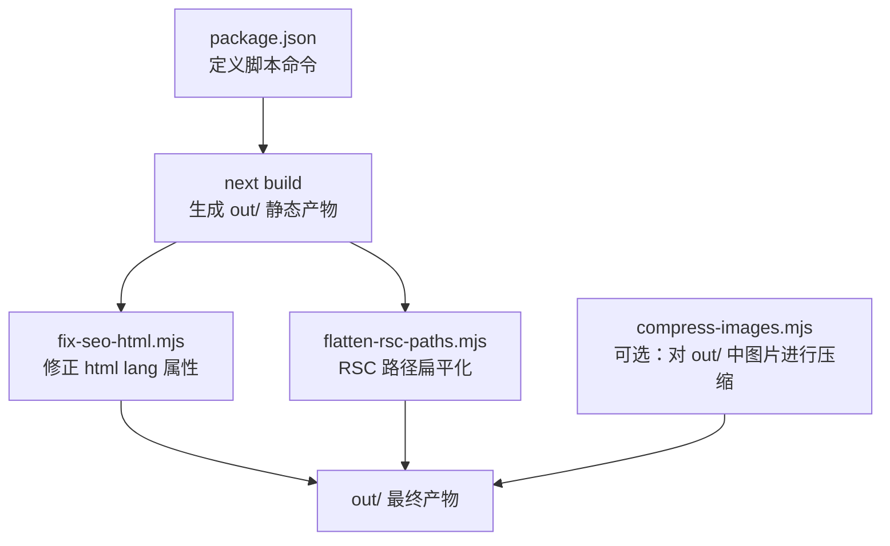
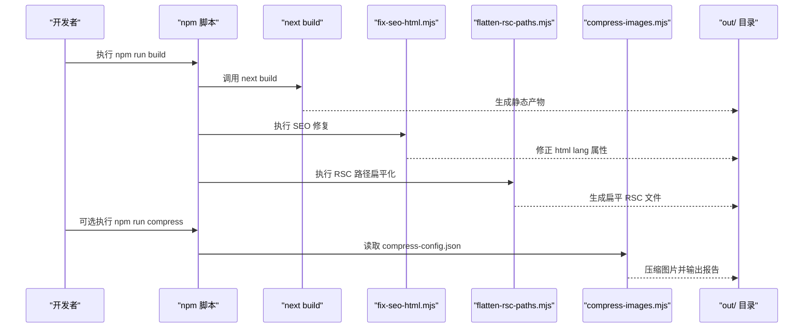
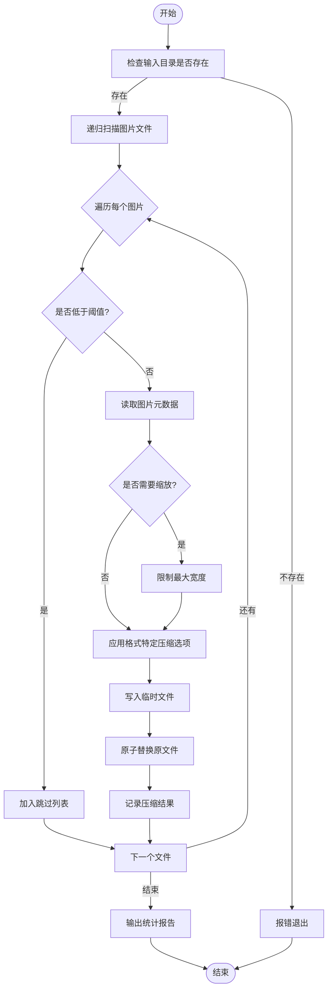
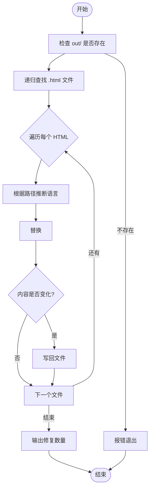
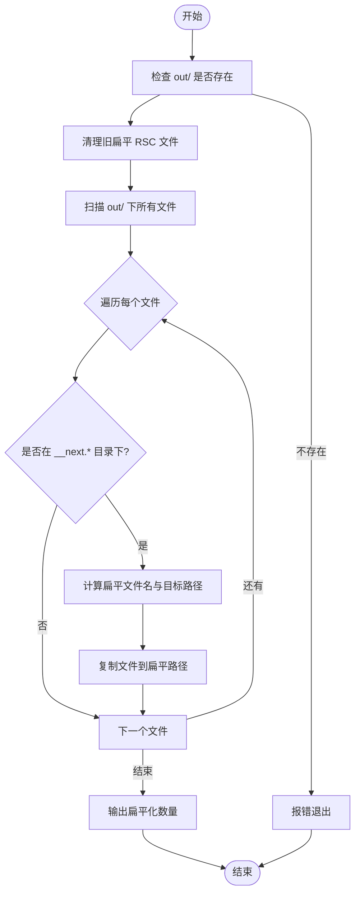
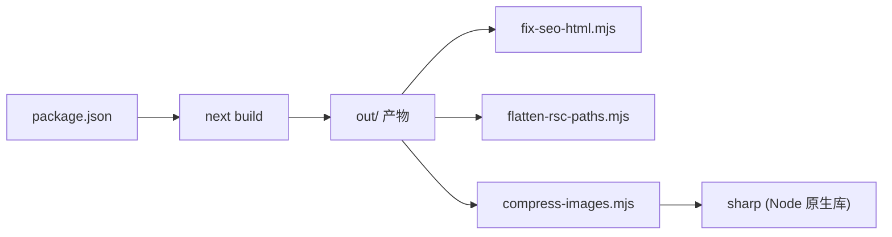
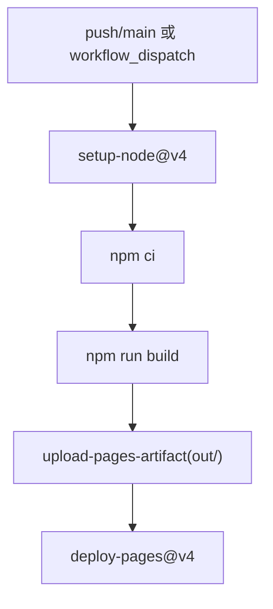

# 构建脚本与自动化

<cite>
**本文引用的文件**   
- [package.json](file://package.json)
- [scripts/compress-images.mjs](file://scripts/compress-images.mjs)
- [scripts/fix-seo-html.mjs](file://scripts/fix-seo-html.mjs)
- [scripts/flatten-rsc-paths.mjs](file://scripts/flatten-rsc-paths.mjs)
- [scripts/compress-config.json](file://scripts/compress-config.json)
- [.github/workflows/deploy.yml.bak](file://.github/workflows/deploy.yml.bak)
</cite>

## 目录
1. [简介](#简介)
2. [项目结构](#项目结构)
3. [核心组件](#核心组件)
4. [架构总览](#架构总览)
5. [详细组件分析](#详细组件分析)
6. [依赖分析](#依赖分析)
7. [性能考虑](#性能考虑)
8. [故障排查指南](#故障排查指南)
9. [结论](#结论)
10. [附录](#附录)

## 简介
本技术文档聚焦于项目的构建脚本与自动化流程，覆盖以下目标：
- 图片压缩脚本 compress-images.mjs 的配置参数与处理流程
- SEO HTML 修复脚本 fix-seo-html.mjs 的作用机制与输出格式
- RSC 路径扁平化脚本 flatten-rsc-paths.mjs 的处理逻辑与应用场景
- 自定义构建脚本的开发规范、错误处理与日志记录建议
- 构建优化技巧与持续集成环境的脚本配置示例

## 项目结构
与构建和自动化相关的核心位置如下：
- scripts 目录：包含所有构建期脚本
- package.json：定义构建命令与脚本入口
- .github/workflows：持续集成工作流（GitHub Pages 部署）

图表来源
- [package.json:5-12](file://package.json#L5-L12)
- [scripts/fix-seo-html.mjs:48-71](file://scripts/fix-seo-html.mjs#L48-L71)
- [scripts/flatten-rsc-paths.mjs:84-130](file://scripts/flatten-rsc-paths.mjs#L84-L130)
- [scripts/compress-images.mjs:154-225](file://scripts/compress-images.mjs#L154-L225)

章节来源
- [package.json:5-12](file://package.json#L5-L12)

## 核心组件
本节概述各脚本的职责与在构建流水线中的角色。

- 图片压缩脚本 compress-images.mjs
  - 功能：扫描指定目录下的图片，按阈值与质量策略进行压缩，支持多种格式与可选的 WebP 转换。
  - 输入：通过配置文件 compress-config.json 控制行为。
  - 输出：原地替换原图或转换为新格式；控制台输出统计报告。
  - 触发方式：npm run compress（独立运行）。

- SEO HTML 修复脚本 fix-seo-html.mjs
  - 功能：遍历 out/ 下所有 HTML 文件，根据路径推断语言并修正 <html lang="..."> 属性。
  - 输入：Next.js 静态导出后的 out/ 目录。
  - 输出：就地更新 HTML 文件中的 lang 属性。
  - 触发方式：作为 npm run build 的后置步骤自动执行。

- RSC 路径扁平化脚本 flatten-rsc-paths.mjs
  - 功能：将 Next.js 16 静态导出产生的嵌套 RSC .txt 文件复制为扁平命名，以适配 GitHub Pages 等静态托管平台的客户端路由请求。
  - 输入：out/ 目录。
  - 输出：在 out/ 根层生成 __next.* 开头的扁平文件名副本。
  - 触发方式：作为 npm run build 的后置步骤自动执行。

章节来源
- [scripts/compress-images.mjs:154-225](file://scripts/compress-images.mjs#L154-L225)
- [scripts/fix-seo-html.mjs:48-71](file://scripts/fix-seo-html.mjs#L48-L71)
- [scripts/flatten-rsc-paths.mjs:84-130](file://scripts/flatten-rsc-paths.mjs#L84-L130)
- [package.json:5-12](file://package.json#L5-L12)

## 架构总览
构建流水线由 next build 驱动，随后依次执行 SEO 修复与 RSC 路径扁平化；图片压缩可作为独立步骤按需执行。

图表来源
- [package.json:5-12](file://package.json#L5-L12)
- [scripts/fix-seo-html.mjs:48-71](file://scripts/fix-seo-html.mjs#L48-L71)
- [scripts/flatten-rsc-paths.mjs:84-130](file://scripts/flatten-rsc-paths.mjs#L84-L130)
- [scripts/compress-images.mjs:154-225](file://scripts/compress-images.mjs#L154-L225)

## 详细组件分析

### 图片压缩脚本 compress-images.mjs
- 配置项（来自 compress-config.json）
  - sizeThresholdMB：仅压缩超过该阈值的图片（单位 MB）
  - quality：按格式设置质量值（jpeg/png/webp/avif）
  - convertToWebP：是否将非 webp 图片统一转为 webp
  - inputDir：待扫描的输入目录（通常为 out/）
  - extensions：参与处理的扩展名列表
- 处理流程
  - 校验输入目录是否存在
  - 递归扫描目录，筛选匹配扩展名的图片
  - 对每个图片：
    - 若小于阈值则跳过
    - 解析元数据，必要时限制最大宽度
    - 根据格式选择压缩选项
    - 写入临时文件后原子替换原文件
    - 记录压缩结果（原始大小、压缩后大小、节省百分比）
  - 汇总并打印报告（已压缩、跳过、错误、总体节省）
- 关键实现要点
  - 使用 sharp 进行高性能图像处理
  - 通过临时文件避免损坏原图
  - 提供人类可读的大小格式化与统计摘要

图表来源
- [scripts/compress-images.mjs:154-225](file://scripts/compress-images.mjs#L154-L225)
- [scripts/compress-images.mjs:53-125](file://scripts/compress-images.mjs#L53-L125)
- [scripts/compress-images.mjs:130-149](file://scripts/compress-images.mjs#L130-L149)
- [scripts/compress-config.json:1-12](file://scripts/compress-config.json#L1-L12)

章节来源
- [scripts/compress-images.mjs:154-225](file://scripts/compress-images.mjs#L154-L225)
- [scripts/compress-images.mjs:53-125](file://scripts/compress-images.mjs#L53-L125)
- [scripts/compress-images.mjs:130-149](file://scripts/compress-images.mjs#L130-L149)
- [scripts/compress-config.json:1-12](file://scripts/compress-config.json#L1-L12)

### SEO HTML 修复脚本 fix-seo-html.mjs
- 作用机制
  - 递归查找 out/ 下所有 .html 文件
  - 根据相对路径判断语言：
    - zh.html 或 zh/ 前缀 → zh-CN
    - en.html 或 en/ 前缀 → en-US
    - 默认 → en-US
  - 使用正则替换 <html lang="..."> 为推断的语言值
  - 仅在内容发生变化时写回文件
- 输出格式
  - 控制台输出被修复的文件数量
  - 直接修改 out/ 下的 HTML 源文件
- 适用场景
  - 静态导出时根布局无法推导 locale，导致 html.lang 不正确
  - 需要确保多语言站点 SEO 友好

图表来源
- [scripts/fix-seo-html.mjs:48-71](file://scripts/fix-seo-html.mjs#L48-L71)
- [scripts/fix-seo-html.mjs:14-32](file://scripts/fix-seo-html.mjs#L14-L32)
- [scripts/fix-seo-html.mjs:34-46](file://scripts/fix-seo-html.mjs#L34-L46)

章节来源
- [scripts/fix-seo-html.mjs:48-71](file://scripts/fix-seo-html.mjs#L48-L71)
- [scripts/fix-seo-html.mjs:14-32](file://scripts/fix-seo-html.mjs#L14-L32)
- [scripts/fix-seo-html.mjs:34-46](file://scripts/fix-seo-html.mjs#L34-L46)

### RSC 路径扁平化脚本 flatten-rsc-paths.mjs
- 问题背景
  - Next.js 16 静态导出会在嵌套目录中生成 RSC .txt 文件（如 __next.$d$locale/blog/$d$slug/__PAGE__.txt）
  - 客户端路由器以点分隔的扁平 URL 请求这些资源（如 __next.$d$locale.blog.$d$slug.__PAGE__.txt）
  - 某些静态托管平台（如 GitHub Pages）不支持动态重定向，需提前准备扁平路径
- 处理逻辑
  - 清理上次运行遗留的扁平 RSC 文件（保留 index.txt 与 __next.* 内部目录的原文件）
  - 扫描 out/ 下所有文件，识别位于 __next.* 目录内的 RSC 文件
  - 计算扁平文件名与目标路径，复制文件到 out/ 根层对应位置
  - 输出被扁平化的文件清单与总数
- 应用场景
  - 部署到 GitHub Pages 或其他不支持服务端重定向的静态托管平台
  - 确保客户端能正确加载 RSC 片段数据

图表来源
- [scripts/flatten-rsc-paths.mjs:84-130](file://scripts/flatten-rsc-paths.mjs#L84-L130)
- [scripts/flatten-rsc-paths.mjs:45-82](file://scripts/flatten-rsc-paths.mjs#L45-L82)
- [scripts/flatten-rsc-paths.mjs:27-39](file://scripts/flatten-rsc-paths.mjs#L27-L39)

章节来源
- [scripts/flatten-rsc-paths.mjs:84-130](file://scripts/flatten-rsc-paths.mjs#L84-L130)
- [scripts/flatten-rsc-paths.mjs:45-82](file://scripts/flatten-rsc-paths.mjs#L45-L82)
- [scripts/flatten-rsc-paths.mjs:27-39](file://scripts/flatten-rsc-paths.mjs#L27-L39)

### 自定义构建脚本开发指南
- 编写规范
  - 使用 ES Module（.mjs），通过 import.meta.url 获取当前目录
  - 明确输入输出目录约定（例如 out/ 作为静态产物目录）
  - 保持幂等性：重复运行不应破坏产物
  - 尽量使用原子操作（先写临时文件再替换）以避免中断导致的不一致
- 错误处理
  - 前置条件检查（如 out/ 是否存在）
  - 捕获异常并输出清晰错误信息
  - 失败时返回非零退出码，便于 CI 感知失败
- 日志记录
  - 结构化输出（分类：成功、跳过、错误）
  - 提供摘要统计（数量、大小、节省比例等）
  - 可选项：将详细日志写入文件以便归档
- 与构建系统集成
  - 在 package.json 的 scripts 中组合多个步骤
  - 提供“仅构建”与“完整构建”两种命令，便于本地调试与 CI 加速
- 安全与健壮性
  - 严格校验用户输入与配置
  - 避免直接删除重要目录，优先增量更新
  - 对大目录扫描采用惰性/分批策略，避免内存峰值过高

[本节为通用指导，不直接分析具体文件]

## 依赖分析
- 运行时依赖
  - sharp：用于高性能图片解码与压缩
- 构建脚本依赖
  - Node.js 内置模块：fs、path、url
- 外部工具
  - serve：用于本地预览 out/ 静态站点
- 脚本间耦合
  - fix-seo-html.mjs 与 flatten-rsc-paths.mjs 均依赖 out/ 产物
  - compress-images.mjs 可选依赖 out/ 产物，且受 compress-config.json 控制

图表来源
- [package.json:5-12](file://package.json#L5-L12)
- [package.json:35-45](file://package.json#L35-L45)
- [scripts/compress-images.mjs:1-3](file://scripts/compress-images.mjs#L1-L3)

章节来源
- [package.json:5-12](file://package.json#L5-L12)
- [package.json:35-45](file://package.json#L35-L45)

## 性能考虑
- 图片压缩
  - 合理设置 sizeThresholdMB，避免对小图进行无意义压缩
  - 针对 PNG 启用调色板与高压缩级别，JPEG 使用 mozjpeg 以获得更好体积
  - 开启 convertToWebP 可显著减小体积，但需评估兼容性
  - 对超大图片进行尺寸限制可减少后续渲染压力
- 构建流水线
  - 将耗时任务（如图片压缩）设为可选步骤，CI 中按需启用
  - 利用缓存（依赖缓存、构建缓存）减少重复工作
- 文件系统 I/O
  - 批量扫描时使用 withFileTypes 提升效率
  - 避免不必要的重复拷贝与写盘

[本节为通用指导，不直接分析具体文件]

## 故障排查指南
- out/ 目录缺失
  - 现象：fix-seo-html.mjs 或 flatten-rsc-paths.mjs 报错提示未找到 out/
  - 解决：先执行 next build 生成静态产物
- 图片压缩失败
  - 现象：脚本输出错误列表，包含文件路径与错误消息
  - 排查：确认文件格式受支持、磁盘空间充足、sharp 环境正常
- RSC 路径 404
  - 现象：部署后部分 RSC 资源 404
  - 排查：确认 flatten-rsc-paths.mjs 已在构建后执行，且托管平台不支持服务端重定向
- SEO lang 属性未生效
  - 现象：HTML 的 lang 仍为空或不正确
  - 排查：确认 fix-seo-html.mjs 已执行，且页面路径符合 zh/en 前缀规则

章节来源
- [scripts/fix-seo-html.mjs:48-71](file://scripts/fix-seo-html.mjs#L48-L71)
- [scripts/flatten-rsc-paths.mjs:84-130](file://scripts/flatten-rsc-paths.mjs#L84-L130)
- [scripts/compress-images.mjs:154-225](file://scripts/compress-images.mjs#L154-L225)

## 结论
本项目通过三个构建脚本实现了静态产物的 SEO 增强与部署兼容，并提供可选的图片体积优化。结合 package.json 的命令编排与 GitHub Actions 的 CI 配置，形成了稳定高效的构建与发布流水线。建议在 CI 中启用图片压缩以提升交付质量，同时保持脚本的可观测性与健壮性。

[本节为总结，不直接分析具体文件]

## 附录

### 构建命令速查
- 完整构建（含 SEO 修复与 RSC 扁平化）
  - npm run build
- 仅构建（跳过后置脚本）
  - npm run build:only
- 图片压缩（可选）
  - npm run compress
- 本地预览
  - npm start

章节来源
- [package.json:5-12](file://package.json#L5-L12)

### 持续集成配置示例（GitHub Pages）
- 触发条件：推送 main 分支或手动触发
- 权限：读取仓库内容、写入 Pages、签发令牌
- 并发：同一 group 取消进行中任务
- 构建阶段：安装依赖、执行 npm run build、上传 out/ 制品
- 部署阶段：使用官方 action 部署到 GitHub Pages

图表来源
- [.github/workflows/deploy.yml.bak:1-56](file://.github/workflows/deploy.yml.bak#L1-L56)

章节来源
- [.github/workflows/deploy.yml.bak:1-56](file://.github/workflows/deploy.yml.bak#L1-L56)