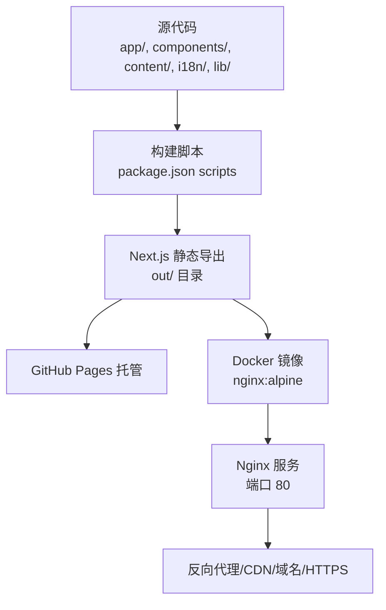
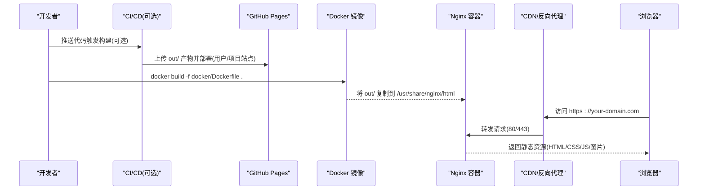
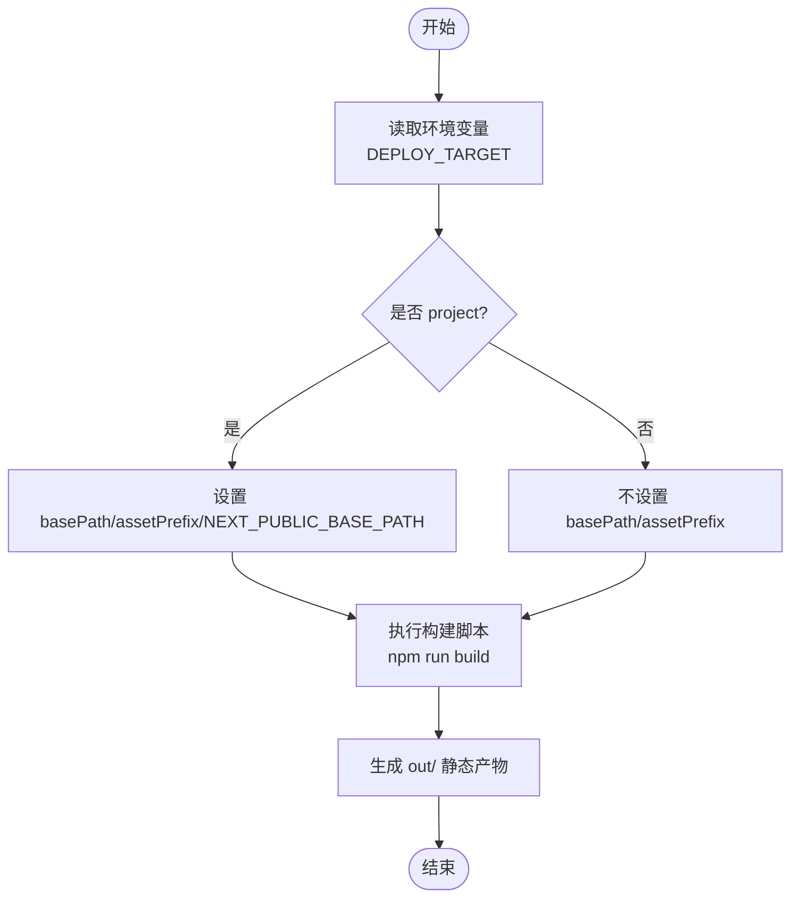
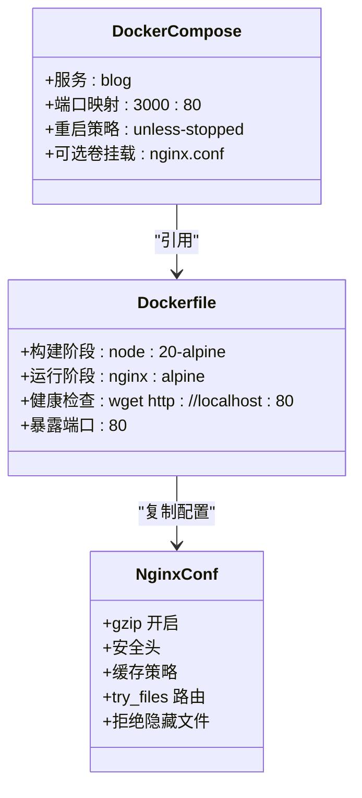
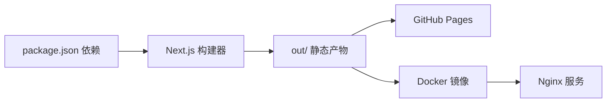

# 部署指南

<cite>
**本文引用的文件列表**
- [README.md](file://README.md)
- [package.json](file://package.json)
- [next.config.ts](file://next.config.ts)
- [i18n/routing.ts](file://i18n/routing.ts)
- [content/config/profile.json](file://content/config/profile.json)
- [docker/Dockerfile](file://docker/Dockerfile)
- [docker/docker-compose.yml](file://docker/docker-compose.yml)
- [docker/nginx.conf](file://docker/nginx.conf)
- [docker/.dockerignore](file://docker/.dockerignore)
- [.github/workflows/deploy.yml.bak](file://.github/workflows/deploy.yml.bak)
</cite>

## 目录
1. [简介](#简介)
2. [项目结构](#项目结构)
3. [核心组件](#核心组件)
4. [架构总览](#架构总览)
5. [详细组件分析](#详细组件分析)
6. [依赖分析](#依赖分析)
7. [性能考虑](#性能考虑)
8. [故障排除指南](#故障排除指南)
9. [结论](#结论)
10. [附录](#附录)

## 简介
本指南面向运维与开发者，提供该 Next.js 静态博客项目的多种部署方案与生产环境最佳实践。涵盖：
- GitHub Pages 静态站点部署（用户站点/项目站点）
- Docker 容器化部署（Nginx 静态服务）
- Nginx 反向代理、域名绑定与 HTTPS（SSL）配置建议
- 环境变量与构建模式差异
- 生产优化与安全加固
- 监控维护与常见问题排查

## 项目结构
本项目采用 Next.js App Router + TypeScript + Tailwind CSS 的现代化前端技术栈，并通过静态导出输出到 out 目录，便于在任意静态资源服务器或 CDN 上托管。Docker 镜像基于多阶段构建，最终由 Nginx 提供静态资源服务。

图表来源
- [package.json:5-12](file://package.json#L5-L12)
- [next.config.ts:21-36](file://next.config.ts#L21-L36)
- [docker/Dockerfile:1-32](file://docker/Dockerfile#L1-L32)
- [docker/nginx.conf:43-95](file://docker/nginx.conf#L43-L95)

章节来源
- [README.md:33-67](file://README.md#L33-L67)
- [package.json:5-12](file://package.json#L5-L12)
- [next.config.ts:21-36](file://next.config.ts#L21-L36)

## 核心组件
- 构建与运行脚本：定义开发、构建、压缩与本地预览命令，构建后执行 SEO 修复与路径扁平化脚本。
- 国际化路由：通过 next-intl 配置支持 en/zh 双语言。
- 部署模式：通过 DEPLOY_TARGET 环境变量切换“用户站点”和“项目站点”，影响 basePath/assetPrefix 与 NEXT_PUBLIC_BASE_PATH。
- Docker 镜像：Node 构建阶段生成静态资源，Nginx 运行时提供静态服务与健康检查。
- Nginx 配置：开启 gzip、安全头、缓存策略、隐藏文件拒绝、404 页面处理等。

章节来源
- [package.json:5-12](file://package.json#L5-L12)
- [i18n/routing.ts:1-6](file://i18n/routing.ts#L1-L6)
- [next.config.ts:6-36](file://next.config.ts#L6-L36)
- [docker/Dockerfile:1-32](file://docker/Dockerfile#L1-L32)
- [docker/nginx.conf:1-112](file://docker/nginx.conf#L1-L112)

## 架构总览
下图展示从源码到线上访问的整体流程，包括两种主要部署路径：GitHub Pages 与 Docker+Nginx。

图表来源
- [README.md:331-442](file://README.md#L331-L442)
- [docker/Dockerfile:19-31](file://docker/Dockerfile#L19-L31)
- [docker/nginx.conf:43-95](file://docker/nginx.conf#L43-L95)

## 详细组件分析

### 部署模式与构建配置
- 构建目标：output: export，生成纯静态站点；trailingSlash: true 保证目录式 URL。
- 部署模式：
  - 用户站点（默认）：无 basePath，资源根路径 /
  - 项目站点（DEPLOY_TARGET=project）：basePath 与 assetPrefix 自动添加子路径前缀
- 客户端可用变量：NEXT_PUBLIC_BASE_PATH、NEXT_PUBLIC_SITE_URL（根据 NODE_ENV 设置）。

图表来源
- [next.config.ts:6-36](file://next.config.ts#L6-L36)
- [package.json:5-12](file://package.json#L5-L12)

章节来源
- [next.config.ts:6-36](file://next.config.ts#L6-L36)
- [package.json:5-12](file://package.json#L5-L12)

### GitHub Pages 静态部署
- 支持两种模式：
  - 用户站点：仓库为 username.github.io，直接部署 out/ 到根路径
  - 项目站点：仓库为普通仓库，使用 basePath 子路径，需启用 GitHub Actions 源
- 自定义域名：在 public 下放置 CNAME 文件，并在 DNS 中配置 A/CNAME 记录指向 GitHub Pages。
- 注意事项：静态导出不支持服务端功能（API Routes、ISR 等），如需自定义 404 确保 out/404.html 存在。

章节来源
- [README.md:331-442](file://README.md#L331-L442)

### Docker 容器化部署
- 多阶段构建：
  - 构建阶段：node:20-alpine，安装依赖并执行 npm run build，产出 out/
  - 运行阶段：nginx:alpine，复制 out/ 到 /usr/share/nginx/html，挂载 nginx.conf，暴露 80 端口
- 健康检查：通过 wget 探测 http://localhost:80
- 编排：docker-compose.yml 映射宿主机 3000 到容器 80，支持重启策略与可选的自定义 nginx.conf 挂载

图表来源
- [docker/Dockerfile:1-32](file://docker/Dockerfile#L1-L32)
- [docker/docker-compose.yml:1-15](file://docker/docker-compose.yml#L1-L15)
- [docker/nginx.conf:1-112](file://docker/nginx.conf#L1-L112)

章节来源
- [docker/Dockerfile:1-32](file://docker/Dockerfile#L1-L32)
- [docker/docker-compose.yml:1-15](file://docker/docker-compose.yml#L1-L15)
- [docker/nginx.conf:1-112](file://docker/nginx.conf#L1-L112)

### Nginx 反向代理与 HTTPS（SSL）
- 反向代理：将外部域名流量转发至容器 80 端口，设置 Host/X-Real-IP/X-Forwarded-For/X-Forwarded-Proto 等头部。
- HTTPS：建议使用证书管理器（如 certbot/acme.sh）或云厂商托管证书，在反向代理层终止 TLS，再内网以 HTTP 转发至 Nginx 容器。
- 安全头：已在内置 nginx.conf 中设置 X-Frame-Options、X-Content-Type-Options、X-XSS-Protection、Referrer-Policy。
- 缓存策略：对 _next/static 资源设置长期不可变缓存，HTML 短缓存，字体与图片长缓存，RSC payload 短缓存。

章节来源
- [docker/nginx.conf:19-85](file://docker/nginx.conf#L19-L85)
- [docker/nginx.conf:43-110](file://docker/nginx.conf#L43-L110)

### 环境变量与配置项
- 构建期环境变量：
  - DEPLOY_TARGET：控制用户站点/项目站点模式
  - NODE_ENV：用于设置 NEXT_PUBLIC_SITE_URL 的默认值
- 客户端可用环境变量（构建期注入）：
  - NEXT_PUBLIC_BASE_PATH：项目站点时为子路径前缀，用户站点为空字符串
  - NEXT_PUBLIC_SITE_URL：生产环境为线上地址，开发环境为 localhost
- 站点内容配置：
  - profile.json：个人信息、社交链接、简历 PDF、主题色、评论配置等
  - i18n/routing.ts：语言列表与默认语言

章节来源
- [next.config.ts:6-36](file://next.config.ts#L6-L36)
- [content/config/profile.json:1-66](file://content/config/profile.json#L1-L66)
- [i18n/routing.ts:1-6](file://i18n/routing.ts#L1-L6)

### 域名绑定与 SSL 证书设置
- GitHub Pages 自定义域名：
  - 在 public 目录创建 CNAME 文件写入域名
  - 在 DNS 服务商处添加 A 记录或 CNAME 记录指向 GitHub Pages
- 自有服务器（Docker+Nginx）：
  - 在反向代理层配置域名与证书（推荐 ACME 自动化）
  - 将 443 流量解密后转发至容器 80 端口
  - 可启用 HSTS、强制 HTTPS 重定向等策略

章节来源
- [README.md:422-442](file://README.md#L422-L442)
- [docker/nginx.conf:43-110](file://docker/nginx.conf#L43-L110)

### 生产环境优化建议
- 静态资源缓存：利用 _next/static 的不可变缓存键名，配合 CDN 进行边缘缓存。
- 图片与媒体：静态导出禁用 next/image 优化，建议在构建前压缩图片（项目提供脚本）。
- 响应体积：启用 gzip，合理设置缓存策略，减少 HTML 缓存时间以便快速更新。
- 安全加固：保留安全头，拒绝访问隐藏文件，限制错误页暴露。
- 日志与可观测性：Nginx access/error log 已配置，可接入集中式日志系统。

章节来源
- [docker/nginx.conf:19-85](file://docker/nginx.conf#L19-L85)
- [package.json:9](file://package.json#L9)

## 依赖分析
- 构建依赖：Next.js、TypeScript、Tailwind CSS、shadcn/ui、next-intl、gray-matter、remark/rehype 生态等。
- 运行依赖：仅静态资源，无需 Node 运行时；Docker 镜像使用 nginx:alpine。
- 工作流依赖（可选）：GitHub Actions 用于自动构建与部署。

图表来源
- [package.json:13-45](file://package.json#L13-L45)
- [docker/Dockerfile:1-32](file://docker/Dockerfile#L1-L32)

章节来源
- [package.json:13-45](file://package.json#L13-L45)
- [docker/Dockerfile:1-32](file://docker/Dockerfile#L1-L32)

## 性能考虑
- 构建时优化：
  - 使用 npm ci 加速依赖安装（CI 场景）
  - 构建前压缩图片，减小资源体积
- 运行时优化：
  - 启用 gzip 与合适的缓存策略
  - 使用 CDN 缓存静态资源
  - 避免不必要的重定向，保持 try_files 路由简洁
- 网络优化：
  - 开启 keepalive、tcp_nopush、tcp_nodelay
  - 合理设置 worker_processes 与 worker_connections

章节来源
- [docker/nginx.conf:19-40](file://docker/nginx.conf#L19-L40)
- [docker/nginx.conf:43-95](file://docker/nginx.conf#L43-L95)
- [package.json:9](file://package.json#L9)

## 故障排除指南
- 构建失败：
  - 确认 Node.js 版本满足要求（Docker 使用 node:20-alpine）
  - 清理 node_modules 与 .next/out 后重试
  - 检查 Markdown frontmatter 格式与路径
- 静态导出限制：
  - 不支持 SSR、中间件、API Routes、next/image 优化
  - 所有 i18n 路由必须预生成
- 资源路径问题：
  - 项目站点需正确设置 basePath/assetPrefix 与 NEXT_PUBLIC_BASE_PATH
  - 注意 Link 组件与原生 a 标签的差异，避免重复前缀
- 404 页面：
  - 确保 out/404.html 存在，Nginx 会内部转发到该页面
- 日志与调试：
  - 查看 Nginx access/error.log
  - 使用 docker logs 查看容器日志
  - 在反向代理层检查上游转发状态码与头部

章节来源
- [README.md:549-582](file://README.md#L549-L582)
- [docker/nginx.conf:97-110](file://docker/nginx.conf#L97-L110)
- [docker/Dockerfile:25-27](file://docker/Dockerfile#L25-L27)

## 结论
本项目提供了完善的静态站点构建与多平台部署能力。对于个人站点，推荐使用 GitHub Pages 的便捷托管；对于需要更高可控性与扩展性的场景，推荐使用 Docker+Nginx 方案，并结合反向代理与 CDN 实现高性能与高可用的生产部署。通过合理的缓存、压缩与安全策略，可获得良好的用户体验与安全性。

## 附录

### 常用命令速查
- 本地开发：npm run dev
- 构建生产：npm run build
- 本地预览静态站点：npm start
- 图片压缩：npm run compress
- Docker Compose 启动：docker compose -f docker/docker-compose.yml up -d --build
- Docker 单镜像运行：docker build -t blog:latest -f docker/Dockerfile . && docker run -d --name blog -p 3000:80 --restart unless-stopped blog:latest

章节来源
- [package.json:5-12](file://package.json#L5-L12)
- [docker/docker-compose.yml:1-15](file://docker/docker-compose.yml#L1-L15)
- [docker/Dockerfile:1-32](file://docker/Dockerfile#L1-L32)

### GitHub Actions 参考
- 示例工作流位于 .github/workflows/deploy.yml.bak，可作为模板参考，按需调整 Node 版本与部署步骤。

章节来源
- [.github/workflows/deploy.yml.bak:1-56](file://.github/workflows/deploy.yml.bak#L1-L56)