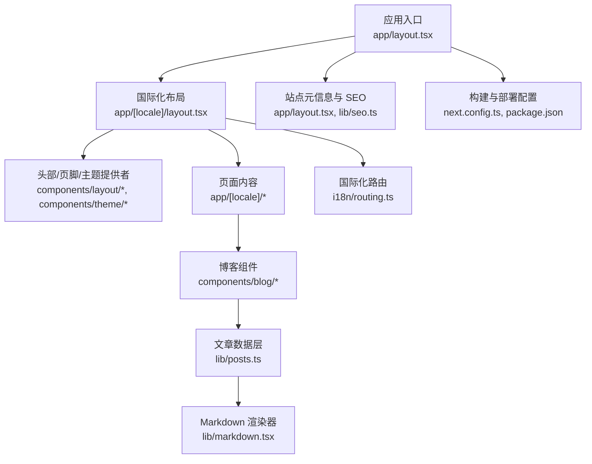
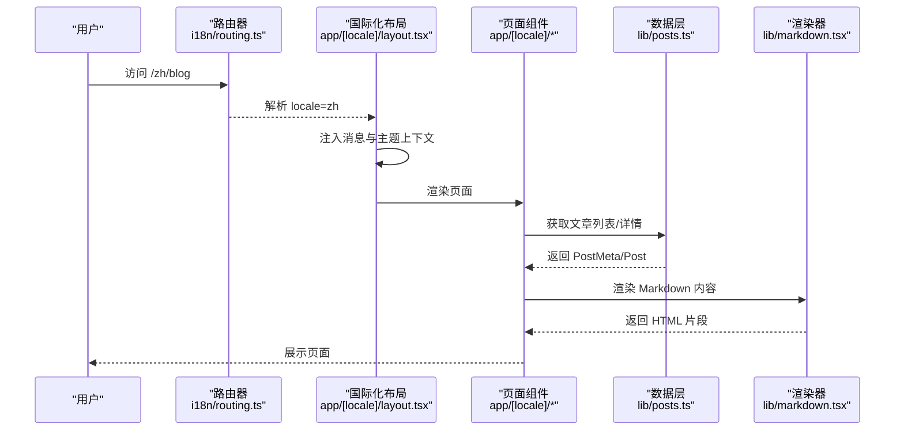
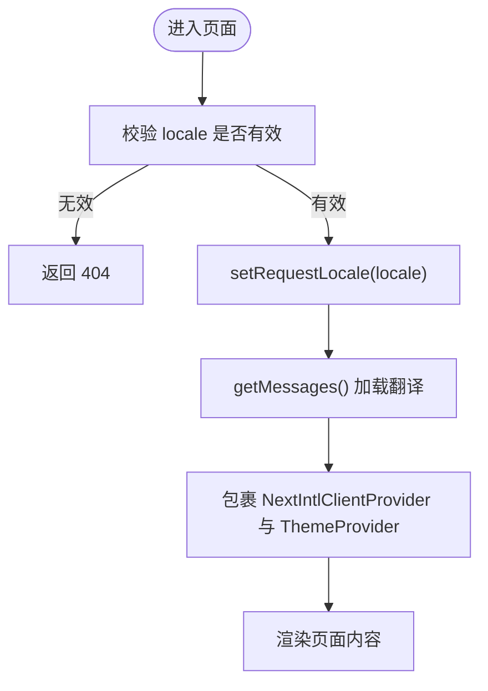
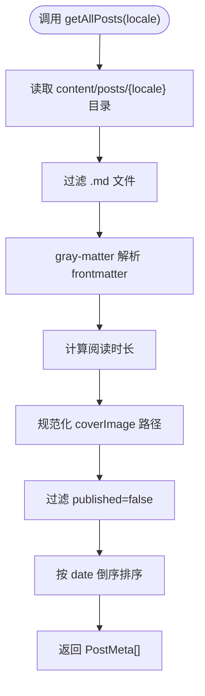
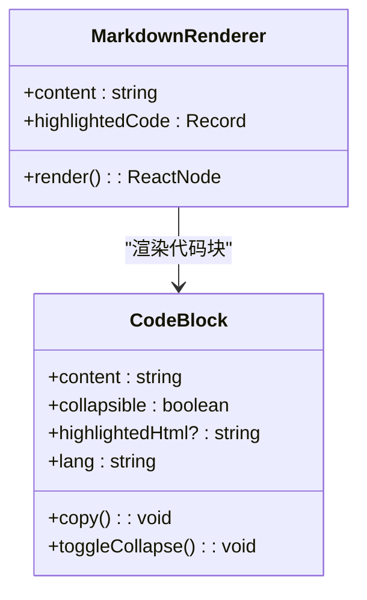
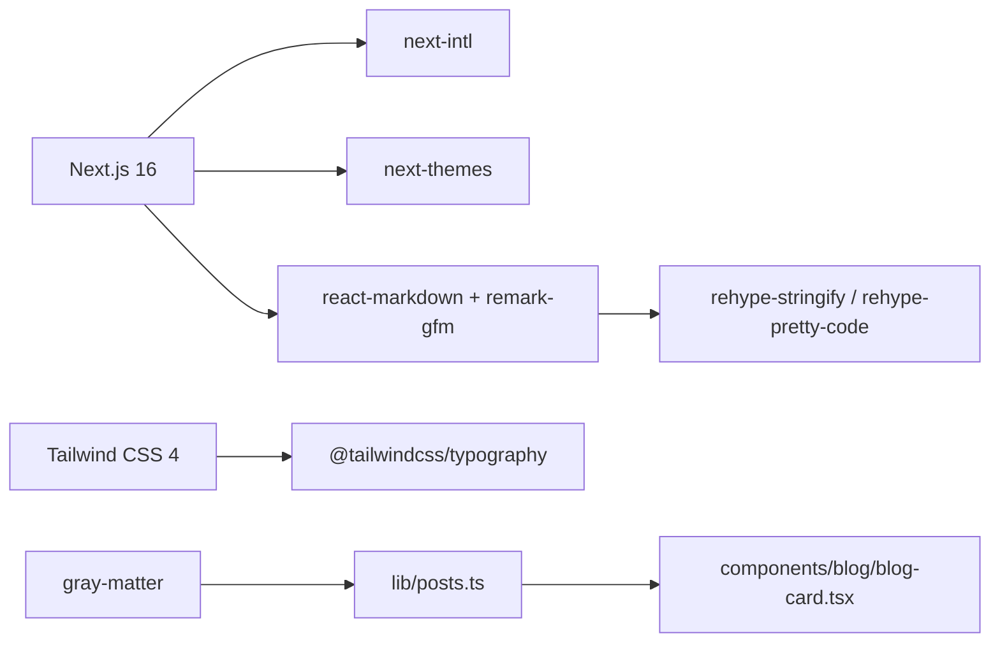

# 项目概述

<cite>
**本文引用的文件列表**
- [README.md](file://README.md)
- [package.json](file://package.json)
- [next.config.ts](file://next.config.ts)
- [app/layout.tsx](file://app/layout.tsx)
- [app/[locale]/layout.tsx](file://app/[locale]/layout.tsx)
- [i18n/routing.ts](file://i18n/routing.ts)
- [lib/posts.ts](file://lib/posts.ts)
- [lib/markdown.tsx](file://lib/markdown.tsx)
- [components/blog/blog-card.tsx](file://components/blog/blog-card.tsx)
- [content/config/profile.json](file://content/config/profile.json)
- [messages/zh.json](file://messages/zh.json)
</cite>

## 目录
1. [简介](#简介)
2. [项目结构](#项目结构)
3. [核心组件](#核心组件)
4. [架构总览](#架构总览)
5. [详细组件分析](#详细组件分析)
6. [依赖关系分析](#依赖关系分析)
7. [性能与可访问性](#性能与可访问性)
8. [故障排查指南](#故障排查指南)
9. [结论](#结论)
10. [附录：技术栈与亮点](#附录技术栈与亮点)

## 简介
本项目是一个现代化的个人博客网站，基于 Next.js 16 构建的静态站点生成器。它支持中英文双语、明暗主题切换、Markdown 文章管理、RSS 订阅、SEO 优化、简历展示、经历与技能时间线等能力，并可通过 GitHub Pages 或 Docker + Nginx 进行部署。整体设计理念强调“内容即代码”、“配置驱动”和“开箱即用”，目标用户为希望快速搭建高质量个人站点的开发者、工程师与技术写作者。

与其他同类项目相比，本项目的差异化优势包括：
- 原生 App Router 与静态导出结合，兼顾开发体验与部署效率
- 基于 next-intl 的双语路由与消息体系，语言切换自然流畅
- 通过 gray-matter 解析 frontmatter 的文章数据模型，便于版本化管理
- 内置 SEO 元信息、Open Graph、Twitter Card、JSON-LD 结构化数据
- 提供 Docker + Nginx 的一键部署方案，适配 VPS 与本地环境
- 丰富的 UI 组件与主题系统，支持个性化定制

[本节不直接分析具体文件]

## 项目结构
项目采用按功能域组织的目录结构，核心模块划分清晰：
- app：Next.js App Router 页面与布局，包含国际化路由 [locale]
- components：React 组件库，涵盖布局、博客、主题、UI 基础组件
- content：内容源（Markdown 文章、经验、技能、配置文件）
- i18n：国际化路由与请求上下文
- lib：工具函数与业务逻辑（文章读取、Markdown 渲染、SEO、站点信息等）
- messages：多语言翻译资源
- public：静态资源（图片、PDF 等）
- docker：容器化部署配置
- scripts：构建后处理脚本（SEO 修复、路径扁平化、图片压缩）

图表来源
- [app/layout.tsx:1-114](file://app/layout.tsx#L1-L114)
- [app/[locale]/layout.tsx:1-64](file://app/[locale]/layout.tsx#L1-L64)
- [i18n/routing.ts:1-6](file://i18n/routing.ts#L1-L6)
- [lib/posts.ts:1-121](file://lib/posts.ts#L1-L121)
- [lib/markdown.tsx:1-318](file://lib/markdown.tsx#L1-L318)
- [next.config.ts:1-38](file://next.config.ts#L1-L38)
- [package.json:1-47](file://package.json#L1-L47)

章节来源
- [README.md:33-67](file://README.md#L33-L67)
- [package.json:1-47](file://package.json#L1-L47)

## 核心组件
- 国际化与路由
  - 定义支持的语言与默认语言，并在布局中注入消息与主题上下文
  - 语言切换通过客户端导航实现，自动保留当前路径并替换前缀
- 主题系统
  - 使用 next-themes 提供明暗主题切换，支持跟随系统
- 博客数据层
  - 从 content/posts/{locale} 读取 Markdown，解析 frontmatter，计算阅读时长，过滤未发布文章，并按日期排序
  - 提供标签、分类聚合与相关文章推荐算法（基于标签重叠与分类匹配）
- Markdown 渲染
  - 使用 react-markdown 与 remark-gfm，自定义标题锚点、表格、链接、代码块（含复制与折叠）
- 站点元信息与 SEO
  - 根布局设置 metadataBase、title 模板、描述、作者、关键词、Open Graph、Twitter Card、robots、图标等
  - 在国际化布局中注入 JSON-LD 结构化数据

章节来源
- [i18n/routing.ts:1-6](file://i18n/routing.ts#L1-L6)
- [app/[locale]/layout.tsx:1-64](file://app/[locale]/layout.tsx#L1-L64)
- [components/theme/theme-provider.tsx:1-11](file://components/theme/theme-provider.tsx#L1-L11)
- [lib/posts.ts:1-121](file://lib/posts.ts#L1-L121)
- [lib/markdown.tsx:1-318](file://lib/markdown.tsx#L1-L318)
- [app/layout.tsx:1-114](file://app/layout.tsx#L1-L114)

## 架构总览
系统采用“静态导出 + 客户端交互”的混合模式：
- 构建期：Next.js 将页面静态导出到 out 目录，启用 trailingSlash 与 unoptimized images，根据环境变量动态设置 basePath/assetPrefix
- 运行期：浏览器加载静态资源，客户端组件负责语言切换、主题切换、评论加载、代码块交互等
- 内容层：Markdown 文件作为单一事实来源，gray-matter 解析 frontmatter，lib/posts.ts 提供统一的数据访问接口
- 国际化层：next-intl 提供路由与消息，布局注入 NextIntlClientProvider
- SEO 层：metadata 与 JSON-LD 提升搜索引擎友好度

图表来源
- [i18n/routing.ts:1-6](file://i18n/routing.ts#L1-L6)
- [app/[locale]/layout.tsx:1-64](file://app/[locale]/layout.tsx#L1-L64)
- [lib/posts.ts:1-121](file://lib/posts.ts#L1-L121)
- [lib/markdown.tsx:1-318](file://lib/markdown.tsx#L1-L318)

## 详细组件分析

### 国际化与语言切换
- 路由定义：locales 包含 en 与 zh，默认语言为 en
- 布局集成：在 [locale] 布局中校验 locale，启用 setRequestLocale，注入 messages 与 ThemeProvider
- 语言切换器：客户端组件通过 useLocale/useRouter/usePathname 实现路径前缀替换与导航

图表来源
- [i18n/routing.ts:1-6](file://i18n/routing.ts#L1-L6)
- [app/[locale]/layout.tsx:1-64](file://app/[locale]/layout.tsx#L1-L64)
- [components/layout/language-switcher.tsx:1-53](file://components/layout/language-switcher.tsx#L1-L53)

章节来源
- [i18n/routing.ts:1-6](file://i18n/routing.ts#L1-L6)
- [app/[locale]/layout.tsx:1-64](file://app/[locale]/layout.tsx#L1-L64)
- [components/layout/language-switcher.tsx:1-53](file://components/layout/language-switcher.tsx#L1-L53)

### 博客数据层与文章管理
- 数据读取：getAllPosts 扫描指定语言的 posts 目录，解析 frontmatter，计算阅读时长，过滤 published=false，按 date 倒序
- 单篇文章：getPostBySlug 读取对应 slug 的 Markdown，返回完整内容与元信息
- 筛选与聚合：getAllTags/getAllCategories 去重排序；getPostsByTag/getPostsByCategory 按条件过滤
- 相关文章：基于标签重叠权重与分类匹配评分，取 Top-N

图表来源
- [lib/posts.ts:1-121](file://lib/posts.ts#L1-L121)

章节来源
- [lib/posts.ts:1-121](file://lib/posts.ts#L1-L121)

### Markdown 渲染与代码块交互
- 渲染管线：react-markdown + remark-gfm，自定义 h1-h4 标题锚点、表格样式、链接行为、图片懒加载
- 代码块：支持行号语言标注、复制按钮、长代码折叠、Shiki 高亮 HTML 注入
- 可读性：段落间距、引用样式、分割线增强阅读体验

图表来源
- [lib/markdown.tsx:1-318](file://lib/markdown.tsx#L1-L318)

章节来源
- [lib/markdown.tsx:1-318](file://lib/markdown.tsx#L1-L318)

### 博客卡片与展示
- 特色卡片：横向布局，左侧封面图，右侧元信息（分类、日期）、标题、摘要、标签与阅读时长
- 常规卡片：纵向布局，顶部封面图，紧凑元信息，标题、摘要、标签
- 交互：悬停边框与背景渐变、箭头动画、响应式适配

章节来源
- [components/blog/blog-card.tsx:1-156](file://components/blog/blog-card.tsx#L1-L156)

### 站点元信息与 SEO
- 根布局设置 metadataBase、title 模板、描述、作者、关键词、Open Graph、Twitter Card、robots、formatDetection、图标
- 国际化布局注入 JSON-LD 结构化数据，提升搜索引擎理解

章节来源
- [app/layout.tsx:1-114](file://app/layout.tsx#L1-L114)
- [app/[locale]/layout.tsx:1-64](file://app/[locale]/layout.tsx#L1-L64)

### 配置与个人资料
- profile.json 集中管理个人信息、社交链接、简历 PDF 地址、主题色、Giscus 评论配置
- 翻译文件 messages/zh.json 提供界面文案的多语言映射

章节来源
- [content/config/profile.json:1-66](file://content/config/profile.json#L1-L66)
- [messages/zh.json:1-168](file://messages/zh.json#L1-L168)

## 依赖关系分析
- 框架与运行时：next 16、react 19、react-dom 19
- 国际化：next-intl 4.x
- 主题：next-themes
- Markdown 生态：react-markdown、remark-gfm、rehype-stringify、rehype-pretty-code
- 样式：tailwindcss 4、@tailwindcss/typography、tailwind-merge、tw-animate-css
- 工具：gray-matter、lucide-react、sharp（构建期图像处理）
- 开发工具：eslint、@types/*

图表来源
- [package.json:1-47](file://package.json#L1-L47)
- [lib/posts.ts:1-121](file://lib/posts.ts#L1-L121)
- [components/blog/blog-card.tsx:1-156](file://components/blog/blog-card.tsx#L1-L156)

章节来源
- [package.json:1-47](file://package.json#L1-L47)

## 性能与可访问性
- 静态导出：output: export 与 trailingSlash 确保纯静态资源输出，减少运行时开销
- 图片优化：unoptimized: true 适配静态托管场景，避免服务端图片处理
- 子路径部署：basePath/assetPrefix 根据 DEPLOY_TARGET 动态设置，保证资源路径正确
- 字体与样式：Geist 字体变量注入，Tailwind 类名按需编译，减少冗余
- 可访问性：语义化标签、aria-label、键盘友好的交互（如复制、折叠）

章节来源
- [next.config.ts:1-38](file://next.config.ts#L1-L38)
- [app/layout.tsx:1-114](file://app/layout.tsx#L1-L114)

## 故障排查指南
- 构建失败
  - 检查 Node.js 版本（需 18+），清理 node_modules 与 .next 后重试
  - 确认 Markdown frontmatter 格式正确
- 部署问题
  - 用户站点与项目站点 basePath 差异：DEPLOY_TARGET=project 时会自动添加子路径前缀
  - GitHub Pages 需要开启 Actions 并上传 out 目录
- 国际化异常
  - 确认 routing.locales 包含目标语言，messages 目录下存在对应翻译文件
- 评论不可用
  - 检查 Giscus 配置中的 repo、repoId、categoryId 是否正确，且 Discussions 已开启

章节来源
- [README.md:549-582](file://README.md#L549-L582)
- [next.config.ts:1-38](file://next.config.ts#L1-L38)
- [content/config/profile.json:1-66](file://content/config/profile.json#L1-L66)

## 结论
本项目以“内容即代码”为核心，结合 Next.js 16 的 App Router 与静态导出能力，提供了高效、可维护、可扩展的个人博客解决方案。其国际化、主题切换、Markdown 管理与 SEO 优化等特性，使其既适合初学者快速上手，也满足有经验的开发者对工程化与可定制化的需求。

[本节不直接分析具体文件]

## 附录：技术栈与亮点
- 技术栈概览
  - 前端框架：Next.js 16（App Router）
  - 类型系统：TypeScript 5
  - 样式系统：Tailwind CSS 4 + shadcn/ui
  - 国际化：next-intl
  - 主题：next-themes
  - Markdown：react-markdown + remark-gfm + rehype-pretty-code
  - 图标：lucide-react
  - 部署：GitHub Pages / Docker + Nginx
- 项目亮点
  - 双语言与明暗主题无缝切换
  - 基于 frontmatter 的结构化文章管理
  - 完善的 SEO 与结构化数据支持
  - 一键构建与多种部署方式
  - 丰富的 UI 组件与可定制主题
- 适用场景
  - 个人技术博客与作品集展示
  - 开发者简历与经历时间线
  - 团队知识库与文档站点（扩展后可用）

章节来源
- [README.md:20-32](file://README.md#L20-L32)
- [package.json:1-47](file://package.json#L1-L47)